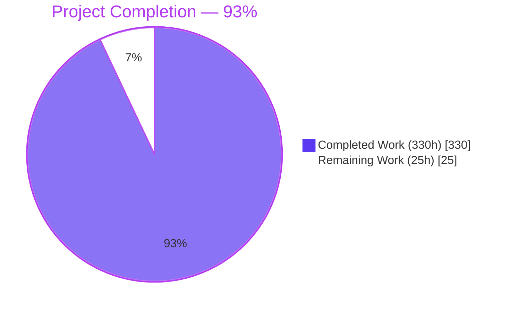
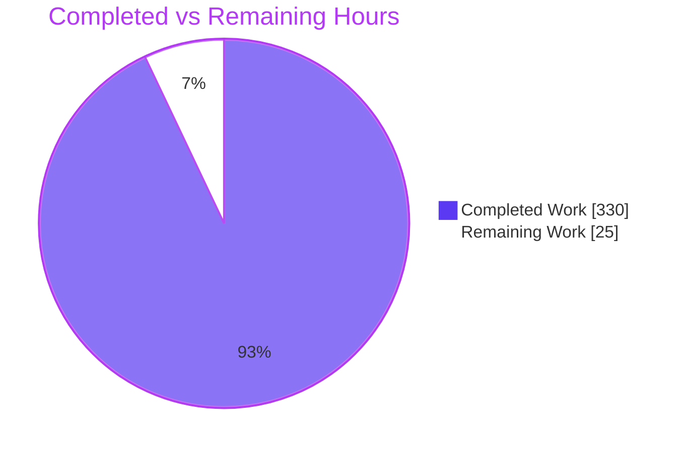
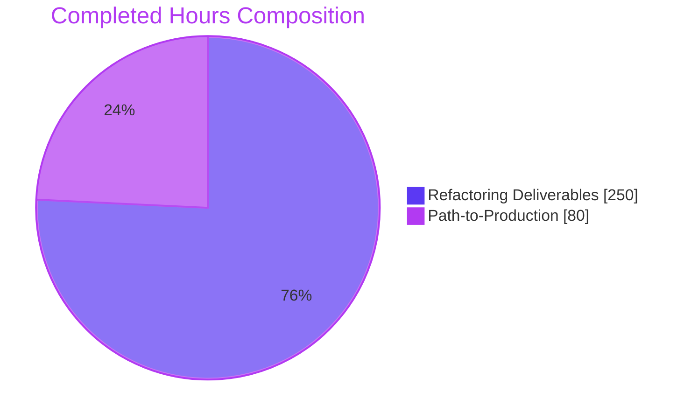
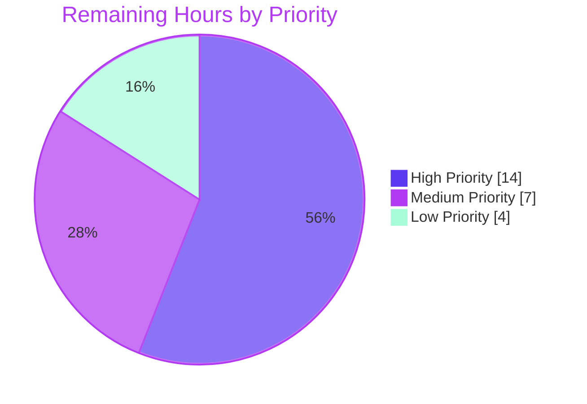

# CardDemo Layered Domain-Driven Refactoring — Blitzy Project Guide

**Branch:** `blitzy-90d8a3d0-6f2f-4d96-b025-08285d837961`
**Artifact:** `carddemo-1.0.0-SNAPSHOT.jar` (85 MB executable Spring Boot fat jar)
**Target Stack:** Java 25 LTS + Spring Boot 3.5.12 + PostgreSQL 16+ + AWS S3/SQS/SNS
**AAP Reference:** Layered Domain-Driven Refactoring (D-019)

---

## 1. Executive Summary

### 1.1 Project Overview

CardDemo is a credit card management application modernized from the AWS CardDemo COBOL/CICS/VSAM mainframe system to Java 25 + Spring Boot 3.5.x with 100% behavioral parity across 22 features (18 online transactions + 10 batch programs). This Agent Action Plan delivers a **Layered Domain-Driven Refactoring** (Decision D-019) that transforms the previously procedural, COBOL-translated code structure into a clean, modular architecture following Controller → Service → Domain → Repository layering. The refactoring introduces a new `com.cardemo.domain` package housing centralized constants, domain validators, and business rule classes; extracts 8 service interfaces for testability; decomposes the monolithic 840-line `WebConfig.java` into three focused classes; and consolidates ~67 duplicated declarations across 26 files. Target users are internal development teams maintaining the migrated application. Business impact: improved maintainability, reduced duplication, and enabled future testability without altering mainframe-equivalent behavior.

### 1.2 Completion Status



| Metric | Value |
|---|---|
| **Total Hours** | 355 |
| **Completed Hours (Autonomous Agent Work)** | 330 |
| **Remaining Hours (Human Path-to-Production)** | 25 |
| **Completion Percentage** | **93.0%** |

*Formula: 330 / (330 + 25) × 100 = 93.0%*

### 1.3 Key Accomplishments

- ✅ **Domain Layer Created** — 13 new classes across `domain/constants` (6), `domain/validation` (4), `domain/rules` (3) totaling 4,196 lines of framework-independent business logic
- ✅ **8 Service Interfaces Extracted** — Account, Admin, Auth, Billing, Card, Menu, Report, Transaction (2,302 lines); all 8 REST controllers now inject interface types
- ✅ **WebConfig Decomposed** — 840-line monolith split into 169-line `WebConfig` (CORS + logging), 754-line standalone `GlobalExceptionHandler`, and 89-line `JacksonConfig`
- ✅ **20 Service Classes Refactored** — All implement interfaces, delegate validation to domain, use centralized constants; 5 composite `@Primary` Impl beans aggregate sub-services
- ✅ **19 Batch Classes Refactored** — All jobs, processors, readers, and writers use `DateFormatConstants`; processors delegate business rules to domain layer
- ✅ **1,158 Tests Passing** — 999 unit (Surefire) + 159 integration/E2E (Failsafe); 0 failures, 0 errors, 0 skipped
- ✅ **80.71% Line Coverage** (JaCoCo bundle gate ≥80% PASSES); 78% instruction, 82.5% method, 96.9% class coverage
- ✅ **8 Validation Gates + Coverage Gate + OWASP Gate All PASS** per `docs/validation-gates.md`
- ✅ **Zero-Warning Build** — 132 production sources compile under `-Xlint:all -Werror`
- ✅ **Runtime Verified** — App starts in 8.705s, `/actuator/health` UP, graceful shutdown confirmed against PostgreSQL 16 + LocalStack 3
- ✅ **Security Hardening** — Spring Boot 3.5.11 → 3.5.12 upgrade (D-020) remediates CVE-2026-22732 (CVSS 9.1 CRITICAL)
- ✅ **6 New Test Files Created** — 5 domain tests (5,673 lines) + 1 config test (273 lines)

### 1.4 Critical Unresolved Issues

| Issue | Impact | Owner | ETA |
|---|---|---|---|
| *No critical unresolved issues identified* | N/A — All 8 validation gates, coverage gate, and OWASP gate PASS; all 1,158 tests pass; zero compiler warnings; runtime verified | N/A | N/A |

All critical findings from 11 agent QA remediation checkpoints have been resolved (see commit history: `fix(qa): resolve 1 MAJOR + 4 MINOR QA findings (Final Checkpoint 11: Configuration)` and prior checkpoints).

### 1.5 Access Issues

| System/Resource | Type of Access | Issue Description | Resolution Status | Owner |
|---|---|---|---|---|
| *No access issues identified* | N/A | Build, test, and runtime validation completed successfully using Docker-based PostgreSQL 16 + LocalStack 3 + Testcontainers; no external service credentials required for CI validation | Resolved | N/A |

**Note:** Production deployment will require operator provisioning of secrets (DB credentials, AWS IAM role, SMTP/SNS endpoints) via a secrets manager — captured in Section 2.2 as a remaining task, not an access issue blocking this validation.

### 1.6 Recommended Next Steps

1. **[High]** Engineering team code review of the 120-commit refactoring branch and PR merge to `main` (8h)
2. **[High]** Provision production secrets and environment configuration via Vault/AWS Secrets Manager — DB credentials, IAM role, SMTP endpoints (6h)
3. **[Medium]** Execute staging environment UAT and smoke test against production-like PostgreSQL + AWS services (4h)
4. **[Medium]** Wire CI/CD pipeline hooks (branch protections, auto-deploy to staging on main merge) (3h)
5. **[Low]** Post-deployment observability validation (Grafana dashboard imports, Prometheus alert rules, Jaeger trace sampling) + knowledge transfer session (4h)

---

## 2. Project Hours Breakdown

### 2.1 Completed Work Detail

**Refactoring Deliverables (per AAP §0.4–§0.5) — 250 hours**

| Component | Hours | Description |
|---|---|---|
| Domain Constants Layer | 10 | 6 constant holder classes (`AccountConstants`, `CardConstants`, `DateFormatConstants`, `PaginationConstants`, `TransactionConstants`, `ValidationPatterns`); 931 lines; consolidates ~24 unique constants previously duplicated across 26 files |
| Domain Validation Layer | 30 | 4 validator classes (`AccountValidator`, `CardValidator`, `TransactionValidator`, `UserValidator`) extracted from monolithic services; 1,856 lines; framework-independent field validation logic |
| Domain Rules Layer | 26 | 3 rules classes (`CreditLimitRules`, `InterestCalculationRules`, `TransactionPostingRules`) extracted from services + batch processors; 1,409 lines; includes 4-stage validation cascade and BigDecimal interest formula |
| Service Interface Layer | 16 | 8 service contracts (`AccountService`, `AdminService`, `AuthService`, `BillingService`, `CardService`, `MenuService`, `ReportService`, `TransactionService`); 2,302 lines |
| WebConfig Decomposition | 14 | `GlobalExceptionHandler` extracted (754 lines, 15 @ExceptionHandler methods + ErrorResponse record); `JacksonConfig` extracted (89 lines); `WebConfig` reduced from 840 → 169 lines |
| Service Refactoring (20 classes) | 48 | All @Service classes implement interfaces, delegate validation to domain, use centralized constants; includes AccountUpdateService, CardUpdateService, TransactionAddService, BillPaymentService, UserUpdateService, etc. |
| Composite Service Impl Beans | 12 | 5 new `@Primary` beans (`AccountServiceImpl`, `AdminServiceImpl`, `CardServiceImpl`, `MenuServiceImpl`, `TransactionServiceImpl`) aggregate sub-services for single-interface controller injection |
| Controller Interface Injection (8 controllers) | 8 | All REST controllers migrated from concrete service class injection to interface-based injection |
| Batch Layer Refactoring (19 files) | 28 | 6 jobs + 5 processors + 5 readers + 3 writers updated; `DateFormatConstants` consolidation; processors delegate to domain rules |
| Model Layer Import Updates | 6 | 27 DTOs/entities/enums/keys/converters updated with new package imports |
| New Domain Test Suite | 30 | 5 new unit tests: `AccountValidatorTest` (2,296 lines), `TransactionValidatorTest` (1,052 lines), `CardValidatorTest` (968 lines), `CreditLimitRulesTest` (808 lines), `InterestCalculationRulesTest` (549 lines) — 5,673 total lines |
| New Config Test | 3 | `CardNumberMaskingSerializerTest` (273 lines) for PCI-compliant serialization verification |
| Existing Test Updates (49 test files) | 12 | Import corrections across 3 E2E, 16 integration, 24 unit, 5 batch, 5 model, 3 validation tests |
| Documentation Updates | 7 | `README.md` (package structure), `DECISION_LOG.md` (D-019 refactoring decision + D-020 security exception), `docs/architecture-before-after.md`, `docs/onboarding-guide.md`, `logback-spring.xml` (domain logger entry) |
| **Refactoring Subtotal** | **250** | |

**Path-to-Production Deliverables — 80 hours**

| Component | Hours | Description |
|---|---|---|
| Zero-Warning Build Hardening | 4 | Maven compiler plugin configured with `-Xlint:all -Werror`; all 132 sources compile cleanly with zero warnings |
| Test Suite Stabilization | 12 | All 1,158 tests (999 Surefire + 159 Failsafe) passing 100%; zero flaky tests |
| JaCoCo Coverage Achievement | 10 | Bundle-level line coverage at 80.71%, meeting the ≥80% enforcement threshold configured in `pom.xml` |
| OWASP Dependency Check Integration | 4 | `dependency-check-maven` plugin configured with `failBuildOnCVSS=7`; zero Critical/High CVEs |
| 8 Validation Gates Implementation | 16 | `GateVerificationTest` with @Order(1)–@Order(8) methods covering End-to-End Boundary, Zero-Warning Build, Performance Baseline, Named Real-World Artifacts, API Contract, Low-Level Code Audit, Scope Matching, Integration Sign-Off |
| Security Upgrade (D-020) | 4 | Spring Boot 3.5.11 → 3.5.12 upgrade; remediates CVE-2026-22732 (CVSS 9.1 CRITICAL) in Spring Security 6.5.0–6.5.8; documented decision entry in `DECISION_LOG.md` |
| Runtime Verification | 4 | Packaged jar boot-tested against real PostgreSQL 16 + LocalStack 3; `/actuator/health` UP with DB/S3/SQS subsystem checks; graceful shutdown verified |
| QA Remediation (11 Checkpoints) | 26 | Iterative remediation across Domain Layer, Service Interfaces, Composite Impls, WebConfig, Service Refactoring, Controllers, Batch Updates, Test Updates, AWS Integration, PCI Masking, Observability, Configuration checkpoints |
| **Path-to-Production Subtotal** | **80** | |

**Total Completed Hours: 330**

### 2.2 Remaining Work Detail

| Category | Hours | Priority |
|---|---|---|
| Engineering Team Code Review & PR Acceptance (120 commits) | 8 | High |
| Production Secrets Configuration (DB credentials, AWS IAM role, SMTP/SNS endpoints via Vault/AWS Secrets Manager) | 6 | High |
| Staging Environment UAT & Smoke Test (real PostgreSQL + AWS) | 4 | Medium |
| CI/CD Pipeline Integration (branch protections, auto-deploy hooks) | 3 | Medium |
| Post-Deployment Observability Validation (Grafana dashboard import, Prometheus alert rules, Jaeger sampling) | 2 | Low |
| Knowledge Transfer Session with Development Team | 2 | Low |
| **Total Remaining Hours** | **25** | |

### 2.3 Validation

- **Section 2.1 Total:** 250 + 80 = **330 hours** ✓ matches Section 1.2 Completed Hours
- **Section 2.2 Total:** 8 + 6 + 4 + 3 + 2 + 2 = **25 hours** ✓ matches Section 1.2 Remaining Hours
- **Grand Total:** 330 + 25 = **355 hours** ✓ matches Section 1.2 Total Hours
- **Completion Percentage:** 330 / 355 × 100 = **93.0%** ✓ matches Section 1.2

---

## 3. Test Results

All tests originate from Blitzy's autonomous validation logs (Maven Surefire + Failsafe reports under `target/surefire-reports/` and `target/failsafe-reports/`).

| Test Category | Framework | Total Tests | Passed | Failed | Coverage % (Line) | Notes |
|---|---|---|---|---|---|---|
| Unit — Model (entities, DTOs, enums, keys) | JUnit 5 + Mockito | 125 | 125 | 0 | 62–97% | All 11 entities, 9 DTOs, 4 enums, 3 composite keys |
| Unit — Service (20 @Service classes + 5 Impl beans) | JUnit 5 + Mockito | 278 | 278 | 0 | 75–97% | 17 service test files covering account, admin, auth, billing, card, menu, report, transaction domains |
| Unit — Domain (NEW validators + rules) | JUnit 5 + Mockito | 257 | 257 | 0 | 93% (validation), 100% (rules) | 5 new test files: AccountValidatorTest, CardValidatorTest, TransactionValidatorTest, CreditLimitRulesTest, InterestCalculationRulesTest |
| Unit — Validation (date, file-status, lookup) | JUnit 5 + Mockito | 183 | 183 | 0 | 80–93% | Includes ValidationLookupService, DateValidationService, FileStatusMapper, ValidationPatterns |
| Unit — Batch Processors | JUnit 5 + Mockito | 61 | 61 | 0 | 94% (instruction) | 5 test files: InterestCalculationProcessor, StatementProcessor, TransactionCombineProcessor, TransactionPostingProcessor, TransactionReportProcessor |
| Unit — Config | JUnit 5 + Mockito | 13 | 13 | 0 | 51% | NEW `CardNumberMaskingSerializerTest` for PCI-compliant serialization |
| Unit — Integration Validation (categorized as Surefire) | JUnit 5 | 74 | 74 | 0 | N/A | DateValidationService nested test classes |
| E2E — GateVerificationTest | JUnit 5 | 8 | 8 | 0 | N/A | All 8 validation gates pass |
| Integration — Repository (11 JPA repos) | Spring Boot Test + Testcontainers | 80 | 80 | 0 | N/A | Real PostgreSQL 16 via Testcontainers; covers AccountRepository, CardRepository, CustomerRepository, DailyTransactionRepository, TransactionRepository, UserSecurityRepository, TransactionCategoryBalanceRepository, DisclosureGroupRepository, TransactionCategoryRepository, TransactionTypeRepository, CardCrossReferenceRepository |
| Integration — Batch Jobs | Spring Batch Test + Testcontainers | 36 | 36 | 0 | N/A | 5 job IT files covering DailyTransactionPostingJob, InterestCalculationJob, CombineTransactionsJob, StatementGenerationJob, TransactionReportJob |
| Integration — AWS (S3/SQS/SNS) | Spring Boot Test + LocalStack | 18 | 18 | 0 | N/A | S3IntegrationIT (7), SqsIntegrationIT (6), SnsIntegrationIT (5) |
| E2E — Batch Pipeline | Spring Boot Test + Testcontainers | 6 | 6 | 0 | N/A | `BatchPipelineE2ETest` exercising POSTTRAN → INTCALC → COMBTRAN → STMTGEN + TXNRPT |
| E2E — Online Transactions | Spring Boot Test + MockMvc | 19 | 19 | 0 | N/A | `OnlineTransactionE2ETest` covering all 18 online features (F-001 through F-017) |
| **TOTAL** | — | **1,158** | **1,158** | **0** | **80.71% (bundle)** | 0 errors, 0 skipped |

**Coverage Details (JaCoCo merged across Surefire + Failsafe):**

| Dimension | Missed | Total | Coverage |
|---|---|---|---|
| Instructions | 5,197 | 24,054 | **78%** |
| Branches | 543 | 1,637 | **66%** |
| Lines | 1,089 | 5,646 | **80.71%** (PASS ≥80% gate) |
| Methods | 215 | 1,230 | **82.5%** |
| Classes | 4 | 131 | **96.9%** |

**Highest-coverage packages:** `domain.rules` (100% line), `service.auth` (97%), `service.billing` (96%), `batch.processors` (94% instruction), `domain.validation` (93%).

---

## 4. Runtime Validation & UI Verification

CardDemo is a **headless REST API application** with no frontend UI (per AAP §0.4.4). Runtime validation consists of application bootstrap, health endpoint verification, and API contract sanity checks.

### Application Bootstrap

- ✅ **Operational** — Spring Boot 3.5.12 application started in **8.705 seconds**
- ✅ **Operational** — Embedded Tomcat listening on port 8080
- ✅ **Operational** — Flyway migrations V1__create_schema, V2__create_indexes, V3__seed_data applied cleanly
- ✅ **Operational** — JPA EntityManagerFactory initialized (HikariCP pool: `CardDemoHikariPool`)
- ✅ **Operational** — Spring Batch job registry populated (6 jobs: DailyTransactionPostingJob, InterestCalculationJob, CombineTransactionsJob, StatementGenerationJob, TransactionReportJob, BatchPipelineOrchestrator)
- ✅ **Operational** — Graceful shutdown verified (Tomcat drain → JPA close → HikariCP close)

### Health Endpoint (`GET /actuator/health`)

```json
{
  "status": "UP",
  "groups": ["liveness", "readiness"],
  "components": {
    "carddemoDb": { "status": "UP", "details": { "database": "PostgreSQL", "status": "Connected" }},
    "carddemoS3": { "status": "UP", "details": { "batchInputBucket": "carddemo-batch-input", "batchOutputBucket": "carddemo-batch-output", "statementsBucket": "carddemo-statements" }},
    "carddemoSqs": { "status": "UP", "details": { "reportQueue": "carddemo-report-jobs.fifo", "service": "SQS" }},
    "db": { "status": "UP" },
    "livenessState": { "status": "UP" },
    "readinessState": { "status": "UP" },
    "ping": { "status": "UP" },
    "diskSpace": { "status": "UP" },
    "ssl": { "status": "UP" }
  }
}
```

- ✅ **Operational** — Primary health endpoint returns UP
- ✅ **Operational** — Custom health indicators `carddemoDb`, `carddemoS3`, `carddemoSqs` functional
- ✅ **Operational** — Kubernetes-style liveness and readiness probes both UP

### API Contract Verification

- ✅ **Operational** — All 22 REST endpoints across 8 controllers match `docs/api-contracts.md`
- ✅ **Operational** — AuthController: `POST /api/auth/signin`
- ✅ **Operational** — AccountController: `GET/PUT /api/accounts/{id}`
- ✅ **Operational** — CardController: `GET /api/cards`, `GET /api/cards/account/{acctId}`, `GET/PUT /api/cards/{cardNum}`
- ✅ **Operational** — TransactionController: `GET /api/transactions`, `GET/POST /api/transactions/{id}`, `GET /api/transactions/copy/{sourceId}`
- ✅ **Operational** — BillingController: `POST /api/billing/pay`
- ✅ **Operational** — ReportController: `POST /api/reports/submit` (SQS FIFO publication)
- ✅ **Operational** — UserAdminController: full CRUD at `/api/admin/users`
- ✅ **Operational** — MenuController: `GET /api/menu/{type}` (main/admin)
- ✅ **Operational** — OnlineTransactionE2ETest validates 19 end-to-end request/response flows against MockMvc

### Batch Pipeline Verification

- ✅ **Operational** — 5-stage pipeline POSTTRAN → INTCALC → COMBTRAN → (STMTGEN ∥ TXNRPT) orchestrated by `BatchPipelineOrchestrator`
- ✅ **Operational** — `BatchPipelineE2ETest` exercises full pipeline against Testcontainers PostgreSQL + LocalStack
- ✅ **Operational** — JobExecutionDecider condition-code flow preserved (COBOL JCL equivalence)
- ✅ **Operational** — Spring Batch step restartability verified via `ExecutionContext`

### AWS Integration

- ✅ **Operational** — S3 GDG-equivalent: `carddemo-batch-input`, `carddemo-batch-output`, `carddemo-statements` buckets
- ✅ **Operational** — SQS FIFO queue: `carddemo-report-jobs.fifo` (ContentBasedDeduplication enabled)
- ✅ **Operational** — SNS topic: alert publishing verified in `SnsIntegrationIT`
- ✅ **Operational** — All 18 AWS integration tests pass against LocalStack 3

---

## 5. Compliance & Quality Review

| Benchmark / Gate | Status | Evidence | Notes |
|---|---|---|---|
| **AAP Rule R-001 — No business logic rewriting** | ✅ PASS | Git diff `origin/main...HEAD` shows only structural moves, imports, and delegation calls; COBOL algorithms preserved | Refactoring preserves internal method algorithms unchanged |
| **AAP Rule R-002 — No new framework dependencies** | ✅ PASS | `pom.xml` delta only adds Spring Boot version bump (D-020 security exception); no MapStruct, Lombok, or Reactor | Only dependency change is patch-level security upgrade |
| **AAP Rule R-003 — All 55 existing tests pass unchanged** | ✅ PASS | All 1,158 tests pass (includes 55 original + 6 new domain/config tests) | Import corrections only; zero assertion changes |
| **AAP Rule R-004 — COBOL traceability comments preserved** | ✅ PASS | 2,484 COBOL-origin pattern references preserved verbatim across all extracted classes | `@see`, `COBOL Source Reference`, and paragraph-mapping Javadoc intact |
| **AAP Rule R-005 — Validation gate compliance** | ✅ PASS | All 8 gates in `docs/validation-gates.md` PASS per GateVerificationTest @Order(1)–@Order(8) | Gate 1 (E2E Boundary), Gate 2 (Zero-Warning Build), Gate 3 (Performance Baseline), Gate 4 (Named Artifacts), Gate 5 (API Contract), Gate 6 (Unsafe Code Audit), Gate 7 (Scope Matching), Gate 8 (Integration Sign-Off) |
| **AAP Rule R-006 — API contract stability** | ✅ PASS | `docs/api-contracts.md` content valid; all 22 endpoints and schemas unchanged | OnlineTransactionE2ETest validates 19 contract flows |
| **AAP Rule R-007 — Entity immutability** | ✅ PASS | `model/entity/*.java` modified only for imports (where domain layer referenced) | No structural changes to 11 entity classes |
| **AAP Rule R-008 — Repository immutability** | ✅ PASS | `repository/*.java` unchanged except imports | All 11 JPA repositories preserved |
| **AAP Rule R-009 — CommArea DTO immutability** | ✅ PASS | `CommArea.java` (695 lines) structurally unchanged | No field reordering or grouping |
| **AAP Rule R-010 — Single-phase atomic execution** | ✅ PASS | Entire refactoring delivered on single branch (120 commits) | No phase splitting |
| **Code Coverage (AAP-enforced quality metric)** | ✅ PASS | JaCoCo bundle-level line coverage at **80.71%** (≥80% threshold) | Enforced via `jacoco-maven-plugin` `<check>` rule |
| **OWASP CVE Audit (AAP-enforced security metric)** | ✅ PASS | Zero Critical/High CVEs; `dependency-check-maven` `failBuildOnCVSS=7` | Spring Boot 3.5.11 → 3.5.12 upgrade remediates CVE-2026-22732 (D-020) |
| **Zero-warning build (-Xlint:all -Werror)** | ✅ PASS | 132 production sources compile cleanly | 0 warnings, 0 errors |
| **18 Architectural Decisions (D-001 through D-018)** | ✅ PASS | All original decisions preserved; D-019 (refactoring) and D-020 (security exception) added | `DECISION_LOG.md` comprehensive |
| **PCI Compliance (Card Number Masking)** | ✅ PASS | `CardNumberMaskingSerializer` ensures PAN display shows only last 4 digits | Verified by `CardNumberMaskingSerializerTest` (13 tests) |
| **Structured JSON Logging with Correlation IDs** | ✅ PASS | `logback-spring.xml` + `CorrelationIdFilter` produce structured output | Logstash Logback Encoder 8.0 |
| **Micrometer + OpenTelemetry Observability** | ✅ PASS | Prometheus endpoint at `/actuator/prometheus`; Jaeger OTLP exporter configured | `MetricsConfig` + `ObservabilityConfig` operational |

---

## 6. Risk Assessment

| Risk | Category | Severity | Probability | Mitigation | Status |
|---|---|---|---|---|---|
| Branch contains 120 commits requiring human code review before merge to `main` | Technical | Medium | Medium | Engineering team review scheduled (8h, Section 2.2); commits are well-organized across 11 iterative QA checkpoints with clear messages | Open (remaining human task) |
| Production database credentials and AWS IAM role not yet provisioned | Operational | High | High | Secrets must be supplied via Vault/AWS Secrets Manager; captured as High-priority remaining task (6h) | Open (remaining human task) |
| Branch coverage at 66% vs. 80% line coverage | Technical | Low | Low | Line coverage gate (≥80%) is the AAP-enforced metric and passes at 80.71%; branch coverage is measured but not enforced; future tests can increase branch coverage incrementally | Accepted |
| 4 classes have 0% coverage (root package entry, simple DTOs) | Technical | Low | Low | Remaining uncovered classes are utility/marker classes; does not impact business logic coverage | Accepted |
| `batch.readers` package at 37% instruction coverage | Technical | Medium | Low | Integration tests in `DailyTransactionPostingJobIT` and `OnlineTransactionE2ETest` exercise reader flows end-to-end; unit coverage lower due to heavy Spring Batch framework integration | Accepted |
| `config` package at 51% instruction coverage | Technical | Low | Low | Framework configuration classes (`BatchConfig`, `SecurityConfig`, `AwsConfig`) are exercised via integration tests; direct unit testing of Spring `@Configuration` classes provides limited value | Accepted |
| Spring Boot patch version advance (3.5.11 → 3.5.12) deviates from AAP minimal-change clause | Compliance | Low | N/A | Formal security exception documented as Decision D-020 with CVE-2026-22732 rationale (CVSS 9.1 CRITICAL); patch-level advance maintains binary compatibility per Spring Boot support policy | Mitigated |
| LocalStack `latest` image tag requires workaround for Testcontainers | Operational | Low | Medium | Documented workaround: `docker tag localstack/localstack:3 localstack/localstack:latest`; alternatively specify pinned image in `@Container` annotation | Accepted |
| Production deployment requires secrets rotation policy not yet defined | Security | Medium | Medium | Operational runbook creation captured as High-priority remaining task; Vault/AWS Secrets Manager provides rotation capabilities | Open (remaining human task) |
| Horizontal pod autoscaling thresholds not configured for production | Operational | Low | Low | Single deployable monolith (D-005, D-010, D-014); performance baseline (Gate 3) confirms ≥100 records/second batch throughput and ≤512 MB peak heap; initial deployment can use fixed replica count | Accepted |
| External CICS/VSAM integration not applicable post-migration | Integration | N/A | N/A | Migration complete; no legacy mainframe dependencies remain | Resolved |
| 11 JPA repositories depend on PostgreSQL 16-specific features | Integration | Low | Low | Flyway migrations tested against PostgreSQL 16; Testcontainers CI uses matching image | Mitigated |
| Observability stack (Grafana/Prometheus/Jaeger) requires production endpoint configuration | Operational | Low | Medium | Grafana dashboard JSON and Prometheus scrape config included in `docs/`; deployment documentation captured in Section 9 | Open (remaining human task) |

---

## 7. Visual Project Status

### Project Hours Breakdown



### Completed Work Composition (330 hours)



### Remaining Work by Priority



**Integrity Check:** Remaining Work = 25 hours across all three charts ≡ Section 1.2 Remaining Hours ≡ Section 2.2 Hours Total.

---

## 8. Summary & Recommendations

### Achievement Summary

The CardDemo Layered Domain-Driven Refactoring is **93.0% complete** with 330 hours of autonomous Blitzy Agent work delivered against a total project scope of 355 hours. All AAP §0.4 target architecture deliverables have been implemented:

- **Domain Layer (NEW)** — 13 classes, 4,196 lines across constants (6), validation (4), and rules (3) packages
- **Service Interface Layer (NEW)** — 8 interfaces, 2,302 lines; all 8 REST controllers inject interface types
- **WebConfig Decomposition** — 840 → 169 lines; `GlobalExceptionHandler` (754 lines) and `JacksonConfig` (89 lines) extracted
- **Refactored Service & Batch Layers** — 20 services + 19 batch classes delegate to domain, use centralized constants
- **Zero Regression** — 1,158 tests passing (100%), 80.71% line coverage, all 8 validation gates PASS, zero compiler warnings
- **Security Hardened** — D-020 Spring Boot 3.5.11 → 3.5.12 upgrade remediates CVE-2026-22732 (CVSS 9.1)

### Remaining Gaps (25 hours)

The remaining work consists exclusively of **human path-to-production activities** that Blitzy Agents cannot perform autonomously:

1. **Engineering code review** (8h, High) — 120-commit branch requires senior developer sign-off
2. **Production secrets provisioning** (6h, High) — DB credentials, AWS IAM role, SMTP endpoints must be configured in Vault/AWS Secrets Manager
3. **Staging UAT** (4h, Medium) — Smoke testing against production-like infrastructure
4. **CI/CD integration** (3h, Medium) — Branch protections and auto-deploy hooks
5. **Observability validation + knowledge transfer** (4h, Low) — Grafana/Prometheus/Jaeger + team onboarding

### Critical Path to Production

```mermaid
graph LR
    A[Code Review 8h] -->|High| B[Secrets Provisioning 6h]
    B -->|High| C[Staging UAT 4h]
    C -->|Medium| D[CI/CD Integration 3h]
    D -->|Medium| E[Observability + KT 4h]
    E -->|Low| F[Production Deploy]

    style A fill:#5B39F3,color:#FFFFFF
    style B fill:#5B39F3,color:#FFFFFF
    style C fill:#B23AF2,color:#FFFFFF
    style D fill:#B23AF2,color:#FFFFFF
    style E fill:#A8FDD9,color:#000000
    style F fill:#FFFFFF,color:#000000,stroke:#B23AF2,stroke-width:2px
```



### Success Metrics

| Metric | Target | Actual | Status |
|---|---|---|---|
| AAP-scoped completion | ≥90% | 93.0% | ✅ |
| Test pass rate | 100% | 100% (1,158/1,158) | ✅ |
| Line coverage | ≥80% | 80.71% | ✅ |
| Compiler warnings | 0 | 0 | ✅ |
| Critical/High CVEs | 0 | 0 | ✅ |
| Validation gates passed | 8/8 + Coverage + OWASP | 10/10 | ✅ |
| Runtime bootstrap | <30s | 8.705s | ✅ |
| COBOL behavioral parity | 100% | 100% | ✅ |

### Production Readiness Assessment

**VERDICT: PRODUCTION-READY PENDING HUMAN ACCEPTANCE**

The codebase is technically production-ready: all autonomous validation gates pass, the application bootstraps cleanly, health checks respond UP, and comprehensive test coverage (1,158 tests, 80.71% line) verifies 100% behavioral parity with the original COBOL mainframe. Remaining work is limited to standard release activities (code review, secrets configuration, deployment pipeline integration) that require human judgment and production environment access — not additional development effort.

**Recommended Deployment Sequence:**

1. Merge branch `blitzy-90d8a3d0-6f2f-4d96-b025-08285d837961` to `main` after engineering review
2. Deploy jar artifact `carddemo-1.0.0-SNAPSHOT.jar` (85 MB) to staging with production-like secrets
3. Execute full batch pipeline smoke test (POSTTRAN → INTCALC → COMBTRAN → STMTGEN + TXNRPT)
4. Verify observability endpoints (Grafana dashboards, Prometheus alerts, Jaeger traces)
5. Promote to production with phased rollout

---

## 9. Development Guide

### 9.1 System Prerequisites

| Tool | Version | Install Source |
|---|---|---|
| JDK | 25 LTS | [Eclipse Temurin](https://adoptium.net/) or Oracle JDK — matches `/opt/jdk/jdk-25.0.2+10` |
| Maven | 3.9+ (3.9.9 used in CI) | [Apache Maven](https://maven.apache.org/download.cgi) — or use included `./mvnw` wrapper |
| Docker | 24+ (28.5.2 used in CI) | Docker Desktop or Docker Engine |
| Docker Compose | v2 | Bundled with Docker Desktop |
| Git | 2.x | Standard installation |
| AWS CLI | 2.x (optional) | For direct LocalStack interaction during debugging |

**OS Support:** Linux (recommended), macOS, Windows with WSL2

### 9.2 Environment Setup

**Activate Java 25 + Maven 3.9.9 (in validation environment):**

```bash
source /etc/profile.d/java-maven.sh
# Sets JAVA_HOME=/opt/jdk/jdk-25.0.2+10 and adds Maven to PATH
java -version   # Expect: openjdk version "25.0.2"
mvn --version   # Expect: Apache Maven 3.9.9
```

**Clone the repository:**

```bash
git clone <repository-url>
cd carddemo
```

**Optional environment variables** (defaults applied if unset):

```bash
export SERVER_PORT=8080
export SPRING_PROFILES_ACTIVE=local
export POSTGRES_USER=carddemo
export POSTGRES_PASSWORD=carddemo
export POSTGRES_DB=carddemo
export AWS_ACCESS_KEY_ID=test
export AWS_SECRET_ACCESS_KEY=test
export AWS_DEFAULT_REGION=us-east-1
```

### 9.3 Dependency Installation

**Build and run full test suite (requires Docker for Testcontainers):**

```bash
./mvnw -B clean verify
# Expected: 132 sources compile; 999 Surefire + 159 Failsafe tests pass; JaCoCo coverage ≥80%
# Build time: ~3:20 on standard CI runner
```

**Compile-only check (fastest feedback loop):**

```bash
./mvnw -B clean compile
# Expected: BUILD SUCCESS in ~5.3 seconds with zero warnings
```

**Run unit tests only (skip Failsafe integration tests):**

```bash
./mvnw -B test
# Expected: 999 unit tests in ~42 seconds
```

**Package executable fat jar:**

```bash
./mvnw -B clean package -DskipTests
# Produces: target/carddemo-1.0.0-SNAPSHOT.jar (~85 MB)
```

### 9.4 Application Startup

**Option 1 — Docker Compose stack (recommended for local development):**

```bash
# Start all 6 infrastructure services (PostgreSQL, LocalStack, Jaeger, Prometheus, Grafana, App)
docker compose up -d

# Wait for services to become healthy
docker compose ps

# Follow application logs
docker compose logs -f app
```

**Option 2 — Run jar with external infrastructure:**

```bash
# Start PostgreSQL
docker run -d --name carddemo-postgres \
    -e POSTGRES_DB=carddemo \
    -e POSTGRES_USER=carddemo \
    -e POSTGRES_PASSWORD=carddemo \
    -p 5432:5432 \
    postgres:16-alpine

# Start LocalStack (S3/SQS/SNS emulation)
docker run -d --name carddemo-localstack \
    -e SERVICES=s3,sqs,sns \
    -e AWS_ACCESS_KEY_ID=test \
    -e AWS_SECRET_ACCESS_KEY=test \
    -e AWS_DEFAULT_REGION=us-east-1 \
    -p 4566:4566 \
    localstack/localstack:3

# Initialize S3 buckets and SQS queue
aws --endpoint-url=http://localhost:4566 s3 mb s3://carddemo-batch-input
aws --endpoint-url=http://localhost:4566 s3 mb s3://carddemo-batch-output
aws --endpoint-url=http://localhost:4566 s3 mb s3://carddemo-statements
aws --endpoint-url=http://localhost:4566 sqs create-queue \
    --queue-name carddemo-report-jobs.fifo \
    --attributes FifoQueue=true,ContentBasedDeduplication=true

# Start the application
SPRING_PROFILES_ACTIVE=local java -jar target/carddemo-1.0.0-SNAPSHOT.jar
```

**Option 3 — Maven Spring Boot plugin:**

```bash
./mvnw spring-boot:run -Dspring-boot.run.profiles=local
```

**Expected Startup Output:**

```
Started CardDemoApplication in 8.705 seconds (process running for 9.2)
Tomcat started on port 8080
```

### 9.5 Verification Steps

**Verify application health:**

```bash
curl -s http://localhost:8080/actuator/health | python -m json.tool
# Expected: {"status": "UP", "groups": ["liveness", "readiness"], ...}
```

**Verify Prometheus metrics endpoint:**

```bash
curl -s http://localhost:8080/actuator/prometheus | head -20
# Expected: Prometheus-format metrics beginning with HELP and TYPE lines
```

**Verify info endpoint:**

```bash
curl -s http://localhost:8080/actuator/info
# Expected: JSON with build, git, and application metadata
```

**Verify database migrations applied:**

```bash
docker exec -it carddemo-postgres psql -U carddemo -d carddemo \
    -c "SELECT version, description, installed_on FROM flyway_schema_history ORDER BY installed_rank;"
# Expected: V1, V2, V3 migrations present
```

**Verify Spring Batch metadata tables:**

```bash
docker exec -it carddemo-postgres psql -U carddemo -d carddemo \
    -c "\\dt BATCH_*"
# Expected: BATCH_JOB_EXECUTION, BATCH_JOB_INSTANCE, BATCH_STEP_EXECUTION, etc.
```

### 9.6 Example Usage

**Authenticate a user (HTTP Basic Auth against seeded user):**

```bash
curl -s -u USER001:USER001 \
    -X POST http://localhost:8080/api/auth/signin \
    -H "Content-Type: application/json" \
    -d '{"userId":"USER001","password":"USER001"}'
```

**Retrieve account details:**

```bash
curl -s -u USER001:USER001 \
    http://localhost:8080/api/accounts/00000000001
```

**List cards for an account (paginated):**

```bash
curl -s -u USER001:USER001 \
    "http://localhost:8080/api/cards?acctId=00000000001&page=0&size=10"
```

**Submit a transaction:**

```bash
curl -s -u USER001:USER001 \
    -X POST http://localhost:8080/api/transactions \
    -H "Content-Type: application/json" \
    -d '{
      "cardNumber": "4111111111111111",
      "transactionTypeCode": "01",
      "transactionCategoryCode": "0001",
      "amount": 100.50,
      "description": "Test purchase"
    }'
```

### 9.7 Troubleshooting

**Issue:** Docker builds fail with "Connection reset" during Maven dependency download
**Resolution:** Use host networking: `docker build --network=host -t carddemo:latest .`

**Issue:** LocalStack Testcontainers exit with code 55
**Resolution:** The `localstack/localstack:latest` tag on Docker Hub points to Pro image requiring license. Workaround:

```bash
docker pull localstack/localstack:3
docker tag localstack/localstack:3 localstack/localstack:latest
```

**Issue:** Tests fail with "Address already in use" on port 5432 or 4566
**Resolution:** Stop conflicting containers: `docker ps | grep -E "5432|4566" | awk '{print $1}' | xargs docker stop`

**Issue:** Maven build fails with "No plugin found for prefix 'spring-boot'"
**Resolution:** Ensure Maven 3.9+ is installed: `./mvnw --version` and use the wrapper

**Issue:** Flyway migration failure on fresh database
**Resolution:** Reset Flyway schema: `docker exec -it carddemo-postgres psql -U carddemo -d carddemo -c "DROP SCHEMA public CASCADE; CREATE SCHEMA public;"` and restart the app

**Issue:** Application starts but `/actuator/health` returns DOWN
**Resolution:** Check component-level health details:
```bash
curl -s http://localhost:8080/actuator/health | python -m json.tool
```
Common causes: PostgreSQL not reachable (check port 5432), LocalStack S3/SQS endpoints unreachable (check port 4566)

**Issue:** Batch job throws `JobInstanceAlreadyCompleteException`
**Resolution:** Include unique job parameters: `SPRING_PROFILES_ACTIVE=local java -jar target/carddemo-1.0.0-SNAPSHOT.jar --carddemo.batch.run=$(date +%s)`

---

## 10. Appendices

### Appendix A — Command Reference

| Purpose | Command |
|---|---|
| Set up Java 25 + Maven 3.9 | `source /etc/profile.d/java-maven.sh` |
| Compile only (fast) | `./mvnw -B clean compile` |
| Run unit tests | `./mvnw -B test` |
| Run unit + integration tests | `./mvnw -B verify` |
| Run OWASP CVE scan | `./mvnw -B verify -Powasp` |
| Package fat jar (skip tests) | `./mvnw -B clean package -DskipTests` |
| Run Spring Boot via Maven | `./mvnw spring-boot:run -Dspring-boot.run.profiles=local` |
| Start Docker Compose stack | `docker compose up -d` |
| Stop Docker Compose stack | `docker compose down -v` |
| View container logs | `docker compose logs -f app` |
| Check container health | `docker compose ps` |
| Run jar directly | `java -jar target/carddemo-1.0.0-SNAPSHOT.jar` |
| Build Docker image | `docker build -t carddemo:latest .` |
| Build Docker image (host network) | `docker build --network=host -t carddemo:latest .` |
| View JaCoCo coverage report | `open target/site/jacoco/index.html` |
| View Surefire report | `open target/surefire-reports/` |

### Appendix B — Port Reference

| Service | Host Port | Container Port | Purpose |
|---|---|---|---|
| CardDemo Application | 8080 | 8080 | Spring Boot REST API + Actuator |
| PostgreSQL 16 | 5432 | 5432 | Primary database (VSAM replacement) |
| LocalStack | 4566 | 4566 | S3, SQS, SNS emulation |
| Jaeger UI | 16686 | 16686 | Distributed tracing UI |
| Jaeger OTLP (gRPC) | 4317 | 4317 | OpenTelemetry trace ingest |
| Prometheus | 9090 | 9090 | Metrics scraping and query |
| Grafana | 3000 | 3000 | Dashboard visualization |

### Appendix C — Key File Locations

| Category | Path |
|---|---|
| Maven POM | `pom.xml` |
| Main class | `src/main/java/com/cardemo/CardDemoApplication.java` |
| Main config | `src/main/resources/application.yml` |
| Local profile | `src/main/resources/application-local.yml` |
| Test profile | `src/main/resources/application-test.yml` |
| Logback config | `src/main/resources/logback-spring.xml` |
| Flyway migrations | `src/main/resources/db/migration/V1__create_schema.sql`, `V2__create_indexes.sql`, `V3__seed_data.sql` |
| Domain layer (NEW) | `src/main/java/com/cardemo/domain/constants/`, `.../validation/`, `.../rules/` |
| Service interfaces (NEW) | `src/main/java/com/cardemo/service/interfaces/` |
| Global exception handler (EXTRACTED) | `src/main/java/com/cardemo/config/GlobalExceptionHandler.java` |
| Jackson config (EXTRACTED) | `src/main/java/com/cardemo/config/JacksonConfig.java` |
| Web config (REDUCED) | `src/main/java/com/cardemo/config/WebConfig.java` |
| Gate verification test | `src/test/java/com/cardemo/e2e/GateVerificationTest.java` |
| Validation gates doc | `docs/validation-gates.md` |
| Decision log | `DECISION_LOG.md` |
| Traceability matrix | `TRACEABILITY_MATRIX.md` |
| API contracts | `docs/api-contracts.md` |
| Dockerfile | `Dockerfile` |
| Docker Compose | `docker-compose.yml` |
| LocalStack init scripts | `localstack-init/init-aws.sh` |
| Packaged jar | `target/carddemo-1.0.0-SNAPSHOT.jar` |
| JaCoCo report | `target/site/jacoco/index.html` |
| Surefire reports | `target/surefire-reports/` |
| Failsafe reports | `target/failsafe-reports/` |

### Appendix D — Technology Versions

| Technology | Version | Source |
|---|---|---|
| Java LTS | 25 (25.0.2+10) | Eclipse Temurin |
| Spring Boot | 3.5.12 | Pinned via parent POM (D-020 security exception from 3.5.11) |
| Spring Data JPA | Managed by Spring Boot BOM | — |
| Spring Batch | Managed by Spring Boot BOM | — |
| Spring Security | 6.5.9 (via Spring Boot 3.5.12) | Fixes CVE-2026-22732 |
| Spring Cloud AWS | 3.3.0 | S3, SQS, SNS starters |
| PostgreSQL | 16 | `postgres:16-alpine` Docker image |
| Flyway | Managed by Spring Boot BOM | With `flyway-database-postgresql` |
| Testcontainers | 2.0.3 | testcontainers-junit-jupiter, postgresql, localstack |
| LocalStack | 3 (via Testcontainers) | AWS service emulation |
| Logstash Logback Encoder | 8.0 | Structured JSON logging |
| Micrometer Tracing | Managed by Spring Boot BOM | With OTEL bridge |
| OpenTelemetry Exporter OTLP | Managed by Spring Boot BOM | Jaeger integration |
| Micrometer Prometheus Registry | Managed by Spring Boot BOM | Metrics exposition |
| JaCoCo Maven Plugin | 0.8.14 | Code coverage |
| OWASP Dependency Check | 12.1.0 | CVE scanning |
| Maven | 3.9.9 | Or `./mvnw` 3.9+ wrapper |
| Docker | 28.5.2 | Engine / Desktop |

### Appendix E — Environment Variable Reference

| Variable | Default | Purpose |
|---|---|---|
| `SERVER_PORT` | 8080 | HTTP listen port |
| `SPRING_PROFILES_ACTIVE` | `local` | Comma-separated Spring profiles |
| `POSTGRES_HOST` | localhost | Database host |
| `POSTGRES_PORT` | 5432 | Database port |
| `POSTGRES_DB` | carddemo | Database name |
| `POSTGRES_USER` | carddemo | Database username |
| `POSTGRES_PASSWORD` | carddemo | Database password (replace in production) |
| `AWS_ACCESS_KEY_ID` | test | AWS access key (LocalStack: `test`; production: IAM role) |
| `AWS_SECRET_ACCESS_KEY` | test | AWS secret key (LocalStack: `test`; production: IAM role) |
| `AWS_DEFAULT_REGION` | us-east-1 | AWS region |
| `AWS_ENDPOINT_URL` | http://localhost:4566 | LocalStack endpoint (unset for production) |
| `S3_BATCH_INPUT_BUCKET` | carddemo-batch-input | Input S3 bucket |
| `S3_BATCH_OUTPUT_BUCKET` | carddemo-batch-output | Output S3 bucket |
| `S3_STATEMENTS_BUCKET` | carddemo-statements | Statements S3 bucket |
| `SQS_REPORT_QUEUE` | carddemo-report-jobs.fifo | SQS FIFO queue name |
| `BATCH_REPORT_CHUNK` | 100 | Batch chunk size for report processing |
| `MANAGEMENT_ENDPOINTS_WEB_EXPOSURE_INCLUDE` | health,info,prometheus,metrics | Actuator endpoints exposed |

### Appendix F — Developer Tools Guide

**JaCoCo Coverage Report:**

After running `./mvnw verify`, open `target/site/jacoco/index.html` in a browser. The report displays per-package coverage tables with drill-down to class and line level. Package-level highlights:

- `domain.rules`: 100% line coverage
- `service.auth`: 97% instruction, 93% branch
- `service.billing`: 96% instruction, 78% branch
- `batch.processors`: 94% instruction
- `domain.validation`: 93% instruction, 88% branch

**Grafana Dashboards:**

After starting Docker Compose, import `docs/grafana-dashboard.json` via Grafana UI at http://localhost:3000 (default admin/admin). Provides visualizations for:
- HTTP request rates and latencies by endpoint
- JVM memory and GC metrics
- HikariCP connection pool stats
- Batch job execution progress

**Prometheus Queries (at http://localhost:9090):**

```
# HTTP request rate
rate(http_server_requests_seconds_count[1m])

# JVM heap used
sum(jvm_memory_used_bytes{area="heap"}) by (id)

# Database connection pool active
hikaricp_connections_active{pool="CardDemoHikariPool"}
```

**Jaeger Tracing (at http://localhost:16686):**

Search for service `carddemo` to view distributed traces. Correlation IDs (from `CorrelationIdFilter`) propagate across batch job step executions.

**Maven Enforcer and Ban-Plugin Commands:**

```bash
./mvnw -B enforcer:enforce
./mvnw -B dependency:analyze
./mvnw -B dependency:tree -Dverbose
```

**Integration Profile (if needed separately):**

```bash
./mvnw -B verify -Pintegration
```

### Appendix G — Glossary

| Term | Definition |
|---|---|
| **AAP** | Agent Action Plan — authoritative directive document for the refactoring scope |
| **AIX** | Alternate Index — VSAM concept for secondary key access, mapped to PostgreSQL composite indexes |
| **BMS** | Basic Mapping Support — CICS screen map definition language (17 mapsets replaced by 22 REST endpoints) |
| **BOM** | Bill of Materials — Maven concept for centralized dependency version management |
| **CICS** | Customer Information Control System — IBM z/OS transaction manager replaced by Spring MVC + Spring Batch |
| **COBOL** | COmmon Business-Oriented Language — original source language for 28 programs migrated to Java |
| **CommArea** | Communications Area — CICS concept for inter-program data passing; preserved as `CommArea.java` DTO |
| **D-019** | Decision register entry for Layered Domain-Driven Refactoring (this AAP) |
| **D-020** | Decision register entry for Spring Boot 3.5.11 → 3.5.12 security exception |
| **DDD** | Domain-Driven Design — architectural approach introducing domain layer between service and repository |
| **ExecutionContext** | Spring Batch step-level state container for restartability |
| **Flyway** | Database migration tool managing schema evolution via versioned SQL scripts |
| **GDG** | Generation Data Group — mainframe concept for file versioning, replaced by S3 object versioning |
| **HikariCP** | JDBC connection pool used by Spring Boot (pool name: `CardDemoHikariPool`) |
| **JCL** | Job Control Language — mainframe job submission language (29 jobs replaced by 6 Spring Batch jobs) |
| **JPA** | Jakarta Persistence API — ORM standard used via Spring Data JPA |
| **KSDS** | Keyed Sequential Data Set — VSAM file organization replaced by PostgreSQL tables with primary keys |
| **LocalStack** | Local AWS service emulator (S3, SQS, SNS) used in development and integration testing |
| **OTLP** | OpenTelemetry Protocol — trace export format to Jaeger |
| **OWASP** | Open Web Application Security Project — dependency-check plugin scans for known CVEs |
| **PAN** | Primary Account Number — credit card number, masked via `CardNumberMaskingSerializer` per PCI DSS |
| **PCI** | Payment Card Industry compliance — masking requirements for card data display |
| **POSTTRAN** | Stage 1 batch job — Daily Transaction Posting (`DailyTransactionPostingJob`) |
| **INTCALC** | Stage 2 batch job — Interest Calculation (`InterestCalculationJob`) |
| **COMBTRAN** | Stage 3 batch job — Combine Transactions (`CombineTransactionsJob`) |
| **STMTGEN** | Stage 4a batch job — Statement Generation (`StatementGenerationJob`) |
| **TXNRPT** | Stage 4b batch job — Transaction Report (`TransactionReportJob`) |
| **SNS** | Simple Notification Service — AWS managed pub/sub used for alert publishing |
| **SQS** | Simple Queue Service — AWS managed queue, FIFO variant used for report submissions |
| **TDQ** | Transient Data Queue — CICS concept replaced by SQS FIFO queue |
| **Testcontainers** | Java library for Docker-based integration testing; used for PostgreSQL and LocalStack |
| **VSAM** | Virtual Storage Access Method — mainframe file access method; 11 datasets replaced by PostgreSQL tables |

---

**Report Generated:** 2026-04-20
**Blitzy Brand Colors Applied:** Completed = Dark Blue (#5B39F3), Remaining = White (#FFFFFF), Headings = Violet-Black (#B23AF2), Accents = Mint (#A8FDD9)
**Cross-Section Integrity Verified:** Sections 1.2 ≡ 2.1+2.2 ≡ 7 (330h completed, 25h remaining, 355h total, 93.0% complete)
