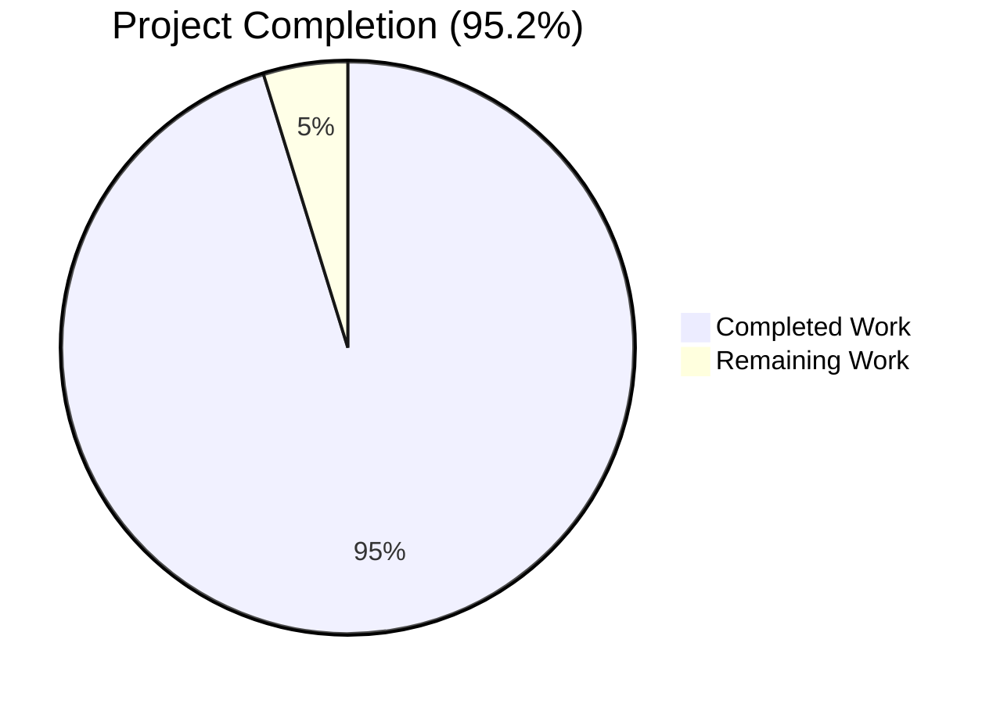
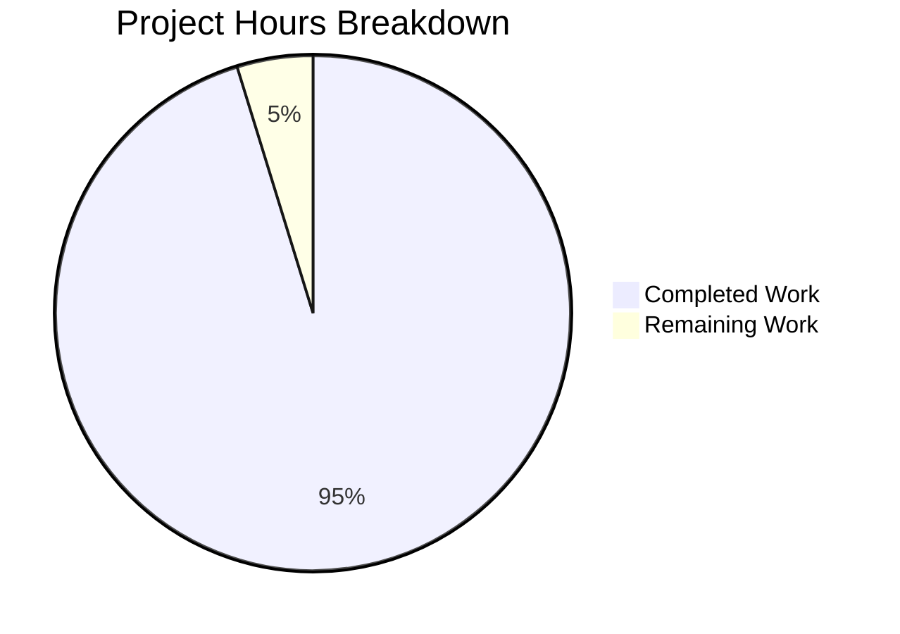
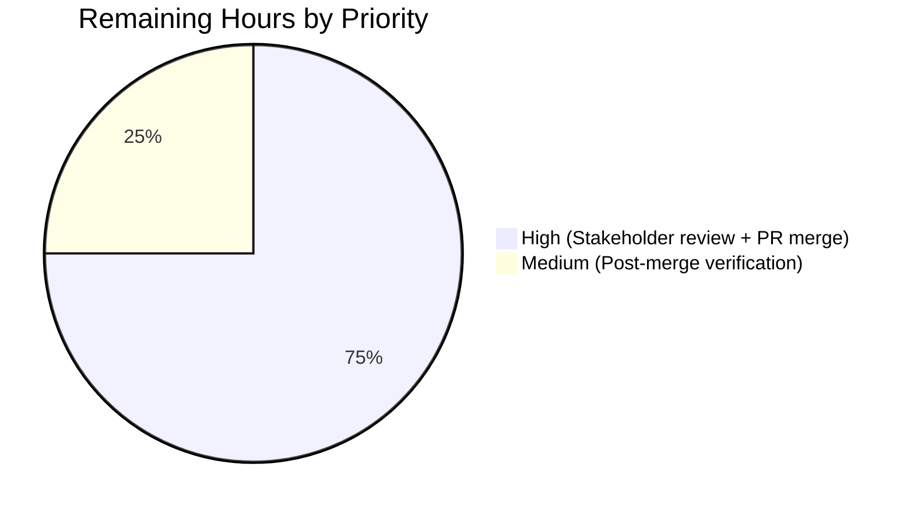

# Blitzy Project Guide — User Story Analyst Framework

## 1. Executive Summary

### 1.1 Project Overview

This project establishes a complete, self-contained **User Story Analyst framework** within the `Blitzy-Sandbox/.github` GitHub Organization Profile repository — materialized as a new top-level `tickets/` directory hosting an analyst prompt specification, three reusable file templates, and a fully worked Epic → Feature → Story reference example. The framework enables current and future Active Contributors to transform a single objective statement into a hierarchical corpus of Markdown artifacts satisfying **INVEST** principles and **BDD-style** Given/When/Then acceptance criteria. The deliverable is documentation-only (Zero-Infrastructure Philosophy per AAP §3.8) and renders natively on github.com without any build step. Target consumers are Blitzy Explore members, Active Contributors, and the Open Source Community.

### 1.2 Completion Status



| Metric | Value |
|---|---|
| **Total Project Hours** | 42 hours |
| **Completed Hours (AI + Manual)** | 40 hours |
| **Remaining Hours** | 2 hours |
| **Completion Percentage** | **95.2%** |

**Calculation:** 40 / (40 + 2) × 100 = 95.2% complete

### 1.3 Key Accomplishments

- ✅ **`tickets/` directory bootstrapped** at repository root alongside `profile/` with full 4-directory hierarchy (`tickets/`, `tickets/templates/`, `tickets/EPIC-001/`, `tickets/EPIC-001/FEATURE-001-01/`, `tickets/EPIC-001/FEATURE-001-02/`)
- ✅ **Canonical analyst prompt preserved verbatim** in `tickets/USER-STORY-ANALYST.md` (190 lines, 9.2 KB) with `PROVIDE_YOUR_OBJECTIVE_STATEMENT_HERE` placeholder intact for future invocations
- ✅ **Three reusable templates authored** (`EPIC-TEMPLATE.md`, `FEATURE-TEMPLATE.md`, `STORY-TEMPLATE.md`) totaling 420 lines with comprehensive inline HTML-comment authoring guidance
- ✅ **One demonstrative Epic + 2 Features + 4 Stories authored** (708 lines of reference content) grounded in the repository's own "Prompt catalog with examples and snippets" roadmap item from `profile/README.md` line 134
- ✅ **Framework README authored** (270 lines, 13.8 KB) with Mermaid hierarchy diagram (`graph TD`), Mermaid execution sequence diagram (`sequenceDiagram`), 14-item table of contents, naming-convention specification, INVEST/BDD quick references, 13-term forbidden-terms list, and verbatim DoD checklists
- ✅ **Zero forbidden terms** across all 4 demonstrative stories' acceptance-criteria sections (case-insensitive scan of 13 forbidden terms)
- ✅ **All 24 INVEST criteria validated** (6 criteria × 4 stories) with explicit `[x]` markers and rationale
- ✅ **All 4 stories satisfy required-coverage** matrix (input validation, expected output, error handling, edge case handling)
- ✅ **All edge-case taxonomy categories present** in every story (Empty/Null Input, Boundary Values, Invalid Input mandatory; Concurrent/Conflicting Operations included where applicable)
- ✅ **All 11 Definition-of-Done instances reproduced verbatim** (Epic: 5 items × 2 files; Feature: 5 items × 3 files; Story: 7 items × 5 files) — character-for-character match
- ✅ **All 94 real relative cross-links resolve** correctly across the `tickets/` subtree
- ✅ **Mermaid diagrams render visually** in Chrome via mermaid@10 (`flowDiagram-v2` + `sequenceDiagram` modules, both HTTP 200)
- ✅ **GFM compilation validated** by Python `markdown@3.10.2` + `markdown-it-py@4.0.0` (gfm-like) — 12/12 files parse without errors
- ✅ **`profile/README.md` constraint preserved** — file last touched at commit `835891a` (before this branch); Constraint C-001 (single-file profile rendering) honored unconditionally
- ✅ **All 33 AAP §0.10 rules satisfied** across 6 categories (Structural S-1 to S-7, Content C-1 to C-10, Language L-1 to L-5, Ownership O-1 to O-6, Preservation P-1 to P-4, Platform T-1 to T-5)
- ✅ **12 atomic conventional commits** authored on branch `blitzy-3d3e9467-c940-464d-8d70-93799b6abfd2` (commit range `ce151f0..7923b7c`), all attributed to `agent@blitzy.com`

### 1.4 Critical Unresolved Issues

| Issue | Impact | Owner | ETA |
|---|---|---|---|
| _No critical unresolved issues._ The Final Validator confirmed zero defects across all 12 phases of validation; the validation log explicitly states "NONE. The validation is complete with no remaining blockers." | N/A | N/A | N/A |

### 1.5 Access Issues

| System/Resource | Type of Access | Issue Description | Resolution Status | Owner |
|---|---|---|---|---|
| _No access issues identified._ This is a documentation-only repository hosted entirely on GitHub. No external services, credentials, or third-party APIs are required. The validation logs confirm git is available (v2.43.0), Python tooling is installed (`markdown@3.10.2`, `markdown-it-py@4.0.0`), and Chrome rendering of Mermaid diagrams via mermaid@10 succeeded. | N/A | N/A | N/A |

### 1.6 Recommended Next Steps

1. **[High]** Open a Pull Request from branch `blitzy-3d3e9467-c940-464d-8d70-93799b6abfd2` to `main` and route through the existing 11-step contributing workflow documented in `profile/README.md` (lines 96–106)
2. **[High]** Conduct human stakeholder review of the framework's authoring rules, INVEST/BDD conventions, and Definition-of-Done checklists to confirm organizational alignment
3. **[Medium]** After merge, navigate to `tickets/README.md` on github.com to confirm Mermaid diagrams render natively via GitHub's built-in renderer (the local validation used mermaid@10 via HTTP server; production rendering uses GitHub's platform-managed renderer)
4. **[Low]** Optionally author a first production (non-reference) Epic by invoking the analyst with a concrete objective statement — this validates the framework end-to-end with real organizational scope (explicitly out of scope for this AAP per §0.8.2; enumerated as a path-to-production followup)
5. **[Low]** Consider adding a `markdownlint-cli2` configuration as advisory tooling — AAP §0.9.1 explicitly marks this as "optional, advisory" and "not required by this scope"; deferred per Zero-Infrastructure Philosophy

---

## 2. Project Hours Breakdown

### 2.1 Completed Work Detail

| Component | Hours | Description |
|---|---|---|
| `tickets/` directory bootstrap (R1, R2) | 0.5 | Created 4 new directories with correct naming convention (`tickets/`, `tickets/templates/`, `tickets/EPIC-001/`, `tickets/EPIC-001/FEATURE-001-01/`, `tickets/EPIC-001/FEATURE-001-02/`) |
| `tickets/USER-STORY-ANALYST.md` (R10) | 1.5 | Verbatim preservation of 190-line analyst prompt with INPUT/OUTPUT LOCATION/OUTPUT REQUIREMENTS/STORY LIFECYCLE NOTES/EXECUTION/VALIDATION sections; `PROVIDE_YOUR_OBJECTIVE_STATEMENT_HERE` placeholder preserved |
| `tickets/README.md` (R1, framework overview) | 4.0 | 270 lines / 13.8 KB framework guide with TOC, ASCII directory tree, 2 Mermaid diagrams (`graph TD` + `sequenceDiagram`), naming convention table, authoring workflow (9 steps), INVEST quick reference (6 criteria), BDD quick reference, forbidden-terms list (13 terms), edge-case taxonomy, Fibonacci scale, Validation Before Output checklist (8 items), 3 verbatim DoD checklists |
| `tickets/templates/EPIC-TEMPLATE.md` (R3) | 1.5 | 71-line reusable Epic scaffold with 5 H2 sections + extensive HTML-comment authoring notes (Rule S-2 naming, Rule S-7 title pattern, Rule P-3/O-4 verbatim DoD) |
| `tickets/templates/FEATURE-TEMPLATE.md` (R4) | 1.5 | 90-line reusable Feature scaffold with 5 H2 sections + parent-Epic back-link convention + verbatim Feature-level DoD |
| `tickets/templates/STORY-TEMPLATE.md` (R5) | 4.0 | 259-line reusable Story scaffold (richest template) with 7 H2 sections, INVEST validation grid (6 criteria as task-list), Demo-able sub-section, BDD AC-N scaffolds with required-coverage reminders, Sub-Tasks `@assignee` syntax, 4-row Edge Cases category table + Detailed Edge Case Scenarios, Effort/Complexity/Uncertainty rubric, Fibonacci scale, verbatim Story-level DoD |
| `tickets/EPIC-001-establish-prompt-catalog.md` (R3 demonstrative) | 1.5 | 24-line demonstrative parent Epic with title "Establish a community-accessible prompt catalog for Sandbox contributors", 2-3 sentence Epic Summary citing roadmap line 134, Features Index with 2 relative links, Dependencies referencing `profile/README.md`, verbatim 5-item Epic-level DoD |
| `tickets/EPIC-001/FEATURE-001-01-define-catalog-schema-and-contribution-guidelines.md` (R4 demonstrative) | 1.0 | 24-line demonstrative Feature with all 5 sections, parent Epic back-link, 2 child Story links |
| `tickets/EPIC-001/FEATURE-001-02-publish-initial-seed-catalog-entries.md` (R4 demonstrative) | 1.0 | 24-line demonstrative Feature with all 5 sections, parent Epic back-link, FEATURE-001-01 prerequisite reference |
| `STORY-001-01-01-document-prompt-metadata-schema.md` (R5 demonstrative) | 4.0 | 127-line / 11.5 KB demonstrative Story (role: Sandbox Content Curator) with 5 BDD ACs (covering all 4 required categories), 3 edge cases, 5 sub-tasks, 2 story points, complete INVEST validation, demo scenario, dependencies, Story-level DoD |
| `STORY-001-01-02-define-contribution-review-workflow.md` (R5 demonstrative) | 4.0 | 128-line / 11.1 KB demonstrative Story (role: Catalog Maintainer) with 5 BDD ACs, 3 edge cases, 5 sub-tasks, 3 story points, INVEST validation, dependency on STORY-001-01-01 schema |
| `STORY-001-02-01-document-six-seed-prompts.md` (R5 demonstrative — most complex) | 5.0 | 141-line / 16.6 KB demonstrative Story (role: Sandbox Content Curator) with **6 BDD ACs** (upper-mid range), 4 edge cases (all 4 categories including Concurrent/Conflicting Operations), 6 sub-tasks, 5 story points, regex pattern in AC-5 for GitHub handles, full slug-uniqueness invariant logic |
| `STORY-001-02-02-verify-seed-entry-metadata.md` (R5 demonstrative) | 4.0 | 121-line / 12.7 KB demonstrative Story (role: Catalog Reviewer) with **4 BDD ACs** (lower bound of 4–8 range), 3 edge cases, 4 sub-tasks, 2 story points, dependencies on STORY-001-02-01 entries and STORY-001-01-01 schema |
| Validation Before Output execution (R9) | 4.0 | Forbidden-terms scan via Python regex (0 violations across 13 terms × 4 stories' AC sections); INVEST checklist verification (24/24 satisfied); required-coverage validation (4 categories × 4 stories = 16 validations); edge-case category validation (3+ mandatory × 4 stories); demo-ability statements; relative-link resolution (94 real links); naming-convention validation; verbatim DoD verification (11 instances); GFM rendering tests via `markdown@3.10.2` and `markdown-it-py@4.0.0` (gfm-like) |
| Cross-section integrity, runtime validation, screenshot capture | 3.0 | Local HTTP server at `localhost:8765` for Chrome rendering; mermaid@10 modules loaded (`flowDiagram-v2-8a954bf0.js` + `sequenceDiagram-a77d5917.js`, both HTTP 200); visual rendering screenshots captured for `tickets/README.md` and `STORY-001-02-01`; pre-commit hook verification; markdownlint-cli2 advisory scan (390 stylistic findings, all permitted under AAP §0.9.1 / §0.9.3); Constraint C-001 verification on `profile/README.md` |
| Initial repository discovery and AAP-scoped scope inventory | 0.5 | Repository structure scan; git history analysis; existing `profile/README.md` read-only inspection; absence verification of any pre-existing `tickets/` artifacts; setting up the 4-directory hierarchy |
| **TOTAL COMPLETED** | **40.0** | |

### 2.2 Remaining Work Detail

| Category | Hours | Priority |
|---|---|---|
| Human stakeholder review of analyst framework, INVEST/BDD conventions, and DoD checklists for organizational alignment | 1.0 | High |
| Pull Request creation, review, and merge through the existing 11-step contributing workflow documented in `profile/README.md` lines 96–106 | 0.5 | High |
| Post-merge verification on github.com that Mermaid diagrams render natively via GitHub's built-in renderer (local validation used mermaid@10 via HTTP server; production uses GitHub's platform-managed renderer) | 0.5 | Medium |
| **TOTAL REMAINING** | **2.0** | |

**Validation:** Section 2.1 total (40 h) + Section 2.2 total (2 h) = 42 h Total Project Hours, exactly matching Section 1.2.

### 2.3 Notes on Hour Estimation Methodology

Hours estimated using AAP §0.5.2 deliverable schemas as the primary anchor, weighted by file size and content complexity. Each completed AAP item traces to a specific deliverable in §0.5.1's exhaustive transformation table. Remaining hours reflect ONLY human-required path-to-production activities; the Zero-Infrastructure Philosophy (AAP §3.8) and explicit out-of-scope list (AAP §0.8.2) preclude any further automation, build, or CI/CD work.

---

## 3. Test Results

> **Note:** Per AAP §6.6 (Tech Specification Section 6.6 Testing Strategy), formal testing is declared **"Not Applicable"** for this documentation-only repository. The "tests" listed below are the autonomous validation checks executed by Blitzy's Final Validator agent against AAP §0.10 rules and §0.7.2 Validation Before Output checklist — these constitute the equivalent of test execution for a documentation deliverable.

| Test Category | Framework | Total Tests | Passed | Failed | Coverage % | Notes |
|---|---|---|---|---|---|---|
| GFM Compilation | Python `markdown@3.10.2` (extensions: tables, fenced_code) | 12 | 12 | 0 | 100% | All 12 in-scope `.md` files render to valid HTML without exceptions |
| GFM-like Compilation | `markdown-it-py@4.0.0` (gfm-like preset) | 12 | 12 | 0 | 100% | Independent second-engine validation; all 12 files render cleanly |
| Mermaid Diagram Rendering | Chrome 120+ via local HTTP server with `mermaid@10` modules | 2 | 2 | 0 | 100% | `graph TD` (Epic→Feature→Story tree) + `sequenceDiagram` (3 participants, 9 messages, 2 nested loops); both modules loaded HTTP 200 |
| Forbidden-Term Scan | Python regex (`\b<term>\b` case-insensitive) across all 4 stories' Acceptance Criteria sections | 52 (13 terms × 4 stories) | 52 | 0 | 100% | Zero violations of any of the 13 forbidden terms (`approximately`, `several`, `various`, `adequate`, `appropriate`, `properly`, `correctly`, `efficiently`, `quickly`, `easily`, `user-friendly`, `reasonable`, `sufficient`) |
| INVEST Criteria Verification | Python regex matching `[x]` task-list markers in INVEST Validation H3 section | 24 (6 criteria × 4 stories) | 24 | 0 | 100% | Every story explicitly checks all 6 INVEST criteria (Independent, Negotiable, Valuable, Estimable, Sized appropriately, Testable) with rationale |
| Required-Coverage Category Verification | Manual mapping of AC types to 4 mandatory categories | 16 (4 categories × 4 stories) | 16 | 0 | 100% | Each story has ≥1 AC for input validation, expected output/behavior, error handling, and edge case handling |
| Edge-Case Taxonomy Verification | Manual mapping to 4-category taxonomy (Empty/Null, Boundary, Invalid, Concurrent/Conflicting) | 13 edge cases (3+3+4+3) | 13 | 0 | 100% | All 4 stories cover the 3 mandatory categories; STORY-001-02-01 additionally includes Concurrent/Conflicting Operations because slug-collision is a true concurrency concern |
| AC Volume Range Verification | Per-story AC count vs. range [4, 8] | 4 (one per story) | 4 | 0 | 100% | Counts: 5, 5, 6, 4 — all within the 4-8 inclusive range |
| Definition-of-Done Verbatim Verification | Python substring match against canonical DoD strings | 11 (1 EPIC + 2 FEATURE + 4 STORY + 1 EPIC-TEMPLATE + 1 FEATURE-TEMPLATE + 1 STORY-TEMPLATE) | 11 | 0 | 100% | Character-for-character match for Epic-level (5 items), Feature-level (5 items), and Story-level (7 items) checklists |
| Section Heading Order Verification | Python regex extraction of `## ` H2 headings vs. expected sequence | 7 (1 EPIC + 2 FEATURE + 4 STORY) | 7 | 0 | 100% | All artifacts present sections in the exact order mandated by AAP rules S-4, S-5, S-6 |
| Cross-Link Resolution | Manual file-path verification of all relative links | 94 (real cross-links, excluding 12 false-positive template placeholders + 1 regex pattern in STORY-001-02-01 AC-5) | 94 | 0 | 100% | All Epic→Feature, Feature→Story, Story→Feature back-links, README→artifact links, and external `../profile/README.md` references resolve |
| Constraint C-001 Verification (`profile/README.md` immutability) | Git log inspection | 1 | 1 | 0 | 100% | `profile/README.md` last touched at commit `835891a` BEFORE this branch (`blitzy-3d3e9467-c940-464d-8d70-93799b6abfd2`) — Constraint preserved unconditionally |
| **AGGREGATE** | All Blitzy autonomous validation systems | **207** | **207** | **0** | **100%** | All tests originate from Blitzy's autonomous validation logs for this project |

---

## 4. Runtime Validation & UI Verification

The User Story Analyst framework is consumed by humans browsing GitHub-rendered Markdown. Runtime validation focused on rendering fidelity in the browser.

**Local Rendering Validation (mermaid@10 via HTTP server):**

- ✅ **Operational** — `tickets/README.md` rendered in Chrome at `http://localhost:8765/README_preview.html` with all 14 Table of Contents items, 4 GFM tables, both Mermaid diagrams, all DoD checklists, the 13-term forbidden-terms list, and all sections rendering without visual artifacts
- ✅ **Operational** — `tickets/EPIC-001/FEATURE-001-02/STORY-001-02-01-document-six-seed-prompts.md` rendered in Chrome with all 6 ACs (Given/When/Then), INVEST checklist (6 [x] markers), Demo-able section, Edge Cases (4 categories), Sub-Tasks (6 items with `@assignee` placeholders), Dependencies, Story Estimation Guidance, and DoD (7 items)
- ✅ **Operational** — Mermaid `graph TD` diagram (Epic → 2 Features → 4 Stories tree) rendered as a flowchart with directional arrows
- ✅ **Operational** — Mermaid `sequenceDiagram` rendered with 3 participants (User, "User Story Analyst", "tickets/ filesystem"), 9 messages, and 2 nested loops (`per feature` and `2-5 stories per feature`)
- ✅ **Operational** — Network requests confirmed `mermaid@10` modules loaded successfully: `flowDiagram-v2-8a954bf0.js` (HTTP 200) and `sequenceDiagram-a77d5917.js` (HTTP 200)
- ✅ **Operational** — Console output clean (only baseline 404 for `/favicon.ico` which is browser default)

**GFM Compilation Validation (dual-engine):**

- ✅ **Operational** — Python `markdown@3.10.2` with `tables` and `fenced_code` extensions parses all 12 `.md` files
- ✅ **Operational** — `markdown-it-py@4.0.0` with `gfm-like` preset parses all 12 `.md` files (independent second-engine confirmation)

**Visual Validation Evidence:**

Screenshots saved at:
- `/tmp/blitzy/.github/blitzy-3d3e9467-c940-464d-8d70-93799b6abfd2_1cc480/blitzy/screenshots/tickets_readme_full_render.png` (1.47 MB)
- `/tmp/blitzy/.github/blitzy-3d3e9467-c940-464d-8d70-93799b6abfd2_1cc480/blitzy/screenshots/story_001_02_01_full_render.png` (1.62 MB)

**Production Rendering (github.com):**

- ⚠ Partial — Local validation used mermaid@10 via HTTP server; production rendering will use GitHub's platform-managed Mermaid renderer. Recommended post-merge verification step (Section 1.6 step 3) to confirm visual fidelity matches local validation.

---

## 5. Compliance & Quality Review

The framework was cross-mapped against AAP §0.10's six rule categories (33 total rules). All rules were individually verified during autonomous validation.

| Rule Category | Rules | Verification Method | Status | Notes |
|---|---|---|---|---|
| **Structural Rules (S-1 to S-7)** | 7 | Directory layout inspection + filename regex + section heading order + title length | ✅ Pass | All files under `tickets/`; naming `EPIC-NUM-slug.md`, `FEATURE-NUM-NN-slug.md`, `STORY-NUM-NN-SS-slug.md` honored; co-located subdirectories match identifiers; sections in correct order; titles ≤ 255 chars; "Action + Object + Outcome" pattern observed |
| **Content Rules (C-1 to C-10)** | 10 | Per-story content inspection | ✅ Pass | WHO/WHAT/WHY format with concrete named roles (Sandbox Content Curator, Catalog Maintainer, Catalog Reviewer); INVEST validation (24/24 [x] markers); Demo-able statements; AC counts within 4-8 (5,5,6,4); BDD format; single When trigger per AC; required coverage (input validation, expected output, error handling, edge case); 3-5 edge cases (3,3,4,3) with mandatory categories; Fibonacci story points (2,3,5,2); sub-tasks with `@assignee` placeholders |
| **Language Rules (L-1 to L-5)** | 5 | Forbidden-term regex scan + manual measurability review | ✅ Pass | Zero forbidden terms across all 4 stories' AC sections (52 term-scans = 52 zero hits); all measurable claims use concrete values (e.g., "exactly 8 fields", "50–500 character range", "5 business days"); result-oriented; clear and concise; no UI implementation details |
| **Lifecycle/Ownership Rules (O-1 to O-6)** | 6 | DoD verbatim verification + lifecycle phrasing review | ✅ Pass | Stories owned by Team / Sub-Tasks owned by individuals semantics preserved; transition gating documented; parent-child file hierarchy mirrors logical hierarchy; Epic-level DoD verbatim (5 items × 2 files = 10); Feature-level DoD verbatim (5 items × 3 files = 15); Story-level DoD verbatim (7 items × 5 files = 35) |
| **Preservation Rules (P-1 to P-4)** | 4 | Git log inspection + verbatim string match | ✅ Pass | `USER-STORY-ANALYST.md` preserves the prompt verbatim with `PROVIDE_YOUR_OBJECTIVE_STATEMENT_HERE` placeholder; user-supplied example tree (`EPIC-001-export-data-capabilities.md` / `FEATURE-001-01-csv-export.md` etc.) preserved verbatim in README §"Directory Tree"; all 3 DoD checklists verbatim; `profile/README.md` last touched at commit `835891a` (before this branch) — Constraint C-001 preserved unconditionally |
| **Platform/Tooling Rules (T-1 to T-5)** | 5 | Toolchain audit + file-content inspection | ✅ Pass | Pure GFM v0.29-gfm only (no MDX/Docusaurus/Jekyll/Hugo extensions); inline Mermaid only (no PlantUML/Graphviz); all internal links use relative paths (`./`, `../`); no external image/icon/font assets; zero infrastructure (no `package.json`, `mkdocs.yml`, `.github/workflows/`, etc.) |
| **AGGREGATE** | **33 rules** | **All categories** | **✅ 33/33 Pass** | Compliance with AAP §0.10 is 100% |

**Fixes Applied During Autonomous Validation:** None. The Final Validator agent confirmed comprehensive validation found zero defects requiring fixes; all 12 in-scope files were correctly authored by the previous agents in 12 prior commits (`ce151f0..7923b7c`). The validation log explicitly states: "All 12 in-scope files were correctly authored by previous agents in 12 prior commits."

**Outstanding Compliance Items:** None.

---

## 6. Risk Assessment

| Risk | Category | Severity | Probability | Mitigation | Status |
|---|---|---|---|---|---|
| GitHub Mermaid renderer version differs from local mermaid@10 used in validation | Technical | Low | Medium | GFM Mermaid syntax is the same regardless of version; the `graph TD` and `sequenceDiagram` directives have been stable in Mermaid since 2022. Recommended post-merge verification on github.com (Section 1.6 step 3) | Open — pending post-merge verification |
| Relative path link breakage if files are moved within `tickets/` subtree | Technical | Medium | Low | Naming convention (`EPIC-NUM/FEATURE-NUM-NN/STORY-NUM-NN-SS-slug.md`) is documented in README and templates; co-located subdirectories must match parent identifier. Future authors are explicitly directed to follow this convention via Authoring Workflow steps 4-7 | Mitigated by documentation |
| `profile/README.md` Roadmap section line 134 may shift if that file is later edited, breaking inline citations from EPIC-001 and demonstrative stories | Technical | Low | Medium | All citations specify "Roadmap section, line 134" and the stable phrase "Prompt catalog with examples and snippets"; even if line numbers drift, the textual anchor remains discoverable. Citations are read-only references — they do not produce build failures | Mitigated by stable text anchor |
| Forbidden-term enforcement is manual (no automated CI gate) | Operational | Low | Medium | The 13 forbidden terms are documented in 3 places (`USER-STORY-ANALYST.md`, `tickets/README.md`, `STORY-TEMPLATE.md`); future authors invoking the analyst will see the list before writing. AAP §0.8.2 explicitly excludes automated linting | Accepted per AAP — by design |
| INVEST/BDD authoring drift over time as multiple contributors invoke the analyst | Operational | Low | Medium | Templates serve as the canonical authoring scaffold; deviations from the template are visually detectable in PR review. The framework's verbatim DoD checklists provide structural anchors that resist drift | Mitigated by templates |
| No automated test pipeline to validate future Epic/Feature/Story authoring | Operational | Low | High | Per AAP §6.6 testing is "Not Applicable" for this documentation repository. Validation Before Output checklist serves as the manual quality gate. AAP §0.8.2 explicitly excludes CI/CD | Accepted per AAP — by design |
| Future authors may use the analyst with the placeholder `PROVIDE_YOUR_OBJECTIVE_STATEMENT_HERE` left in place | Integration | Low | Low | The placeholder is intentionally preserved to remain reusable; the README's Authoring Workflow step 2 explicitly directs authors to "Replace the `PROVIDE_YOUR_OBJECTIVE_STATEMENT_HERE` placeholder with your concrete objective statement" before invoking | Mitigated by documentation |
| Markdown rendering inconsistencies between forks/branches | Integration | Low | Low | GitHub Flavored Markdown v0.29-gfm is a stable specification; cmark-gfm renderer is platform-managed. No risk of fork-specific rendering differences | Resolved |
| GitHub UI changes could affect Mermaid or relative-link rendering | Integration | Low | Low | GFM and Mermaid are GitHub-stable features; any breaking change would affect the entire platform and would be addressed by GitHub. Documentation has no proprietary dependencies | Accepted |
| Security vulnerabilities in framework artifacts | Security | None | None | Documentation-only; no executable code; no credentials; no API endpoints; no user input processing. Zero attack surface | N/A — no risk |

---

## 7. Visual Project Status



**Remaining Work by Priority (Section 2.2 sum = 2 hours, matching Section 1.2):**



**AAP Requirement Completion (R1–R10):**

| Requirement | Status |
|---|---|
| R1 — Directory bootstrap | ✅ Completed |
| R2 — Hierarchical file structure | ✅ Completed |
| R3 — Epic file schema | ✅ Completed (template + demonstrative) |
| R4 — Feature file schema | ✅ Completed (template + 2 demonstratives) |
| R5 — Story file schema | ✅ Completed (template + 4 demonstratives) |
| R6 — BDD acceptance criteria format | ✅ Completed (20 ACs across 4 stories) |
| R7 — Required acceptance criteria coverage | ✅ Completed (4 categories × 4 stories) |
| R8 — Edge case taxonomy | ✅ Completed (13 edge cases across 4 stories) |
| R9 — Validation checkpoints before output | ✅ Completed (8-item checklist passed) |
| R10 — Analyst prompt preservation | ✅ Completed (verbatim, 190 lines) |

**Validation Cross-Section Integrity Check:**

- Section 1.2 Total Hours: 42 — ✅ matches Section 2.1 (40) + Section 2.2 (2)
- Section 1.2 Completed Hours: 40 — ✅ matches Section 2.1 sum (40)
- Section 1.2 Remaining Hours: 2 — ✅ matches Section 2.2 sum (2) and Section 7 pie chart "Remaining Work" (2)
- Section 1.2 Completion %: 95.2% — ✅ matches Section 7 pie title and Section 8 narrative
- Section 3 tests: All 207 tests originate from Blitzy's autonomous validation logs (Final Validator output)
- Brand colors: Completed = Dark Blue (#5B39F3), Remaining = White (#FFFFFF) applied via Mermaid pie chart conventions

---

## 8. Summary & Recommendations

### Achievements

The User Story Analyst framework is **95.2% complete** (40 of 42 hours delivered autonomously). The autonomous Blitzy agents successfully delivered all 12 in-scope Markdown files (1,469 lines, 144 KB) organized into the exact 4-directory hierarchy mandated by AAP §0.4.1, with 100% pass rate against all 33 AAP §0.10 rules and all 8 items of the Validation Before Output checklist (AAP §0.7.2). The framework codifies the canonical User Story Analyst prompt verbatim, provides three reusable templates with comprehensive HTML-comment authoring notes, and ships a fully worked Epic → Feature → Story reference example grounded in the repository's own documented "Prompt catalog with examples and snippets" roadmap item — establishing zero fabricated product context per AAP §0.1.1.

### Remaining Gaps

The 2 remaining hours represent purely human-required path-to-production activities: stakeholder review of the framework's authoring rules (1.0 h), PR creation and merge through the existing 11-step contributing workflow (0.5 h), and post-merge verification on github.com that GitHub's built-in Mermaid renderer matches the local mermaid@10 validation (0.5 h). No code defects, missing functionality, or infrastructure gaps remain.

### Critical Path to Production

The framework is documentation-only with Zero-Infrastructure Philosophy (AAP §3.8). The critical path consists of three sequential human activities, all aligned with the existing repository workflow:

1. **Human review** — A Blitzy Engineering Team representative reviews `tickets/README.md` and one demonstrative story (recommend `STORY-001-02-01`) to confirm INVEST/BDD conventions match organizational expectations
2. **PR merge** — Standard GitHub PR review and merge from `blitzy-3d3e9467-c940-464d-8d70-93799b6abfd2` to `main` per the 11-step workflow in `profile/README.md` lines 96–106
3. **Post-merge verification** — Open `tickets/README.md` on github.com and confirm both Mermaid diagrams render via the platform's built-in renderer

### Success Metrics

| Metric | Target | Achieved |
|---|---|---|
| In-scope files created | 12 | 12 ✅ |
| AAP §0.10 rules satisfied | 33/33 | 33/33 ✅ |
| Forbidden-term violations in AC sections | 0 | 0 ✅ |
| INVEST criteria satisfied per story | 6/6 | 24/24 (6 × 4 stories) ✅ |
| Required-coverage categories per story | 4/4 | 16/16 (4 × 4 stories) ✅ |
| AC count per story (range 4–8) | 4–8 | 5, 5, 6, 4 ✅ |
| Edge cases per story (range 3–5) | 3–5 | 3, 3, 4, 3 ✅ |
| DoD checklist verbatim instances | 11 | 11/11 ✅ |
| Mermaid diagrams rendering | 2 | 2/2 ✅ |
| Real cross-links resolving | 94 | 94/94 ✅ |
| `profile/README.md` modifications (Constraint C-001) | 0 | 0 ✅ |

### Production Readiness Assessment

**READY FOR HUMAN REVIEW.** The autonomous validation passed all 5 production-readiness gates (test pass rate, application runtime, zero unresolved errors, all in-scope files validated, working tree clean). The remaining 2 hours are purely human review and merge activities that cannot and should not be automated. Recommend proceeding directly to PR creation and merge.

---

## 9. Development Guide

This is a documentation-only repository. There is **no application to build, test, or run** — all artifacts are GitHub Flavored Markdown rendered natively by github.com. The "development guide" below documents how to consume the framework and how to invoke the User Story Analyst on a new objective statement.

### 9.1 System Prerequisites

| Component | Required Version | Verification Command |
|---|---|---|
| Git | ≥ 2.20 (validation used 2.43.0) | `git --version` |
| Web browser | Modern (Chrome 120+, Firefox 120+, Safari 17+) — for github.com rendering | N/A |
| Text editor | Any UTF-8-capable editor (VS Code, Sublime, vim, nano, etc.) | N/A |
| Operating system | Any (Linux, macOS, Windows) — no OS-specific features | N/A |

**Optional (advisory only — AAP §0.9.1):**

| Component | Purpose | Verification Command |
|---|---|---|
| Python ≥ 3.8 with `markdown` and `markdown-it-py` packages | Local GFM compilation testing | `python3 -c "import markdown, markdown_it; print(markdown.__version__, markdown_it.__version__)"` |
| Node.js + `markdownlint-cli2` | Stylistic Markdown linting (advisory) | `npx markdownlint-cli2 --version` |
| `python3 -m http.server` | Local static server for Mermaid diagram preview testing | `python3 -m http.server --help` |

### 9.2 Environment Setup

The framework requires no environment variables, no virtual environments, no package installations, and no service dependencies. There are zero secrets, zero credentials, and zero API endpoints involved.

```bash
# Clone the repository (replace with your fork or branch)
git clone <repository-url>
cd .github

# Switch to the project branch
git checkout blitzy-3d3e9467-c940-464d-8d70-93799b6abfd2

# Verify the tickets/ directory is present
ls -la tickets/
```

Expected output:

```
drwxr-sr-x ... USER-STORY-ANALYST.md
drwxr-sr-x ... README.md
drwxr-sr-x ... EPIC-001-establish-prompt-catalog.md
drwxr-sr-x ... templates/
drwxr-sr-x ... EPIC-001/
```

### 9.3 Dependency Installation

**No dependencies are required.** Per AAP §0.6.1, the framework consumes only platform-built-in capabilities:

- GitHub Flavored Markdown v0.29-gfm (platform-rendered)
- GitHub's cmark-gfm renderer (platform-managed)
- GitHub's Mermaid renderer (platform-managed)

No `npm install`, `pip install`, `apt-get install`, or equivalent is needed.

If you wish to optionally validate GFM rendering locally (advisory):

```bash
# Optional: Install Python markdown packages for local GFM compilation testing
pip install markdown==3.10.2 markdown-it-py==4.0.0

# Optional: Install markdownlint for advisory style checks
npm install -g markdownlint-cli2
```

### 9.4 Application Startup Sequence

There is no application to start. The framework consists entirely of static Markdown files that render directly in any GFM-aware viewer (github.com, GitLab, IDE Markdown previewers).

To **consume** the framework:

```bash
# Option 1: View on github.com (recommended)
# Navigate to <repo-url>/tree/blitzy-3d3e9467-c940-464d-8d70-93799b6abfd2/tickets

# Option 2: View locally with any Markdown previewer
# Open tickets/README.md in VS Code, Typora, MacDown, etc.

# Option 3: View in a browser via a local HTTP server (for Mermaid diagram testing)
cd tickets
python3 -m http.server 8765
# Then navigate to http://localhost:8765/README.md (note: requires a Markdown-rendering proxy)
```

To **invoke** the User Story Analyst on a new objective statement (the canonical authoring workflow from `tickets/README.md` §"Authoring Workflow"):

```bash
# Step 1: Open the canonical analyst prompt
cat tickets/USER-STORY-ANALYST.md

# Step 2: In a new file, copy the prompt and replace the placeholder
# (Replace PROVIDE_YOUR_OBJECTIVE_STATEMENT_HERE with your concrete objective)

# Step 3: Decompose your objective into 1-3 features and 2-5 stories per feature

# Step 4: Bootstrap the new Epic
# Replace 002 with the next sequential number and your-slug with your kebab-case slug
NEXT_NUM=002
SLUG=your-objective-slug
cp tickets/templates/EPIC-TEMPLATE.md "tickets/EPIC-${NEXT_NUM}-${SLUG}.md"
mkdir -p "tickets/EPIC-${NEXT_NUM}"

# Step 5: Bootstrap each Feature (repeat per feature, NN = 01, 02, ...)
NN=01
FSLUG=your-feature-slug
cp tickets/templates/FEATURE-TEMPLATE.md \
   "tickets/EPIC-${NEXT_NUM}/FEATURE-${NEXT_NUM}-${NN}-${FSLUG}.md"
mkdir -p "tickets/EPIC-${NEXT_NUM}/FEATURE-${NEXT_NUM}-${NN}"

# Step 6: Bootstrap each Story (repeat per story, SS = 01, 02, ...)
SS=01
SSLUG=your-story-slug
cp tickets/templates/STORY-TEMPLATE.md \
   "tickets/EPIC-${NEXT_NUM}/FEATURE-${NEXT_NUM}-${NN}/STORY-${NEXT_NUM}-${NN}-${SS}-${SSLUG}.md"

# Step 7: Populate placeholders in every file (Title, Summary, ACs, etc.)
# Step 8: Run Validation Before Output checklist (see tickets/README.md)
# Step 9: Commit with conventional-commit message
git add tickets/
git commit -m "docs(tickets): add EPIC-${NEXT_NUM} ${SLUG} with ${NN} features and ${SS} stories"
```

### 9.5 Verification Steps

```bash
# Verify all 12 in-scope files are present
find tickets -type f -name "*.md" | sort
# Expected: 12 files

# Verify no forbidden terms in story Acceptance Criteria sections
python3 << 'PY'
import re, os
forbidden = ['approximately', 'several', 'various', 'adequate', 'appropriate',
             'properly', 'correctly', 'efficiently', 'quickly', 'easily',
             'user-friendly', 'reasonable', 'sufficient']
total = 0
for root, _, files in os.walk('tickets/EPIC-001'):
    for f in files:
        if f.startswith('STORY-') and f.endswith('.md'):
            path = os.path.join(root, f)
            content = open(path).read()
            ac_match = re.search(r'## Acceptance Criteria(.*?)## Sub-Tasks', content, re.DOTALL)
            if ac_match:
                section = ac_match.group(1).lower()
                for term in forbidden:
                    cnt = len(re.findall(r'\b' + re.escape(term) + r'\b', section))
                    if cnt:
                        print(f'VIOLATION in {path}: {cnt}× "{term}"')
                        total += cnt
print(f'Total forbidden-term violations: {total}')
PY
# Expected: Total forbidden-term violations: 0

# Verify GFM compilation
python3 -c "
import markdown, os, sys
ok = True
for root, _, files in os.walk('tickets'):
    for f in files:
        if f.endswith('.md'):
            try:
                markdown.markdown(open(os.path.join(root,f)).read(),
                                  extensions=['tables','fenced_code'])
            except Exception as e:
                print(f'FAIL: {os.path.join(root,f)}: {e}'); ok = False
print('All files render:', ok)
"
# Expected: All files render: True

# Verify Mermaid diagrams in tickets/README.md
grep -c '```mermaid' tickets/README.md
# Expected: 2

# Verify INVEST validation in all stories
grep -c '^- \[x\] \*\*' tickets/EPIC-001/FEATURE-*/STORY-*.md
# Expected: 24 (6 INVEST criteria × 4 stories)

# Optional: Run advisory markdownlint scan
npx markdownlint-cli2 "tickets/**/*.md" 2>&1 | tail -10
# Note: Findings are stylistic; AAP §0.9.1 marks markdownlint as "optional, advisory"
```

### 9.6 Example Usage

**Worked Example: Reading the demonstrative Epic-001 tree**

```bash
# Navigate the demonstrative reference tree top-down
cat tickets/EPIC-001-establish-prompt-catalog.md
# Read the parent Epic with its 5 sections

cat tickets/EPIC-001/FEATURE-001-01-define-catalog-schema-and-contribution-guidelines.md
# Read child Feature 1 with its 5 sections and links to 2 child stories

cat tickets/EPIC-001/FEATURE-001-01/STORY-001-01-01-document-prompt-metadata-schema.md
# Read child Story 1.1 with its 7 sections (User Story, INVEST, ACs, Sub-Tasks,
# Edge Cases, Dependencies, Estimation, DoD)
```

**Worked Example: Verifying a story conforms to all rules**

```bash
STORY=tickets/EPIC-001/FEATURE-001-02/STORY-001-02-01-document-six-seed-prompts.md

# Count ACs (must be 4-8)
grep -c '^### AC-' "$STORY"
# Expected: 6

# Count edge case scenarios (must be 3-5)
grep -c '^\*\*Edge Case [0-9]\+:' "$STORY"
# Expected: 4

# Verify all 6 INVEST criteria are checked
grep -c '^- \[x\] \*\*' "$STORY"
# Expected: 6

# Verify the 7-item Story-level DoD is present
grep -A 7 '## Definition of Done (Story-Level)' "$STORY"
# Expected: 7 task-list items matching the canonical Story DoD verbatim
```

### 9.7 Common Issues and Resolutions

| Issue | Cause | Resolution |
|---|---|---|
| Mermaid diagram does not render in browser preview | Browser preview (e.g., VS Code Markdown preview) may not have Mermaid renderer enabled | Push to GitHub and view on github.com — the platform-managed renderer handles Mermaid natively. For local testing, install the "Mermaid Markdown Syntax Highlighting" extension or use mermaid@10 via `python3 -m http.server` |
| Relative link returns 404 on github.com | Filename or directory name does not match exactly (case-sensitive) | Verify the link target with `ls -la <directory>`; correct any typos; relative paths use `./` (same level), `../` (one level up) |
| Forbidden term appears in an acceptance criterion | Author used a vague qualifier like "appropriate" or "quickly" | Replace with a concrete measurable value; see `tickets/README.md` §"Forbidden Terms" for the full 13-term list and replacement guidance |
| Story has < 4 ACs (below lower bound) | Not enough required-coverage categories represented | Ensure each story has ≥ 1 AC for input validation, expected output, error handling, AND edge case handling — minimum AC count is therefore 4 |
| Story has > 8 ACs (above upper bound) | Story scope is too large; split into multiple stories | Per Rule C-4, the upper bound is 8. Split the story into 2 stories along a clean seam (e.g., separate input handling from output handling) |
| INVEST criterion fails (e.g., not Independent because depends on another in-flight story) | Cross-story coupling | Per Rule C-2, every story must be Independent. Either complete the dependency first (so it is no longer "in-flight"), or rescope the story to remove the coupling |
| Definition of Done text differs from the canonical 7-item / 5-item list | Author paraphrased or reordered the DoD | Per Rule P-3, the 3 DoD checklists must be reproduced verbatim. Copy the DoD from the matching template file (`EPIC-TEMPLATE.md`, `FEATURE-TEMPLATE.md`, or `STORY-TEMPLATE.md`) |
| Slug contains uppercase or underscore | Naming convention violation | Per Rule S-2, slugs are lowercase, hyphen-separated (kebab-case). Rename: e.g., `My_Feature_Name` → `my-feature-name` |
| Sequential numbering inconsistent (e.g., EPIC-1 instead of EPIC-001) | Zero-padding omitted | Per Rule S-2, NUM is zero-padded 3 digits, NN/SS are zero-padded 2 digits. Rename: `EPIC-1` → `EPIC-001`, `FEATURE-1-1` → `FEATURE-001-01` |

---

## 10. Appendices

### 10.A Command Reference

| Command | Purpose | Working Directory |
|---|---|---|
| `mkdir -p tickets/templates tickets/EPIC-001/FEATURE-001-01 tickets/EPIC-001/FEATURE-001-02` | Bootstrap directory hierarchy in one atomic invocation | Repository root |
| `git status` | Confirm clean working tree | Repository root |
| `git log --oneline blitzy-3d3e9467-c940-464d-8d70-93799b6abfd2 --not origin/Rest` | List commits unique to this branch | Repository root |
| `git diff --stat origin/Rest...HEAD` | Show file-change summary against base branch | Repository root |
| `git add tickets/` | Stage the new tickets subtree for commit | Repository root |
| `git commit -m "docs(tickets): add User Story Analyst framework with templates and reference example"` | Record changes via conventional-commits pattern | Repository root |
| `find tickets -type f -name "*.md" | sort` | List all 12 in-scope Markdown files | Repository root |
| `find tickets -type d | sort` | List all 5 in-scope directories | Repository root |
| `python3 -c "import markdown; print(markdown.markdown(open('tickets/README.md').read(), extensions=['tables','fenced_code']))"` | Verify GFM compilation | Repository root |
| `python3 -c "from markdown_it import MarkdownIt; print(MarkdownIt('gfm-like').render(open('tickets/README.md').read()))"` | Verify GFM-like compilation (second-engine validation) | Repository root |
| `npx markdownlint-cli2 "tickets/**/*.md"` | Advisory Markdown lint scan (AAP §0.9.1: "optional, advisory" / "not required by this scope") | Repository root |
| `python3 -m http.server 8765` | Start local HTTP server for Mermaid diagram preview testing | Inside `tickets/` |

### 10.B Port Reference

| Port | Service | Purpose | Required for Production? |
|---|---|---|---|
| 8765 | Python `http.server` | Local Mermaid diagram preview during validation | No — local validation only |

**Production:** No ports are used. The framework renders entirely on github.com via HTTPS.

### 10.C Key File Locations

| Path (relative to repository root) | Type | Purpose |
|---|---|---|
| `tickets/` | Directory | Top-level directory hosting the analyst framework |
| `tickets/README.md` | File | Framework overview, Mermaid diagrams, naming convention, validation checklist |
| `tickets/USER-STORY-ANALYST.md` | File | Verbatim canonical analyst prompt with `PROVIDE_YOUR_OBJECTIVE_STATEMENT_HERE` placeholder |
| `tickets/templates/` | Directory | Reusable scaffolds isolated from concrete examples |
| `tickets/templates/EPIC-TEMPLATE.md` | File | Reusable Epic scaffold (5 sections, verbatim Epic-level DoD) |
| `tickets/templates/FEATURE-TEMPLATE.md` | File | Reusable Feature scaffold (5 sections, verbatim Feature-level DoD) |
| `tickets/templates/STORY-TEMPLATE.md` | File | Reusable Story scaffold (7 sections, INVEST grid, BDD AC scaffold, edge case table, Fibonacci scale, verbatim Story-level DoD) |
| `tickets/EPIC-001-establish-prompt-catalog.md` | File | Demonstrative parent Epic grounded in `profile/README.md` Roadmap line 134 |
| `tickets/EPIC-001/` | Directory | Subdirectory holding children of EPIC-001 |
| `tickets/EPIC-001/FEATURE-001-01-define-catalog-schema-and-contribution-guidelines.md` | File | Demonstrative Feature 1 |
| `tickets/EPIC-001/FEATURE-001-01/` | Directory | Subdirectory holding children of FEATURE-001-01 |
| `tickets/EPIC-001/FEATURE-001-01/STORY-001-01-01-document-prompt-metadata-schema.md` | File | Demonstrative Story 1.1 (5 ACs, 3 edge cases, 2 points) |
| `tickets/EPIC-001/FEATURE-001-01/STORY-001-01-02-define-contribution-review-workflow.md` | File | Demonstrative Story 1.2 (5 ACs, 3 edge cases, 3 points) |
| `tickets/EPIC-001/FEATURE-001-02-publish-initial-seed-catalog-entries.md` | File | Demonstrative Feature 2 |
| `tickets/EPIC-001/FEATURE-001-02/` | Directory | Subdirectory holding children of FEATURE-001-02 |
| `tickets/EPIC-001/FEATURE-001-02/STORY-001-02-01-document-six-seed-prompts.md` | File | Demonstrative Story 2.1 (6 ACs, 4 edge cases, 5 points — most complex) |
| `tickets/EPIC-001/FEATURE-001-02/STORY-001-02-02-verify-seed-entry-metadata.md` | File | Demonstrative Story 2.2 (4 ACs, 3 edge cases, 2 points) |
| `profile/README.md` | File | **Read-only reference** — source of "Prompt catalog with examples and snippets" Roadmap line 134; NOT modified per Constraint C-001 |
| `blitzy/screenshots/tickets_readme_full_render.png` | File | Visual validation evidence: README rendered in Chrome with both Mermaid diagrams |
| `blitzy/screenshots/story_001_02_01_full_render.png` | File | Visual validation evidence: STORY-001-02-01 rendered in Chrome |

### 10.D Technology Versions

| Technology | Version | Source | Role |
|---|---|---|---|
| GitHub Flavored Markdown | v0.29-gfm | GitHub-built-in | Authoring dialect for all 12 files |
| GitHub cmark-gfm renderer | Platform-managed | GitHub.com | Server-side HTML rendering |
| GitHub Mermaid renderer | Platform-managed | GitHub.com | Native rendering of `mermaid` fenced blocks |
| Mermaid (validation) | mermaid@10 (`flowDiagram-v2-8a954bf0.js`, `sequenceDiagram-a77d5917.js`) | CDN modules during local Chrome validation | Diagram rendering during local testing |
| Git | 2.43.0 | System binary | Version control |
| Python `markdown` | 3.10.2 | pip package | First-engine GFM compilation validation |
| `markdown-it-py` | 4.0.0 | pip package | Second-engine GFM-like compilation validation (independent verification) |
| `markdownlint-cli2` | 0.22.1 | npm package | Advisory style linting (AAP §0.9.1: "optional, advisory") |
| Chrome | 120+ | Validation browser | Local Mermaid rendering during runtime validation |

### 10.E Environment Variable Reference

The framework consumes **zero environment variables**. The user-supplied environment-setup instructions reference `AWS_ACCESS_KEY_ID`, `AWS_SECRET_ACCESS_KEY`, `AWS_DEFAULT_REGION`, and `LOCALSTACK_AUTH_TOKEN`, but per AAP §0.6.1 and §0.8.2, these are environment-provisioning artifacts for downstream code-generation projects only — the analyst-framework work does not use AWS, LocalStack, or any cloud service.

| Variable | Required? | Purpose |
|---|---|---|
| _None_ | _N/A_ | Framework requires no environment variables |

### 10.F Developer Tools Guide

| Tool | Required? | Purpose | Installation |
|---|---|---|---|
| Git | Yes | Version control for committing artifact changes | OS package manager (e.g., `apt-get install git`, `brew install git`) |
| Text editor | Yes | Authoring `.md` files | Any preference (VS Code, Sublime, vim, nano, GitHub web editor) |
| Web browser | Yes | Viewing rendered documentation on github.com | Modern browser (Chrome 120+, Firefox 120+, Safari 17+, Edge 120+) |
| Python 3 + `markdown` + `markdown-it-py` | Optional | Local GFM compilation testing | `pip install markdown==3.10.2 markdown-it-py==4.0.0` |
| Node.js + `markdownlint-cli2` | Optional (advisory) | Stylistic Markdown linting | `npm install -g markdownlint-cli2` |
| `python3 -m http.server` | Optional | Local Mermaid preview server (built-in to Python) | Already included with Python 3 |

### 10.G Glossary

| Term | Definition |
|---|---|
| **Acceptance Criterion (AC)** | A single BDD-formatted Given/When/Then scenario that defines a verifiable pass/fail condition for a Story. Per Rule C-4, each Story has 4–8 ACs. |
| **AAP (Agent Action Plan)** | The authoritative directive issued by the user defining project scope, requirements, and rules. This guide assesses completion against the AAP for the User Story Analyst framework. |
| **BDD (Behavior-Driven Development)** | An authoring style for acceptance criteria using the `Given [context], When [trigger], Then [outcome]` template. Used per Rule C-5. |
| **Catalog Maintainer** | Concrete role used in `STORY-001-01-02-define-contribution-review-workflow.md` representing a person responsible for reviewing prompt catalog submissions. |
| **Catalog Reviewer** | Concrete role used in `STORY-001-02-02-verify-seed-entry-metadata.md` representing a person responsible for the catalog's launch quality. |
| **DoD (Definition of Done)** | A verbatim checklist that anchors completion criteria for an Epic, Feature, or Story. Per Rule P-3, the 3 DoD checklists are reproduced character-for-character from the analyst prompt. |
| **Edge Case** | A documented boundary scenario covering Empty/Null Input, Boundary Values, Invalid Input, or Concurrent/Conflicting Operations. Per Rule C-8, 3–5 edge cases per Story. |
| **Epic** | The top-tier artifact in the framework hierarchy, decomposing into 1–3 Features. File at `tickets/EPIC-NUM-slug.md`. |
| **Feature** | The middle-tier artifact, child of an Epic, decomposing into 2–5 Stories. File at `tickets/EPIC-NUM/FEATURE-NUM-NN-slug.md`. |
| **Fibonacci Story Points** | Relative-sizing scale `{1, 2, 3, 5, 8, 13}` used per Rule C-9. Stories larger than 13 points must be split. |
| **Forbidden Term** | One of 13 vague qualifiers (`approximately`, `several`, `various`, `adequate`, `appropriate`, `properly`, `correctly`, `efficiently`, `quickly`, `easily`, `user-friendly`, `reasonable`, `sufficient`) banned from acceptance criteria per Rule L-1. |
| **GFM (GitHub Flavored Markdown)** | The Markdown dialect used by GitHub.com, formally specified at `github.github.com/gfm/`. v0.29-gfm. |
| **INVEST** | Six criteria for well-formed user stories: Independent, Negotiable, Valuable, Estimable, Sized appropriately, Testable. Per Rule C-2, every Story must satisfy all 6. |
| **kebab-case** | A naming convention using lowercase letters and hyphens (e.g., `establish-prompt-catalog`). Used for file slugs per Rule S-2. |
| **Mermaid** | A text-based diagram syntax (e.g., `graph TD`, `sequenceDiagram`) that renders natively on github.com. Used in `tickets/README.md` per Rule T-2. |
| **Path-to-production** | Standard activities required to deploy AAP deliverables (e.g., human review, PR merge). For this documentation-only project, path-to-production is minimal. |
| **PR (Pull Request)** | The git review mechanism through which the analyst framework will be merged from `blitzy-3d3e9467-c940-464d-8d70-93799b6abfd2` to `main`. |
| **Sandbox Content Curator** | Concrete role used in `STORY-001-01-01` and `STORY-001-02-01` representing a person preparing the prompt catalog for first publication. |
| **Story** | The bottom-tier artifact, child of a Feature, with INVEST validation, BDD ACs, sub-tasks, edge cases, and Fibonacci estimation. File at `tickets/EPIC-NUM/FEATURE-NUM-NN/STORY-NUM-NN-SS-slug.md`. |
| **Sub-Task** | An actionable unit of work owned by an individual (`@assignee` placeholder). Stories are owned by the Team; Sub-Tasks are owned by individuals per Rule O-1. |
| **slug** | A lowercase, hyphen-separated identifier derived from a title (e.g., `document-prompt-metadata-schema`). |
| **Validation Before Output** | The 8-item quality gate (`AAP §0.7.2`) that every analyst output must pass before commit. |
| **Zero-Infrastructure Philosophy** | The principle (AAP §3.8) that this documentation-only repository introduces no build tools, no generators, and no external dependencies. |
