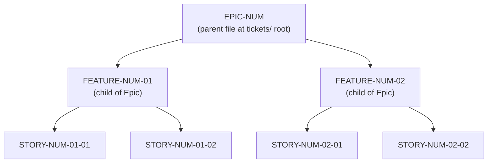
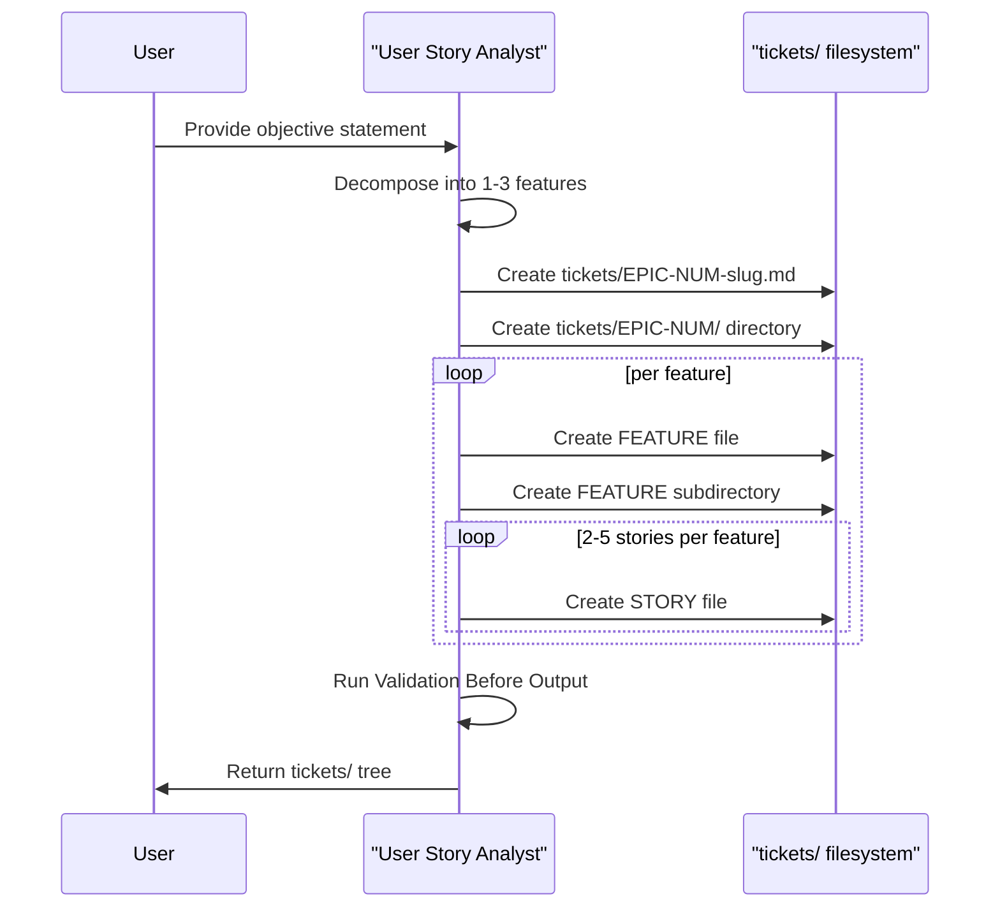

# Technical Specification

# 0. Agent Action Plan

## 0.1 Intent Clarification

### 0.1.1 Core Documentation Objective

Based on the provided requirements, the Blitzy platform understands that the documentation objective is to establish a complete, self-contained User Story Analyst framework within the `Blitzy-Sandbox/.github` repository — materialized as a new `tickets/` directory at the repository root that hosts the analyst prompt specification, reusable file templates, and a concrete worked example — so that any current or future human contributor can transform a single objective statement into a hierarchical corpus of Epic → Feature → Story Markdown artifacts that satisfy INVEST principles and BDD-style Given/When/Then acceptance criteria without interpretive ambiguity.

- **Request Category:** Create new documentation (no existing `tickets/` directory, no User Story Analyst artifacts, no Epic/Feature/Story templates exist in the repository).
- **Documentation Type:** A composite of (1) a process specification that codifies the User Story Analyst methodology, (2) authoring templates that enforce structural consistency, and (3) a reference implementation that demonstrates correct output.
- **Primary Deliverable Surface:** A new top-level folder `tickets/` containing a README, the verbatim analyst prompt, three reusable templates, and one end-to-end example Epic with child Feature and Story files conforming to the mandated `EPIC-NUM-slug.md`, `EPIC-NUM/FEATURE-NUM-NN-slug.md`, and `EPIC-NUM/FEATURE-NUM-NN/STORY-NUM-NN-SS-slug.md` nesting pattern.

Critical objective-statement ambiguity has been surfaced and must be resolved by downstream agents before any production (non-reference) tickets are authored: the user-supplied template contains the literal placeholder `PROVIDE_YOUR_OBJECTIVE_STATEMENT_HERE` in the Objective Statement field. Because an unresolved placeholder cannot be decomposed into a meaningful Epic, the Blitzy platform resolves this ambiguity by (a) preserving the placeholder verbatim in the archived prompt specification for future invocations and (b) grounding the single reference example in an objective statement derived directly from the repository's own documented roadmap in `profile/README.md` (the "Prompt catalog with examples and snippets" roadmap item) so that the demonstration remains faithful to the repository's actual state and introduces no fabricated product context.

### 0.1.2 Enumerated Documentation Requirements

The Blitzy platform understands each requirement as follows:

- **Requirement R1 — Directory bootstrap:** Create the `tickets/` directory at the repository root (alongside `profile/`) if it does not already exist. Repository inspection has confirmed this directory does not currently exist — only `profile/` is present at the root.
- **Requirement R2 — Hierarchical file structure:** Implement the exact three-tier folder hierarchy specified by the user: `tickets/EPIC-NUM-slug.md` for parent epic files, `tickets/EPIC-NUM/FEATURE-NUM-NN-slug.md` for feature files, and `tickets/EPIC-NUM/FEATURE-NUM-NN/STORY-NUM-NN-SS-slug.md` for story files, with co-located subdirectories carrying the parent artifact's identifier as their folder name.
- **Requirement R3 — Epic file schema:** Each epic file must include, in order, an Epic Title (≤ 255 characters, Action + Object + Outcome), 2–3 sentence Epic Summary with business value and scope boundaries, Features Index with relative links, Dependencies section, and an Epic-level Definition of Done checklist of exactly the five items specified by the user.
- **Requirement R4 — Feature file schema:** Each feature file must include Feature Title, 1–2 sentence Feature Summary with epic contribution, User Stories Index with relative links, Dependencies, and a Feature-level Definition of Done checklist of exactly the five items specified by the user.
- **Requirement R5 — Story file schema:** Each story file must include Story Title, User Story in WHO/WHAT/WHY format with concrete named role, INVEST validation against all six criteria (Independent, Negotiable, Valuable, Estimable, Sized appropriately, Testable), Demo-able confirmation, 4–8 BDD acceptance criteria, Sub-tasks with `@assignee` placeholders, 3–5 edge cases, Dependencies, Story Estimation Guidance (Effort/Complexity/Uncertainty plus Fibonacci story points from {1, 2, 3, 5, 8, 13}), and a Story-level Definition of Done checklist of exactly the seven items specified by the user.
- **Requirement R6 — BDD acceptance criteria format:** Every acceptance criterion must follow the **AC-N: Descriptive Title** heading followed by bolded `**Given**`, `**When**`, `**Then**` bullet lines and must avoid the explicitly forbidden terms listed in Section 0.10.
- **Requirement R7 — Required acceptance criteria coverage:** Every story must contain at least one criterion for each of input validation, expected output/behavior, error handling, and edge case handling.
- **Requirement R8 — Edge case taxonomy:** Every story must document 3–5 edge cases covering the mandatory categories (Empty/Null Input, Boundary Values, Invalid Input) and include Concurrent/Conflicting Operations when applicable.
- **Requirement R9 — Validation checkpoints before output:** All artifacts must pass the user-specified validation checklist (zero forbidden terms, Given/When/Then structure with clear pass/fail, required edge-case categories covered, INVEST satisfied, demo-able, Epic→Feature→Story links correct, naming convention honored).
- **Requirement R10 — Analyst prompt preservation:** The complete User Story Analyst prompt supplied by the user — including execution steps, story lifecycle notes, and all template bodies — must be preserved verbatim within the repository so it is reusable for future objective statements without requiring re-entry.

### 0.1.3 Special Instructions and Constraints

- **Directive — Directory idempotency:** "Create directory if it does not exist" — the plan treats `tickets/` creation as idempotent and confirms its absence before scaffolding.
- **Directive — File-naming convention:** The user explicitly specifies slug-cased filenames concatenated with numeric identifiers: `EPIC-NUM-slug.md`, `FEATURE-NUM-NN-slug.md`, `STORY-NUM-NN-SS-slug.md`. The `NUM`, `NN`, and `SS` tokens resolve to zero-padded three-digit, two-digit, and two-digit integers respectively (e.g., `EPIC-001`, `FEATURE-001-01`, `STORY-001-01-01`) to match the user-provided example `EPIC-001-export-data-capabilities.md`.
- **Directive — Exact Definition of Done checklists:** The user enumerated specific checklist items for Epic-level (5 items), Feature-level (5 items), and Story-level (7 items) Definitions of Done. These lists must be reproduced character-for-character in every generated artifact.
- **Directive — Forbidden terms list preservation:** The following terms must not appear in any acceptance criterion: approximately, several, various, adequate, appropriate, properly, correctly, efficiently, quickly, easily, user-friendly, reasonable, sufficient. This list is transcribed verbatim into Section 0.10.
- **USER PROVIDED TEMPLATE:** The complete User Story Analyst prompt is preserved as follows and must be copied verbatim (including emphasis, hierarchy levels, and code-block boundaries) into `tickets/USER-STORY-ANALYST.md`:

```
You are a User Story Analyst. Your function is to transform a single objective statement into a comprehensive user epic with testable acceptance criteria following INVEST principles and BDD-style acceptance criteria.

INPUT:
Objective Statement: PROVIDE_YOUR_OBJECTIVE_STATEMENT_HERE

OUTPUT LOCATION:
All files saved in tickets/ directory at repository root. Create directory if it does not exist.

File Structure:
tickets/
├── EPIC-NUM-slug.md (Parent epic file)
└── EPIC-NUM/ (Directory for epic contents)
    ├── FEATURE-NUM-01-slug.md (Feature file)
    ├── FEATURE-NUM-01/ (Directory for feature's stories)
    │   ├── STORY-NUM-01-01-slug.md (Individual user story)
    │   ├── STORY-NUM-01-02-slug.md
    │   └── STORY-NUM-01-NN-slug.md
    ├── FEATURE-NUM-02-slug.md
    └── FEATURE-NUM-02/
        ├── STORY-NUM-02-01-slug.md
        └── STORY-NUM-02-NN-slug.md

[ ... full prompt body preserved verbatim, including EPIC FILE, FEATURE FILES, USER STORY FILES schemas,
 INVEST Validation Criteria, BDD Acceptance Criteria Effectiveness Requirements, Forbidden Terms list,
 Required Coverage matrix, Sub-Tasks, Edge Cases table, Dependencies, Story Estimation Guidance,
 Definition of Done at Story / Feature / Epic levels, Story Lifecycle Notes, Execution sequence,
 and Validation Before Output checklist ... ]
```

- **USER EXAMPLE:** The user-provided sample filesystem tree is preserved verbatim and will be stored as a reference illustration within `tickets/README.md`:

```
tickets/
├── EPIC-001-export-data-capabilities.md
└── EPIC-001/
    ├── FEATURE-001-01-csv-export.md
    ├── FEATURE-001-01/
    │   ├── STORY-001-01-01-add-export-button.md
    │   ├── STORY-001-01-02-generate-csv-file.md
    │   └── STORY-001-01-03-handle-export-errors.md
    ├── FEATURE-001-02-pdf-export.md
    └── FEATURE-001-02/
        ├── STORY-001-02-01-add-pdf-option.md
        └── STORY-001-02-02-generate-pdf-file.md
```

- **Style Preferences:** The user requires BDD Given/When/Then phrasing, quantifiable outcomes, measurable benefits in user stories, and Fibonacci story-point estimation. The tone is authoritative but accessible; technical detail is preferred in acceptance criteria without resorting to implementation specifics per BDD best practice.

### 0.1.4 Technical Interpretation

These documentation requirements translate to the following technical documentation strategy:

- To materialize the User Story Analyst framework, the Blitzy platform will CREATE a new top-level `tickets/` directory and populate it with one analyst specification file, one system overview README, three reusable templates in a nested `tickets/templates/` subdirectory, and one demonstrative Epic → Feature → Story tree.
- To codify the analyst process, the Blitzy platform will CREATE `tickets/USER-STORY-ANALYST.md` containing the complete user-supplied prompt preserved verbatim within a top-level Markdown document so that future invocations reference a single canonical source.
- To enforce structural consistency, the Blitzy platform will CREATE `tickets/templates/EPIC-TEMPLATE.md`, `tickets/templates/FEATURE-TEMPLATE.md`, and `tickets/templates/STORY-TEMPLATE.md` with all mandated sections, heading levels, Definition of Done checklists, and BDD scaffolds present as fillable placeholders.
- To demonstrate correct execution, the Blitzy platform will CREATE one parent epic (`tickets/EPIC-001-establish-prompt-catalog.md`) grounded in the repository's documented roadmap item "Prompt catalog with examples and snippets" and populate its subordinate `tickets/EPIC-001/` subtree with two features and four stories that pass every validation rule.
- To ensure discoverability and maintenance, the Blitzy platform will CREATE `tickets/README.md` that indexes all analyst-related artifacts, documents the naming convention, embeds the visual directory tree, and instructs future users on how to invoke the analyst with a concrete objective statement.

### 0.1.5 Inferred Documentation Needs

- **Based on the repository state:** `profile/README.md` is the only existing content file and contains no reference to a ticket-tracking or story-authoring convention; therefore a new `tickets/README.md` is required to integrate the analyst framework into the repository's information architecture without modifying the existing `profile/README.md`.
- **Based on prompt structure:** The user-supplied prompt contains distinct sections (INPUT, OUTPUT LOCATION, OUTPUT REQUIREMENTS, EXECUTION, VALIDATION BEFORE OUTPUT) that correspond to reusable lifecycle phases; the derived `tickets/USER-STORY-ANALYST.md` will retain these natural divisions so that downstream agents can reference each phase discretely.
- **Based on hierarchy:** The Epic → Feature → Story chain implies three distinct template files rather than a single monolithic template — each artifact tier has a unique schema (features reference stories; stories contain INVEST validation and BDD acceptance criteria that do not apply to epics or features).
- **Based on required INVEST and BDD compliance:** A validation checklist document (`tickets/README.md` "Authoring Checklist" section) is implicit in the user's "Validation Before Output" block — surfacing this as explicit documentation reduces the risk that downstream authors skip validation steps.
- **Based on the repository's documentation-only nature:** Because <span>`Blitzy-Sandbox/.github`</span> contains no CI pipelines, no automated linting, and no build system, all validation is manual — the documentation must therefore be self-validating, which motivates explicit forbidden-term lists and DoD checklists inline in every template.
- **Based on GitHub Flavored Markdown rendering:** Every Markdown artifact will render directly on GitHub without intermediate build steps; task-list syntax `- [ ]` is natively interactive in issues/PRs but static in repository Markdown files, so the Definition of Done checklists serve as both authoring prompts and acceptance documentation.


## 0.2 Documentation Discovery and Analysis

### 0.2.1 Existing Documentation Infrastructure Assessment

Repository analysis reveals that `Blitzy-Sandbox/.github` is a documentation-only repository with a minimal single-file content surface and no pre-existing ticket, story, or agile artifact infrastructure. The complete discovery inventory is enumerated below.

- **Repository Root Contents:** The working tree at `/tmp/blitzy/.github/Rest_05863e` contains exactly one non-`.git` top-level folder — `profile/` — and no top-level content files. No `tickets/`, `issues/`, `stories/`, `docs/`, `wiki/`, or similar folder exists at the root.
- **Complete File Inventory (non-`.git`):**
  - `profile/README.md` — 6,914 bytes, 168 lines, GitHub Organization Profile README.
- **Documentation Generator Configuration:** No `mkdocs.yml`, `docusaurus.config.js`, `conf.py` (Sphinx), `typedoc.json`, `jsdoc.conf.json`, `.readthedocs.yml`, or equivalent documentation framework configuration is present. No static-site-generator toolchain is in use.
- **API Documentation Tools:** None present. The repository contains no source code, so no JSDoc/Sphinx/Godoc/Rustdoc/TSDoc surface exists.
- **Diagram Tools Detected:** No explicit Mermaid `*.mmd`, PlantUML `*.puml`, or Graphviz `*.dot` artifacts. The single Markdown file uses GitHub Flavored Markdown rendered natively by GitHub's cmark-based engine.
- **Documentation Hosting/Deployment:** Content is served exclusively by GitHub's built-in Organization Profile rendering feature (the `profile/README.md` special path) introduced in September 2021. There is no external hosting, no CDN, and no build pipeline.
- **Style Guides/Templates:** No `STYLE.md`, `CONTRIBUTING.md`, `.github/ISSUE_TEMPLATE/`, or `.github/PULL_REQUEST_TEMPLATE.md` exists in the repository root. The `profile/README.md` itself documents an 11-step contributing workflow in prose, but that workflow governs project ingestion on the Blitzy platform — not story authoring or ticket management.
- **Git History:** Six commits exist on the active branch `Rest`, including `835891a docs: rewrite README for clarity and ClearDocs structure`, `a210e50 chore: rename Blitzy Public Sandbox team`, `d559d75 chore: moving into profile folder`, `cc0e17b Update README to refine description of human roles`, `392b6c3 Add README for Blitzy Sandbox documentation`, and `1e1f50f Initial commit`. Every prior commit targets `profile/README.md` exclusively; no prior work has touched any `tickets/` path.
- **.blitzyignore files:** A `find / -name ".blitzyignore"` scan returned zero matches. No file-exclusion patterns apply to this documentation work.

**Documentation Framework Current State:** The repository uses no documentation framework — content authoring is GitHub Flavored Markdown rendered directly by GitHub. This imposes the constraint that all new documentation must be self-contained Markdown files with no build-time transformation.

### 0.2.2 Repository Content Analysis for Documentation

The following content was inspected and cataloged to ground the demonstrative Epic → Feature → Story reference implementation in repository reality:

| Discovery Target | Path Inspected | Relevance to Analyst Framework |
|---|---|---|
| Organization profile README | `profile/README.md` | Source of the natural objective statement used for the demonstrative reference epic (the "Prompt catalog" roadmap item is listed under the Roadmap section of this file) |
| Repository root | `/` | Confirmed absence of any pre-existing `tickets/`, `docs/`, or ticket-tracking structure |
| Git history | `.git/` (metadata only) | Establishes that all prior commits edited `profile/README.md` alone, confirming no analyst artifacts exist historically |
| Profile folder | `profile/` | Contains only `README.md`; no companion files (no assets, images, or supplementary markdown) |

**Public APIs/CLI/Config inventory:** Not applicable. Repository contains no code, no CLIs, no configuration files, and no data models — standard documentation targets (API references, module docs, config docs) are structurally absent.

**Related documentation found:** The sole related document is `profile/README.md` itself, which remains in-scope as a *reference* (not for modification) because (a) its Roadmap section supplies a factual, repository-grounded objective statement for the demonstrative epic and (b) the analyst framework must coexist with the existing profile system without disturbing its rendering.

### 0.2.3 Technical Specification Cross-Reference

The repository's own tech specification provides the controlling feature catalog and constraint set. The following sections were retrieved and anchor the scope decisions:

- **Section 1.1 Executive Summary** — Establishes the repository's documentation-only identity and four stakeholder groups (Blitzy Explore Members, Active Contributors, Blitzy Engineering Team, Open Source Community). The analyst framework primarily serves Active Contributors who decompose objective statements into structured tickets.
- **Section 1.3 Scope** — Six in-scope features (Organization Profile Rendering, Getting Started Guidance, Contributing Workflow, Lifecycle Stage Documentation, Resource Directory, Roadmap Communication). The `tickets/` framework introduces a seventh documentation surface — ticket authoring — that is consistent with the existing "Contributing Workflow" scope.
- **Section 2.1 Feature Catalog** — Ten catalogued features F-001 through F-010 with priorities and categorization. None of these features reference story authoring, ticket management, or acceptance criteria processes; the analyst framework is therefore additive and does not modify the existing feature taxonomy.
- **Section 2.6 Assumptions and Constraints:**
  - Assumption A-001 (GitHub profile convention) — not affected by the analyst work; `tickets/` is a separate path from `profile/`.
  - Constraint C-001 (Single Markdown file for profile rendering) — preserved; the analyst work adds files only under `tickets/`, not under `profile/`.
  - Constraint C-002 (No JavaScript, server-side logic, or dynamic content) — satisfied; all analyst artifacts are pure Markdown.
  - Constraint C-003 (No application/user/transactional data) — satisfied; ticket files contain only textual process documentation.
  - Constraint C-004 (Roadmap items are communication-only) — respected; the demonstrative epic derives its objective from a roadmap item but does not alter the roadmap section of `profile/README.md`.
- **Section 3.2 Content Authoring Technologies** — Confirms GitHub Flavored Markdown (GFM v0.29-gfm) as the sole authoring surface. All new analyst artifacts conform to GFM.
- **Section 3.8 Technology Stack Summary** — Reaffirms the Zero-Infrastructure Philosophy; the analyst framework introduces no build tools, no generators, and no external dependencies.
- **Section 6.6 Testing Strategy** — Formally declares testing as "Not Applicable"; validation of analyst artifacts is manual (human review against the Validation Before Output checklist in Section 0.7).

### 0.2.4 Web Search Research Conducted

External research was performed to validate best practices for the BDD and INVEST patterns embedded in the analyst framework. Findings:

- **BDD Given/When/Then structure:** <cite index="4-29,4-30,4-31,4-32,4-33,4-34,4-35,4-36,4-37,4-38,4-39,4-40,4-41">BDD uses a set of three attributes to elaborate on the story itself. GIVEN is the context. You're establishing what's already true before the first action occurs. It commonly describes some combination of what we know about the user, or the system, or the state of the data before anything happens. Think of this as the "before state". WHEN is the action taken. This is always an event of some kind, something that triggers the outcome we're trying to measure or affect. It's commonly a user input or a data change. THEN is the outcome. This describes all the next steps, everything that should occur when the action takes place. Nothing here is optional: in the GIVEN context, WHEN the action is taken, THEN every listed outcome will occur. These attributes are grouped together into scenarios. Each scenario is a unique GIVEN/WHEN/THEN combination.</cite>
- **When clause atomicity:** <cite index="8-21,8-22,8-23">Ideally, acceptance criteria should be written as unambiguously as possible, so that we reserve conversation time for more complex matters. There are bigger fish to fry. The When clause should only contain a single trigger, and the Given clause should list all the conditions that have an impact to that trigger.</cite> The STORY-TEMPLATE.md will include an inline authoring note enforcing single-trigger When clauses.
- **Acceptance criteria specificity:** <cite index="7-16,7-17">Be Specific: Avoid vague terms and focus on measurable outcomes. Instead of saying "The page should load quickly," specify "The page should load within 2 seconds."</cite> The forbidden-terms list in Section 0.10 operationalizes this specificity requirement.
- **Criteria volume guidance:** <cite index="10-12,10-13,10-14">Aim for three to five specific criteria per story. Use the Given-When-Then format for clarity: "Given [initial context], When [action occurs], Then [expected outcome]". For example: "Given I'm on the product search page, When I enter a product name and click search, Then results matching that name display within 3 seconds with product name, image, and price".</cite> The user's instruction of 4–8 criteria per story aligns with this range and is preserved.
- **GitHub Flavored Markdown task lists:** <cite index="20-1,20-2">To create a task list, preface list items with a hyphen and space followed by [ ]. To mark a task as complete, use [x].</cite> The Definition of Done checklists in every artifact use this exact syntax.
- **GFM tables and task lists render directly on GitHub:** <cite index="15-1">GFM adds tables with | separators, task lists with - [ ] checkboxes, strikethrough with ~~text~~, and automatic linking of URLs.</cite> This confirms that no preprocessor is required for the analyst artifacts to render correctly.
- **GFM is the GitHub-native dialect:** <cite index="11-10,11-11,11-12">GitHub Flavored Markdown, often shortened as GFM, is the dialect of Markdown that is currently supported for user content on GitHub.com and GitHub Enterprise. This formal specification, based on the CommonMark Spec, defines the syntax and semantics of this dialect. GFM is a strict superset of CommonMark.</cite>

These external findings validate that the user's prescribed prompt — particularly its BDD, INVEST, and GFM-task-list-driven DoD structure — aligns with current industry best practice and does not require modification.


## 0.3 Documentation Scope Analysis

### 0.3.1 Code-to-Documentation Mapping

Because the `Blitzy-Sandbox/.github` repository contains no source code, no public APIs, no configuration files, and no data models, the traditional code-to-documentation mapping (API surfaces → reference docs; modules → module docs; config → config docs) is structurally not applicable. Instead, the documentation scope is driven entirely by the user-supplied analyst prompt and the hierarchical file-structure specification it mandates. The mapping below replaces "source code" with "authoritative source materials" and documents how each input shapes a specific output artifact.

| Authoritative Source Material | Source Location | Documentation Output | Documentation Needed |
|---|---|---|---|
| User Story Analyst prompt body | User's input (this Agent Action Plan's user-provided input block) | `tickets/USER-STORY-ANALYST.md` | Verbatim preservation of the prompt as a canonical specification, including all eight required sections, validation checklist, and execution sequence |
| Epic file schema (5 required sections) | User's input — "EPIC FILE (Parent)" block | `tickets/templates/EPIC-TEMPLATE.md` | Reusable fillable template with all five sections as empty placeholders, Definition of Done checklist reproduced verbatim |
| Feature file schema (5 required sections) | User's input — "FEATURE FILES (Children of Epic)" block | `tickets/templates/FEATURE-TEMPLATE.md` | Reusable fillable template with all five sections, user-stories-index placeholder, DoD checklist |
| Story file schema (8 required sections) | User's input — "USER STORY FILES (Children of Feature)" block | `tickets/templates/STORY-TEMPLATE.md` | Reusable fillable template with INVEST validation grid, BDD acceptance-criteria scaffold, edge-case table, estimation guidance, DoD checklist |
| Filesystem hierarchy diagram | User's input — "File Structure" and "Example" blocks | `tickets/README.md` | Visual tree, naming-convention rules, authoring workflow, validation checklist |
| Roadmap item "Prompt catalog with examples and snippets" | `profile/README.md` Roadmap section | `tickets/EPIC-001-establish-prompt-catalog.md` and subtree | Concrete, repository-grounded demonstrative Epic → Feature → Story example |
| INVEST criteria explanations | User's input — "INVEST Validation Criteria" block | Embedded in `tickets/templates/STORY-TEMPLATE.md` and `tickets/README.md` | Criterion-by-criterion validation checklist to be completed per-story |
| BDD forbidden-terms list | User's input — "Forbidden Terms" block | Embedded in `tickets/templates/STORY-TEMPLATE.md` and `tickets/README.md` | Authoring-time warning and validation rule |
| Acceptance-criteria coverage matrix | User's input — "Required Coverage" block | Embedded in `tickets/templates/STORY-TEMPLATE.md` | Four mandatory AC categories enumerated with example Given clauses |
| Edge-case taxonomy (4 categories) | User's input — "Edge Cases" block | Embedded in `tickets/templates/STORY-TEMPLATE.md` | Four-row category table with "Required / If applicable" flags |
| Fibonacci story-point scale | User's input — "Story Estimation Guidance" block | Embedded in `tickets/templates/STORY-TEMPLATE.md` | Effort/Complexity/Uncertainty rubric plus fixed point set {1, 2, 3, 5, 8, 13} |
| Definition-of-Done checklists (Story: 7 items; Feature: 5 items; Epic: 5 items) | User's input — three distinct DoD blocks | Embedded verbatim in each corresponding template | GitHub-task-list-syntax checklists |

### 0.3.2 Documentation Gap Analysis

Given the requirements and repository analysis, documentation gaps include the complete absence of every artifact class mandated by the User Story Analyst prompt. There is no partial coverage to augment; every required file is a net-new creation.

- **Completely undocumented areas (100% gap):**
  - User Story Analyst process specification — no canonical record of the analyst prompt exists in the repository.
  - Epic file schema and template — no Epic file or template exists.
  - Feature file schema and template — no Feature file or template exists.
  - Story file schema and template — no Story file or template exists.
  - BDD acceptance criteria conventions — no Given/When/Then authoring guidance exists.
  - INVEST validation rubric — no INVEST checklist exists.
  - Ticket-authoring lifecycle — no documentation of how to transition stories, who owns them, or how they relate to the existing 11-step contributing workflow documented in `profile/README.md`.
  - Demonstrative reference example — no worked Epic → Feature → Story tree exists to illustrate correct format.
- **Incomplete/outdated areas:** None. Because no predecessor artifacts exist, no obsolescence or drift has accumulated.
- **Missing navigation:** No `tickets/README.md` exists to index the framework; any user discovering `tickets/` in the future would find only a raw file listing without orientation.
- **Missing cross-references:** `profile/README.md` currently makes no mention of the `tickets/` path. The plan does **not** modify `profile/README.md` (preserving Constraint C-001's single-file profile mandate); instead, the `tickets/README.md` will reference `profile/README.md` unidirectionally so the profile rendering remains untouched.

### 0.3.3 Feature-Level Documentation Decomposition for the Reference Example

The demonstrative `EPIC-001` subtree is grounded in the single roadmap item "Prompt catalog with examples and snippets" from `profile/README.md`. The objective-statement substitution used for the reference example is:

> "Establish a community-accessible prompt catalog that enables Blitzy Sandbox contributors to discover, evaluate, and contribute reusable prompt patterns so that prompt reuse accelerates project ingestion and reduces time-to-first-successful-generation."

This substitution is a faithful expansion of the roadmap line without fabricating new product scope — it merely restates the roadmap item in INVEST-compatible prose. The decomposition is:

- **EPIC-001** — "Establish a community-accessible prompt catalog for Sandbox contributors."
  - **FEATURE-001-01** — "Define prompt catalog schema and contribution guidelines." (2 stories)
    - **STORY-001-01-01** — "Document prompt metadata schema for catalog entries."
    - **STORY-001-01-02** — "Define contribution review workflow for catalog submissions."
  - **FEATURE-001-02** — "Publish initial seed set of catalog entries." (2 stories)
    - **STORY-001-02-01** — "Document six seed prompts sourced from existing contributor usage."
    - **STORY-001-02-02** — "Verify seed-entry metadata against the published schema."

This decomposition yields 1 Epic + 2 Features + 4 Stories, sitting within the user's bounds (1–3 features per epic; 2–5 stories per feature).


## 0.4 Documentation Implementation Design

### 0.4.1 Documentation Structure Planning

The new `tickets/` hierarchy will live at the repository root alongside the existing `profile/` directory. The complete intended structure is:

```
tickets/
├── README.md                                                          (framework overview, authoring workflow, validation checklist)
├── USER-STORY-ANALYST.md                                              (verbatim preservation of the user-supplied analyst prompt)
├── templates/
│   ├── EPIC-TEMPLATE.md                                               (reusable epic scaffold, 5 sections, DoD checklist)
│   ├── FEATURE-TEMPLATE.md                                            (reusable feature scaffold, 5 sections, DoD checklist)
│   └── STORY-TEMPLATE.md                                              (reusable story scaffold with INVEST, BDD, edge cases, estimation, DoD)
├── EPIC-001-establish-prompt-catalog.md                               (demonstrative parent epic)
└── EPIC-001/
    ├── FEATURE-001-01-define-catalog-schema-and-contribution-guidelines.md
    ├── FEATURE-001-01/
    │   ├── STORY-001-01-01-document-prompt-metadata-schema.md
    │   └── STORY-001-01-02-define-contribution-review-workflow.md
    ├── FEATURE-001-02-publish-initial-seed-catalog-entries.md
    └── FEATURE-001-02/
        ├── STORY-001-02-01-document-six-seed-prompts.md
        └── STORY-001-02-02-verify-seed-entry-metadata.md
```

The preexisting `profile/README.md` remains untouched. The new `tickets/` tree is fully additive.

### 0.4.2 Content Generation Strategy

- **Information Extraction Approach:**
  - Extract the complete User Story Analyst prompt body from the user's input block and preserve it verbatim in `tickets/USER-STORY-ANALYST.md`. The verbatim copy includes the `PROVIDE_YOUR_OBJECTIVE_STATEMENT_HERE` placeholder so that future users substitute their concrete objective in place.
  - Extract each of the three schema blocks (Epic, Feature, Story) from the user's input and convert each into a fillable Markdown template with every mandated section present as a heading with either a `<!-- TODO: ... -->` HTML comment placeholder or a square-bracket placeholder such as `[Action + Object + Outcome, ≤255 chars]`.
  - Extract the six INVEST criteria, the BDD coverage matrix, the four edge-case categories, and the Fibonacci estimation scale and embed them as inline checklists within `tickets/templates/STORY-TEMPLATE.md` and summarize them in `tickets/README.md`.
  - Ground the demonstrative Epic → Feature → Story tree in the roadmap item "Prompt catalog with examples and snippets" sourced from `profile/README.md`; no fabricated product content is introduced.
- **Template Application:** Each demonstrative artifact (EPIC-001, FEATURE-001-01, FEATURE-001-02, STORY-001-01-01, STORY-001-01-02, STORY-001-02-01, STORY-001-02-02) is produced by (a) copying the corresponding template, (b) substituting the placeholders with content specific to the reference objective, and (c) running the Validation Before Output checklist (Section 0.7.2) before commitment. The demonstrative artifacts therefore double as both reference examples and an end-to-end validation of the templates themselves.
- **Documentation Standards:** All artifacts use <cite index="11-10,11-11">GitHub Flavored Markdown (GFM), the dialect of Markdown that is currently supported for user content on GitHub.com and GitHub Enterprise, as a formal specification based on the CommonMark Spec</cite>. Headings follow the `# → ## → ### → ####` cascade. Code examples use fenced blocks with language identifiers. Task lists use `- [ ]` and `- [x]` syntax. Tables follow the standard pipe-and-hyphen syntax. Internal links between artifacts use relative paths (e.g., `./EPIC-001/FEATURE-001-01-define-catalog-schema-and-contribution-guidelines.md`). Source citations in story bodies use inline references of the form `Source: profile/README.md:LineNumber`.

### 0.4.3 Heading Hierarchy and Style Conventions

To ensure consistent rendering across GitHub's cmark-based renderer and to match the user-specified schema exactly, every Epic, Feature, and Story file follows a fixed heading cascade:

| Artifact Tier | Level 1 (`#`) | Level 2 (`##`) | Level 3 (`###`) |
|---|---|---|---|
| Epic | Epic Title | `Epic Summary`, `Features Index`, `Dependencies`, `Definition of Done (Epic-Level)` | (none) |
| Feature | Feature Title | `Feature Summary`, `User Stories Index`, `Dependencies`, `Definition of Done (Feature-Level)` | (none) |
| Story | Story Title | `User Story`, `Acceptance Criteria`, `Sub-Tasks`, `Edge Cases`, `Dependencies`, `Story Estimation Guidance`, `Definition of Done (Story-Level)` | `AC-1:` through `AC-N:` titles under `Acceptance Criteria`; scenario subheadings under `Edge Cases` |

### 0.4.4 Diagram and Visual Strategy

The analyst framework itself is a structural/process documentation surface and benefits from one canonical architectural diagram illustrating the Epic → Feature → Story relationship. A Mermaid `graph TD` diagram is embedded in `tickets/README.md` to visualize the hierarchy:



An additional Mermaid sequence diagram in `tickets/README.md` traces the analyst's execution sequence from "Parse objective statement" through "Save story files" to give downstream authors a procedural mental model:



No screenshots, raster images, or external assets are required; both diagrams are inline Mermaid blocks rendered natively by GitHub.


## 0.5 Documentation File Transformation Mapping

### 0.5.1 Complete File-by-File Transformation Table

Every file to be created, updated, deleted, or referenced for this task is listed below. The table is exhaustive; nothing is deferred as "to be discovered."

| Target Documentation File | Transformation | Source Code/Docs | Content/Changes |
|---|---|---|---|
| `tickets/` (directory) | CREATE | — | New top-level directory at repository root; created implicitly by writing any file beneath it |
| `tickets/README.md` | CREATE | User's input + `profile/README.md` (for context) + the User Story Analyst prompt body | Framework overview, full directory-tree diagram (visual ASCII tree), Mermaid hierarchy and sequence diagrams, naming-convention specification, authoring workflow (numbered steps mirroring the user's Execution sequence), forbidden-terms list, Validation Before Output checklist, links to `USER-STORY-ANALYST.md` and to the three templates |
| `tickets/USER-STORY-ANALYST.md` | CREATE | User's input — complete analyst prompt body | Verbatim preservation of the entire user-supplied prompt including all section headings (INPUT, OUTPUT LOCATION, OUTPUT REQUIREMENTS, EPIC FILE, FEATURE FILES, USER STORY FILES, STORY LIFECYCLE NOTES, EXECUTION, VALIDATION BEFORE OUTPUT), the `PROVIDE_YOUR_OBJECTIVE_STATEMENT_HERE` placeholder, all INVEST criteria text, all BDD effectiveness requirements, the forbidden-terms list, the required-coverage matrix, the edge-case table, and the three Definition-of-Done checklists |
| `tickets/templates/` (directory) | CREATE | — | New subdirectory to separate reusable scaffolds from concrete examples |
| `tickets/templates/EPIC-TEMPLATE.md` | CREATE | User's input — "EPIC FILE" schema block | Fillable scaffold with `# [Epic Title: Action + Object + Outcome, ≤255 chars]` header and five second-level sections (Epic Summary, Features Index, Dependencies, Definition of Done), each with placeholder text; Epic-level DoD checklist (5 items) preserved verbatim |
| `tickets/templates/FEATURE-TEMPLATE.md` | CREATE | User's input — "FEATURE FILES" schema block | Fillable scaffold with Feature Title header and five second-level sections (Feature Summary, User Stories Index, Dependencies, Definition of Done); Feature-level DoD checklist (5 items) preserved verbatim |
| `tickets/templates/STORY-TEMPLATE.md` | CREATE | User's input — "USER STORY FILES" schema block | Fillable scaffold with Story Title header and eight second-level sections (User Story, Acceptance Criteria, Sub-Tasks, Edge Cases, Dependencies, Story Estimation Guidance, Definition of Done); INVEST 6-criterion checklist; BDD AC template block reproducing `**AC-N: [Title]**` → `- **Given** [...]` → `- **When** [...]` → `- **Then** [...]`; forbidden-terms reminder; 4-row Edge Cases category table; Fibonacci scale {1,2,3,5,8,13}; Story-level DoD checklist (7 items) preserved verbatim |
| `tickets/EPIC-001-establish-prompt-catalog.md` | CREATE | `profile/README.md` Roadmap section (line(s) containing "Prompt catalog with examples and snippets") + User Story Analyst prompt EPIC schema | Demonstrative parent epic. Epic Title: "Establish a community-accessible prompt catalog for Sandbox contributors." Epic Summary: 2–3 sentence description citing the roadmap item. Features Index: two relative links to FEATURE-001-01 and FEATURE-001-02. Dependencies: links to `profile/README.md` roadmap stanza. Definition of Done: verbatim 5-item Epic checklist |
| `tickets/EPIC-001/` (directory) | CREATE | — | Subdirectory holding children of EPIC-001 |
| `tickets/EPIC-001/FEATURE-001-01-define-catalog-schema-and-contribution-guidelines.md` | CREATE | User's input (feature schema) + EPIC-001 context | Feature Title: "Define prompt catalog schema and contribution guidelines." Feature Summary: 1–2 sentence description of epic contribution. User Stories Index: two relative links to STORY-001-01-01 and STORY-001-01-02. Dependencies: reference to EPIC-001. Definition of Done: verbatim 5-item Feature checklist |
| `tickets/EPIC-001/FEATURE-001-01/` (directory) | CREATE | — | Subdirectory holding children of FEATURE-001-01 |
| `tickets/EPIC-001/FEATURE-001-01/STORY-001-01-01-document-prompt-metadata-schema.md` | CREATE | User's input (story schema) + FEATURE-001-01 context | Story Title: "Document prompt metadata schema for catalog entries." WHO/WHAT/WHY user story with concrete role (Sandbox Content Curator). INVEST validation: all 6 criteria addressed. 5 BDD acceptance criteria covering input validation, valid output, error handling, edge case (required coverage satisfied). Sub-tasks with `@assignee` placeholders. 3 edge cases (Empty/Null Input, Boundary Values, Invalid Input). Dependencies. Estimation: Low/Low/Low, 2 points. Story-level DoD: verbatim 7-item checklist |
| `tickets/EPIC-001/FEATURE-001-01/STORY-001-01-02-define-contribution-review-workflow.md` | CREATE | User's input (story schema) + FEATURE-001-01 context | Story Title: "Define contribution review workflow for catalog submissions." Full story body per template, grounded in the 11-step contributing workflow from `profile/README.md`. 5 BDD acceptance criteria, 3 edge cases, sub-tasks, dependencies (references STORY-001-01-01 schema), estimation 3 points |
| `tickets/EPIC-001/FEATURE-001-02-publish-initial-seed-catalog-entries.md` | CREATE | User's input (feature schema) + EPIC-001 context | Feature Title: "Publish initial seed set of catalog entries." Feature Summary. User Stories Index: two relative links. Dependencies (references FEATURE-001-01). Definition of Done verbatim |
| `tickets/EPIC-001/FEATURE-001-02/` (directory) | CREATE | — | Subdirectory holding children of FEATURE-001-02 |
| `tickets/EPIC-001/FEATURE-001-02/STORY-001-02-01-document-six-seed-prompts.md` | CREATE | User's input (story schema) + FEATURE-001-02 context | Story Title: "Document six seed prompts sourced from existing contributor usage." Full story body per template. 6 BDD acceptance criteria (4 required categories + 2 additional), 4 edge cases (all required categories), sub-tasks, dependencies on STORY-001-01-01 schema, estimation 5 points |
| `tickets/EPIC-001/FEATURE-001-02/STORY-001-02-02-verify-seed-entry-metadata.md` | CREATE | User's input (story schema) + FEATURE-001-02 context | Story Title: "Verify seed-entry metadata against the published schema." Full story body per template. 4 BDD acceptance criteria, 3 edge cases, sub-tasks, dependencies on STORY-001-02-01 and the schema from STORY-001-01-01, estimation 2 points |
| `profile/README.md` | REFERENCE | `profile/README.md` | NOT MODIFIED. Used read-only as the source for the Roadmap item that anchors the demonstrative epic objective statement. Constraint C-001 (single-file profile rendering) is preserved — no edits to this file |

**Summary counts:** 11 new files, 4 new directories, 1 referenced-only file, 0 updates, 0 deletions.

### 0.5.2 New Documentation Files Detail

#### 0.5.2.1 `tickets/README.md`

```
File: tickets/README.md
Type: Framework overview and authoring guide
Source Inputs: User-supplied analyst prompt; profile/README.md (for context linkage only)
Sections:
    - Title: "Tickets — User Story Analyst Framework"
    - Overview: purpose of the framework, relationship to the 11-step contributing workflow
    - Directory Tree: ASCII tree diagram reproducing the user's filesystem example
    - Hierarchy Diagram: Mermaid graph TD showing Epic→Feature→Story relationships
    - Execution Flow: Mermaid sequence diagram tracing analyst runtime
    - Naming Convention: rules for EPIC-NUM, FEATURE-NUM-NN, STORY-NUM-NN-SS slug format
    - Authoring Workflow: step-by-step procedure for invoking the analyst
    - INVEST Quick Reference: 6-criterion explanation table
    - BDD Quick Reference: Given/When/Then structure summary
    - Forbidden Terms: enumerated list
    - Validation Before Output: reproduced verbatim
    - Related Resources: links to USER-STORY-ANALYST.md, the three templates, and profile/README.md
Diagrams:
    - Mermaid hierarchy diagram (graph TD)
    - Mermaid execution-sequence diagram (sequenceDiagram)
Key Citations: User's input (analyst prompt); profile/README.md (Roadmap section referenced but not quoted at length)
```

#### 0.5.2.2 `tickets/USER-STORY-ANALYST.md`

```
File: tickets/USER-STORY-ANALYST.md
Type: Verbatim prompt specification
Source Input: User's input — complete analyst prompt
Sections (preserved verbatim, in user-supplied order):
    - Role statement: "You are a User Story Analyst..."
    - INPUT: Objective Statement field with PROVIDE_YOUR_OBJECTIVE_STATEMENT_HERE placeholder
    - OUTPUT LOCATION: filesystem rules and example tree
    - OUTPUT REQUIREMENTS: EPIC FILE schema, FEATURE FILES schema, USER STORY FILES schema
    - STORY LIFECYCLE NOTES: ownership, transition, relationships
    - EXECUTION: 7-step execution sequence
    - VALIDATION BEFORE OUTPUT: validation checklist
Content: No modification. Preserves user emphasis (**bold**, headings), code blocks, and structure exactly.
```

#### 0.5.2.3 `tickets/templates/EPIC-TEMPLATE.md`

```
File: tickets/templates/EPIC-TEMPLATE.md
Type: Reusable Epic scaffold
Source Input: User's input — EPIC FILE schema block
Sections:
    - Placeholder Title (H1)
    - Epic Summary (H2) — placeholder prose "[2-3 sentence description ...]"
    - Features Index (H2) — placeholder list entry format
    - Dependencies (H2) — placeholder prose
    - Definition of Done (Epic-Level) (H2) — verbatim 5-item task list
Authoring Notes: inline HTML comments reminding authors of constraints
```

#### 0.5.2.4 `tickets/templates/FEATURE-TEMPLATE.md`

```
File: tickets/templates/FEATURE-TEMPLATE.md
Type: Reusable Feature scaffold
Source Input: User's input — FEATURE FILES schema block
Sections:
    - Placeholder Title (H1)
    - Feature Summary (H2) — placeholder prose "[1-2 sentence description ...]"
    - User Stories Index (H2) — placeholder list entry format
    - Dependencies (H2) — placeholder prose
    - Definition of Done (Feature-Level) (H2) — verbatim 5-item task list
Authoring Notes: inline HTML comments reminding authors of constraints
```

#### 0.5.2.5 `tickets/templates/STORY-TEMPLATE.md`

```
File: tickets/templates/STORY-TEMPLATE.md
Type: Reusable Story scaffold (richest template)
Source Input: User's input — USER STORY FILES schema block
Sections:
    - Placeholder Title (H1)
    - User Story (H2) — WHO/WHAT/WHY triplet with placeholders; INVEST 6-criterion checklist embedded
    - Acceptance Criteria (H2) — 4-8 AC-N placeholders in BDD format, required-coverage reminder (4 categories)
    - Sub-Tasks (H2) — task-list placeholders with @assignee
    - Edge Cases (H2) — 4-row category table with required/if-applicable flags and 3-5 scenario placeholders
    - Dependencies (H2) — placeholder
    - Story Estimation Guidance (H2) — Effort/Complexity/Uncertainty + Fibonacci scale
    - Definition of Done (Story-Level) (H2) — verbatim 7-item task list
Authoring Notes: inline HTML comments listing forbidden terms, reminding of INVEST compliance, and instructing authors to remove placeholders before commit
```

#### 0.5.2.6 Demonstrative Reference Artifacts

```
File: tickets/EPIC-001-establish-prompt-catalog.md
Type: Demonstrative Epic (concrete, repository-grounded)
Source Inputs: profile/README.md Roadmap item "Prompt catalog with examples and snippets";
               Epic schema from user's input
Sections: Epic Title, Epic Summary (cites profile/README.md roadmap),
          Features Index (2 links), Dependencies (roadmap reference),
          Definition of Done (verbatim 5-item checklist)

File: tickets/EPIC-001/FEATURE-001-01-define-catalog-schema-and-contribution-guidelines.md
Type: Demonstrative Feature
Sections: Feature Title, Feature Summary, User Stories Index (2 links),
          Dependencies (EPIC-001), Definition of Done (verbatim 5-item checklist)

File: tickets/EPIC-001/FEATURE-001-01/STORY-001-01-01-document-prompt-metadata-schema.md
Type: Demonstrative Story
Sections: Story Title, User Story (Content Curator as WHO), INVEST validation (all 6),
          5 BDD acceptance criteria (required coverage satisfied, zero forbidden terms),
          Sub-Tasks (3 items with @assignee), Edge Cases (3 scenarios),
          Dependencies, Story Estimation Guidance (Low/Low/Low, 2 points),
          Definition of Done (verbatim 7-item checklist)

File: tickets/EPIC-001/FEATURE-001-01/STORY-001-01-02-define-contribution-review-workflow.md
Type: Demonstrative Story
Sections: as above; grounded in the 11-step contributing workflow documented in
          profile/README.md for workflow context; 5 BDD acceptance criteria;
          3 edge cases; 3 points

File: tickets/EPIC-001/FEATURE-001-02-publish-initial-seed-catalog-entries.md
Type: Demonstrative Feature
Sections: as per FEATURE schema; references FEATURE-001-01 as prerequisite

File: tickets/EPIC-001/FEATURE-001-02/STORY-001-02-01-document-six-seed-prompts.md
Type: Demonstrative Story
Sections: as per STORY schema; 6 BDD acceptance criteria (demonstrates upper bound of 4-8);
          4 edge cases covering all 4 required categories; 5 points

File: tickets/EPIC-001/FEATURE-001-02/STORY-001-02-02-verify-seed-entry-metadata.md
Type: Demonstrative Story
Sections: as per STORY schema; 4 BDD acceptance criteria (demonstrates lower bound of 4-8);
          3 edge cases; 2 points
```

### 0.5.3 Documentation Files to Update Detail

No existing documentation files are modified. Constraint C-001 from the tech specification (single Markdown file requirement for profile rendering) mandates that `profile/README.md` remain unchanged. This plan introduces no updates, only new-file creation.

### 0.5.4 Documentation Configuration Updates

None required. The repository uses no documentation framework (no `mkdocs.yml`, `docusaurus.config.js`, `.readthedocs.yml`, `package.json` build scripts, Sphinx `conf.py`, or similar). GitHub's built-in cmark renderer serves all content without configuration.

### 0.5.5 Cross-Documentation Dependencies

- **Internal navigation links (relative paths):**
  - `tickets/README.md` → `./USER-STORY-ANALYST.md`
  - `tickets/README.md` → `./templates/EPIC-TEMPLATE.md`, `./templates/FEATURE-TEMPLATE.md`, `./templates/STORY-TEMPLATE.md`
  - `tickets/README.md` → `./EPIC-001-establish-prompt-catalog.md` (as the worked example)
  - `tickets/EPIC-001-establish-prompt-catalog.md` → `./EPIC-001/FEATURE-001-01-define-catalog-schema-and-contribution-guidelines.md`, `./EPIC-001/FEATURE-001-02-publish-initial-seed-catalog-entries.md`
  - `tickets/EPIC-001/FEATURE-001-01-*.md` → `./FEATURE-001-01/STORY-001-01-01-*.md`, `./FEATURE-001-01/STORY-001-01-02-*.md`
  - `tickets/EPIC-001/FEATURE-001-02-*.md` → `./FEATURE-001-02/STORY-001-02-01-*.md`, `./FEATURE-001-02/STORY-001-02-02-*.md`
  - `tickets/EPIC-001-establish-prompt-catalog.md` → `../profile/README.md#roadmap` (read-only reference for the roadmap-derived objective)
- **Upward/parent links:** Each feature file includes a "Parent Epic" back-link to `../EPIC-001-establish-prompt-catalog.md`. Each story file includes a "Parent Feature" back-link to `../FEATURE-001-0X-*.md`.
- **Table of contents updates:** `tickets/README.md` contains a top-level table of contents linking each framework component. `profile/README.md`'s existing table of contents is NOT modified.
- **Glossary and index:** Not required; the framework is self-contained and the terminology (Epic, Feature, Story, INVEST, BDD) is defined inline in `tickets/README.md`'s Quick Reference sections.


## 0.6 Dependency Inventory

### 0.6.1 Documentation Dependencies

Because this work product is pure GitHub Flavored Markdown rendered directly by GitHub, no software package installation, no static-site generator, no diagram toolchain, and no build step is required. The framework relies exclusively on capabilities already guaranteed by GitHub's content rendering engine.

| Registry | Package/Tool Name | Version | Purpose |
|---|---|---|---|
| GitHub Platform (built-in) | GitHub Flavored Markdown | 0.29-gfm | Authoritative Markdown dialect used for every analyst artifact. <cite index="11-10,11-11,11-12">GitHub Flavored Markdown, often shortened as GFM, is the dialect of Markdown that is currently supported for user content on GitHub.com and GitHub Enterprise. This formal specification, based on the CommonMark Spec, defines the syntax and semantics of this dialect. GFM is a strict superset of CommonMark.</cite> |
| GitHub Platform (built-in) | GitHub Markdown Rendering Engine | cmark-gfm (platform-managed) | Server-side HTML rendering of `.md` files; handles tables, task lists, strikethrough, autolinks natively |
| GitHub Platform (built-in) | GitHub Mermaid Renderer | Platform-managed | Renders fenced `mermaid` blocks in `tickets/README.md` directly on github.com; no local Mermaid CLI needed |
| Git | git | Any version ≥ 2.20 | Version control for the new `tickets/` tree; already in use (6 commits observed) |

**Explicit non-dependencies** (tools that would be listed for a typical documentation project but are NOT required here, consistent with the Zero-Infrastructure Philosophy documented in tech specification Section 3.8):

| Absent Tool Category | Example Tools Not Needed | Rationale |
|---|---|---|
| Static site generators | mkdocs, docusaurus, sphinx, jekyll, hugo, mkdocs-material | GitHub renders Markdown directly; no site-build step exists |
| API documentation generators | typedoc, jsdoc, sphinx-autodoc, godoc, rustdoc | No source code exists in the repository |
| Diagram CLIs | @mermaid-js/mermaid-cli, plantuml, graphviz | GitHub renders Mermaid inline at the platform level |
| Link checkers | markdown-link-check, lychee, linkinator | Link integrity validation is performed manually per tech spec Section 6.6 |
| Linters | markdownlint, remark-lint, textlint, vale | No CI pipeline exists; forbidden-term validation is performed manually per the analyst prompt's Validation Before Output checklist |
| Package managers | npm, pip, poetry, gem, go modules | No code runtime; nothing to install |
| Build systems | webpack, rollup, esbuild, make | No compilation step |
| Test runners | jest, pytest, mocha, vitest | Tech spec Section 6.6 formally declares testing Not Applicable for this repository |

**Compatibility note:** The setup instructions provided by the user include installation of `awscli`, `localstack-pro`, and LocalStack CLI v4.14.0 with its associated authentication token. These are not dependencies of this documentation work — they are environment-provisioning commands intended for downstream projects that ingest this repository via the Blitzy platform. Because this Agent Action Plan's scope is confined to Markdown authoring within `tickets/`, none of the LocalStack/AWS tooling is invoked, and no AWS or LocalStack services are created, modified, or consumed during the analyst-framework work.

### 0.6.2 Documentation Reference Updates

No link updates are required because no pre-existing documentation file references the `tickets/` path. `profile/README.md` is explicitly not modified, so no rewriting of its internal links is performed. All newly created files use relative paths to cross-reference each other within the `tickets/` subtree and use an upward relative reference (`../profile/README.md`) only for the read-only roadmap citation anchoring the demonstrative Epic.

**Link transformation rules applied within the new corpus:**

- **New (intra-`tickets/`) link style:** `[FEATURE-001-01](./EPIC-001/FEATURE-001-01-define-catalog-schema-and-contribution-guidelines.md)` — relative path with explicit `./` or `../` prefix.
- **Upward reference style:** `../profile/README.md#roadmap` — relative path ascending one level; fragment identifier uses the auto-generated GitHub slug for the "Roadmap" heading.
- **No external URL changes:** Every URL in `profile/README.md` (15+ links including `platform.blitzy.com`, `docs.blitzy.com`, `blitzy.com`, `img.shields.io` badge sources, mailto links) is left untouched.

### 0.6.3 Runtime and Environment Dependencies

Authoring-side requirements (human contributor's workstation):

- Any text editor capable of writing UTF-8 Markdown (no specific editor mandated).
- `git` for committing files.

Rendering-side requirements (consumers viewing the content):

- A modern web browser accessing github.com. GitHub serves the rendered HTML server-side; no client-side scripting is required.

There are no other runtime dependencies. The framework has zero infrastructure footprint consistent with tech spec Section 3.8's Zero-Infrastructure Philosophy.


## 0.7 Coverage and Quality Targets

### 0.7.1 Documentation Coverage Metrics

Because the `tickets/` framework is net-new, "current coverage" is zero percent across every target surface. The table below records baseline (pre-work) and target (post-work) coverage by documentation surface.

| Documentation Surface | Current Coverage | Target Coverage | Definition of Coverage |
|---|---|---|---|
| User Story Analyst prompt specification | 0/1 (0%) | 1/1 (100%) | Existence of `tickets/USER-STORY-ANALYST.md` containing the verbatim prompt |
| Epic authoring template | 0/1 (0%) | 1/1 (100%) | Existence of `tickets/templates/EPIC-TEMPLATE.md` with all 5 mandated sections |
| Feature authoring template | 0/1 (0%) | 1/1 (100%) | Existence of `tickets/templates/FEATURE-TEMPLATE.md` with all 5 mandated sections |
| Story authoring template | 0/1 (0%) | 1/1 (100%) | Existence of `tickets/templates/STORY-TEMPLATE.md` with all 8 mandated sections including INVEST rubric, BDD scaffold, edge-case table, Fibonacci scale, and verbatim DoD |
| Framework overview README | 0/1 (0%) | 1/1 (100%) | Existence of `tickets/README.md` with tree diagram, Mermaid hierarchy, Mermaid sequence, naming-convention, authoring workflow, INVEST/BDD quick references, forbidden-terms list, and Validation Before Output checklist |
| Demonstrative Epic | 0/1 (0%) | 1/1 (100%) | Existence of `tickets/EPIC-001-establish-prompt-catalog.md` with all 5 sections populated from repository-grounded content |
| Demonstrative Features | 0/2 (0%) | 2/2 (100%) | Existence of both FEATURE-001-01 and FEATURE-001-02 files with all 5 sections |
| Demonstrative Stories | 0/4 (0%) | 4/4 (100%) | Existence of all four STORY files with all 8 sections, INVEST satisfied, 4–8 BDD criteria each, 3–5 edge cases each, Fibonacci estimation |
| Forbidden-terms enforcement | 0% validated | 100% validated | Zero occurrences of forbidden terms across every acceptance criterion in every story |
| INVEST compliance | 0/4 (0%) | 4/4 (100%) | Explicit validation block confirming all 6 INVEST criteria per story |
| Required AC coverage categories | 0/4 (0%) per story | 4/4 (100%) per story | Each story must include ≥1 AC for input validation, ≥1 AC for valid output/behavior, ≥1 AC for error handling, ≥1 AC for edge case |
| Edge-case taxonomy | 0/3 (0%) per story | 3/3 mandatory + optional per story | Empty/Null Input, Boundary Values, Invalid Input required per story; Concurrent/Conflicting Operations included if applicable |
| Hierarchical linking | 0% | 100% | Every Epic links to all child Features; every Feature links to all child Stories; every Story back-links to its parent Feature; every Feature back-links to its parent Epic |

### 0.7.2 Validation Before Output Checklist

The following validation rules — transcribed verbatim from the user-supplied analyst prompt — constitute the Definition of Done for this Agent Action Plan's scope. Every generated artifact must pass every rule before commit:

- [ ] Zero forbidden terms in acceptance criteria (checked string-match against the 13-term forbidden list in Section 0.10)
- [ ] Each acceptance criterion follows the Given/When/Then structure with a clear pass/fail determination
- [ ] All required edge case categories are covered per story (Empty/Null Input, Boundary Values, Invalid Input mandatory; Concurrent/Conflicting Operations if applicable)
- [ ] All stories satisfy every INVEST criterion (Independent, Negotiable, Valuable, Estimable, Sized appropriately, Testable) as documented in the story's INVEST Validation block
- [ ] All stories are demo-able to a Product Owner
- [ ] Epic file links correctly to all child Feature files via relative paths
- [ ] Feature files link correctly to all child Story files via relative paths
- [ ] All files saved under `tickets/` with correct naming convention (`EPIC-NUM-slug.md`, `FEATURE-NUM-NN-slug.md`, `STORY-NUM-NN-SS-slug.md`)

### 0.7.3 Documentation Quality Criteria

- **Completeness requirements:**
  - Every Epic includes all 5 mandated sections in the exact order specified by the user (Title, Summary, Features Index, Dependencies, DoD).
  - Every Feature includes all 5 mandated sections in the exact order specified (Title, Summary, User Stories Index, Dependencies, DoD).
  - Every Story includes all 8 mandated sections in the exact order specified (Title, User Story, Acceptance Criteria, Sub-Tasks, Edge Cases, Dependencies, Story Estimation Guidance, DoD).
  - Every template file includes authoring-note comments reminding contributors of INVEST, BDD, and forbidden-term rules.
- **Accuracy validation:**
  - Every acceptance criterion uses a single `When` trigger per <cite index="8-23">The When clause should only contain a single trigger, and the Given clause should list all the conditions that have an impact to that trigger.</cite>
  - Every numeric claim in an acceptance criterion (time bounds, counts, thresholds) is quantified with a concrete number, avoiding vague terms per <cite index="7-3,7-4">Be Specific: Avoid vague terms and focus on measurable outcomes. Instead of saying "The page should load quickly," specify "The page should load within 2 seconds."</cite>
  - Every citation to `profile/README.md` is verified against the live repository file (confirmed to contain the Roadmap item "Prompt catalog with examples and snippets").
  - Every INVEST validation line in a Story file is individually confirmed: Independent (no cross-story cascade), Negotiable (not contract), Valuable (measurable business outcome), Estimable (concrete scope), Sized (≤ one sprint), Testable (verifiable AC).
- **Clarity standards:**
  - Technical accuracy paired with accessible prose; acceptance criteria written in end-user language without implementation vocabulary per BDD best practice.
  - Progressive disclosure: `tickets/README.md` provides overview, templates give structure, demonstrative files give concrete examples.
  - Consistent terminology: "Epic", "Feature", "Story", "Acceptance Criterion", "Sub-Task", "Edge Case", "Definition of Done" used with identical meaning across every artifact.
- **Maintainability:**
  - Every demonstrative Story cites its source in `profile/README.md` where applicable using `Source: profile/README.md:LineNumber` inline references.
  - Templates isolate variant content from boilerplate so future updates (e.g., adding a 9th story section) require editing only the template file plus a one-time propagation.
  - Fibonacci estimation confined to {1, 2, 3, 5, 8, 13} consistently across every story for relative comparability.

### 0.7.4 Example and Diagram Requirements

- **Minimum acceptance criteria per story:** 4 (enforced lower bound; upper bound is 8).
- **Minimum edge cases per story:** 3 (enforced lower bound; upper bound is 5).
- **Mermaid diagrams required:** Exactly 2 in `tickets/README.md` (one hierarchy `graph TD`, one `sequenceDiagram`).
- **Code-block examples:** Each template includes 1 exemplar filled-in block under an HTML-comment header illustrating correct placeholder substitution.
- **Code example testing:** Not applicable — no runnable code is produced; "testing" is manual compliance review against the Validation Before Output checklist.
- **Visual content freshness:** Because no raster images or external assets are used, no image-staleness policy applies. Mermaid diagrams live in source and render on every page view; they are self-current.


## 0.8 Scope Boundaries

### 0.8.1 Exhaustively In Scope

The following files, directories, and content areas are in scope for this Agent Action Plan:

- **New top-level directory at repository root:**
  - `tickets/` — created via writing files beneath it
- **New framework-level documentation files:**
  - `tickets/README.md` — framework overview, diagrams, naming rules, validation checklist, links
  - `tickets/USER-STORY-ANALYST.md` — verbatim preservation of the user-supplied analyst prompt
- **New template subdirectory and templates:**
  - `tickets/templates/` — subdirectory for reusable scaffolds
  - `tickets/templates/EPIC-TEMPLATE.md` — reusable Epic scaffold with 5 sections and Epic-level DoD
  - `tickets/templates/FEATURE-TEMPLATE.md` — reusable Feature scaffold with 5 sections and Feature-level DoD
  - `tickets/templates/STORY-TEMPLATE.md` — reusable Story scaffold with 8 sections, INVEST validation, BDD AC scaffold, edge-case table, Fibonacci estimation, Story-level DoD
- **New demonstrative Epic tree (reference example, grounded in `profile/README.md` Roadmap):**
  - `tickets/EPIC-001-establish-prompt-catalog.md`
  - `tickets/EPIC-001/` subdirectory
  - `tickets/EPIC-001/FEATURE-001-01-define-catalog-schema-and-contribution-guidelines.md`
  - `tickets/EPIC-001/FEATURE-001-01/` subdirectory
  - `tickets/EPIC-001/FEATURE-001-01/STORY-001-01-01-document-prompt-metadata-schema.md`
  - `tickets/EPIC-001/FEATURE-001-01/STORY-001-01-02-define-contribution-review-workflow.md`
  - `tickets/EPIC-001/FEATURE-001-02-publish-initial-seed-catalog-entries.md`
  - `tickets/EPIC-001/FEATURE-001-02/` subdirectory
  - `tickets/EPIC-001/FEATURE-001-02/STORY-001-02-01-document-six-seed-prompts.md`
  - `tickets/EPIC-001/FEATURE-001-02/STORY-001-02-02-verify-seed-entry-metadata.md`
- **Wildcard patterns describing the complete scope surface:**
  - `tickets/*.md` — framework-level documentation at `tickets/` root
  - `tickets/templates/*.md` — all reusable templates
  - `tickets/EPIC-*/FEATURE-*.md` — all feature files under any epic subtree
  - `tickets/EPIC-*/FEATURE-*/STORY-*.md` — all story files under any feature subtree
- **Read-only references (not modified, cited only):**
  - `profile/README.md` — source of the Roadmap item "Prompt catalog with examples and snippets" used as the demonstrative objective statement
- **Content elements within scope:**
  - Verbatim preservation of the complete User Story Analyst prompt supplied by the user
  - INVEST 6-criterion validation rubric embedded in every story and its template
  - BDD Given/When/Then acceptance-criteria scaffold in every story and its template
  - Forbidden-terms enforcement across all acceptance criteria
  - 4-category edge-case taxonomy (Empty/Null Input, Boundary Values, Invalid Input, Concurrent/Conflicting Operations)
  - Fibonacci {1, 2, 3, 5, 8, 13} story-point scale
  - Verbatim Definition-of-Done checklists at Epic level (5 items), Feature level (5 items), and Story level (7 items)
  - Mermaid diagrams (one hierarchy, one sequence) in `tickets/README.md`
  - Relative-path internal linking across the `tickets/` tree
  - Filesystem naming convention: `EPIC-NUM-slug.md`, `FEATURE-NUM-NN-slug.md`, `STORY-NUM-NN-SS-slug.md` with zero-padded numeric identifiers

### 0.8.2 Explicitly Out of Scope

The following are explicitly excluded from this Agent Action Plan:

- **Modifications to `profile/README.md`** — The existing profile rendering file is cited read-only and must not be edited. Tech specification Constraint C-001 (single Markdown file for profile rendering) is preserved.
- **Modifications to any existing repository file** — All work is additive; no updates, no deletions.
- **Changes to git branching strategy, commit conventions, or repository settings** — The analyst framework ships via standard file additions on the current working branch.
- **Authoring additional Epics beyond EPIC-001** — Only one demonstrative Epic is in scope. Future Epics are authored by downstream users invoking the analyst with their own concrete objective statements.
- **Integration with external ticket-tracking systems** — No Jira, GitHub Issues, Linear, Asana, or equivalent integration is established. The Markdown files are self-contained. GitHub Issues may reference these files, but such integration is user-performed and outside this scope.
- **Automated validation tooling** — No `markdownlint`, `vale`, or custom GitHub Action validates the forbidden-terms list, INVEST compliance, or Given/When/Then structure. Validation remains manual per the prompt's Validation Before Output checklist.
- **CI/CD pipeline configuration** — No `.github/workflows/` YAML is created. Tech specification Section 6.6 formally declares testing Not Applicable and tech spec Section 3.8 prescribes the Zero-Infrastructure Philosophy.
- **Static site generator configuration** — No `mkdocs.yml`, `docusaurus.config.js`, `.readthedocs.yml`, `conf.py`, `_config.yml`, `astro.config.mjs`, or equivalent is added.
- **Package manifests** — No `package.json`, `requirements.txt`, `pyproject.toml`, `go.mod`, `Cargo.toml`, or equivalent is added. The framework installs nothing.
- **LocalStack / AWS / docker infrastructure** — The user-supplied environment-setup instructions install `awscli`, `localstack-pro`, and the LocalStack CLI v4.14.0. These are environment-level provisioning artifacts outside the analyst-framework scope; no AWS S3 buckets, no LocalStack containers, and no docker-compose files are created by this work.
- **Source code of any kind** — No Python, JavaScript, TypeScript, Go, Rust, Java, Shell, Dockerfile, or other executable content is produced. Every artifact is a Markdown document.
- **Documentation deployment** — No publication pipeline (GitHub Pages, Read the Docs, Netlify, Vercel, etc.) is configured. GitHub renders the files in-repo natively.
- **Additional tech-spec sections** — This plan addresses only Section 0 (Agent Action Plan). Other tech-spec sections (1.1–9.5) remain under their respective owning agents.
- **Translation / localization** — All content is English. No i18n infrastructure or translated variants are produced.
- **Custom emoji or shortcodes beyond GFM defaults** — Only GFM-supported standard emoji and shortcodes are used.
- **Resolution of the placeholder objective statement** — The `PROVIDE_YOUR_OBJECTIVE_STATEMENT_HERE` string inside `tickets/USER-STORY-ANALYST.md` is preserved verbatim; the plan does not substitute a different placeholder, default, or fabricated objective. The demonstrative `EPIC-001` subtree uses a repository-grounded roadmap-derived objective *for the reference example only*, not as a replacement for the placeholder in the archived analyst prompt.
- **Any file or pattern matching `.blitzyignore` rules** — A scan found no `.blitzyignore` files, so no files are excluded on that basis; this bullet is noted for completeness.


## 0.9 Execution Parameters

### 0.9.1 Documentation-Specific Commands

Because the framework is pure GitHub Flavored Markdown with no build step, the "command surface" is limited to local authoring and version-control operations. No documentation build, generate, or deploy command is required.

| Operation | Command | Purpose |
|---|---|---|
| Create directory | `mkdir -p tickets/templates tickets/EPIC-001/FEATURE-001-01 tickets/EPIC-001/FEATURE-001-02` | Bootstraps the complete directory hierarchy in one atomic invocation |
| Stage files | `git add tickets/` | Stages the new tickets subtree for commit |
| Commit work | `git commit -m "docs(tickets): add User Story Analyst framework with templates and reference example"` | Records the work in version control; commit message follows the conventional-commits pattern observed in git history (e.g., `docs: rewrite README...`, `chore: ...`) |
| Preview rendering | Open the GitHub repository web UI | GitHub renders `.md` files server-side; no local preview server is required |
| Link verification | Manual navigation through `tickets/README.md` → each artifact | Confirms relative-path correctness on github.com |
| Mermaid diagram verification | Render `tickets/README.md` on github.com | Confirms Mermaid blocks render as graphs (GitHub's native Mermaid renderer) |
| Forbidden-term scan | `grep -n -E 'approximately\|several\|various\|adequate\|appropriate\|properly\|correctly\|efficiently\|quickly\|easily\|user-friendly\|reasonable\|sufficient' tickets/EPIC-001/*/*.md tickets/EPIC-001/*/*/*.md` | Manual sanity check that no forbidden term slipped into acceptance criteria |

**Default content format:** GitHub Flavored Markdown (GFM v0.29-gfm). Every `.md` file in `tickets/` uses this dialect.

**Citation requirement:** Every demonstrative Story section that references `profile/README.md` uses inline citations of the form `Source: profile/README.md (section: Roadmap)` or equivalent.

**Style guide to follow:** No pre-existing repository style guide exists. The framework establishes its own style:

- Headings use ATX-style (`#`, `##`, `###`) exclusively; no Setext (`===`, `---`) headings.
- Emphasis uses `**bold**` for UI labels and section keywords; `_italic_` is reserved for user-facing examples.
- Code spans use single backticks for inline file paths, commands, and identifiers.
- Fenced code blocks always declare a language (` ````, ` ```mermaid`, ` ```bash`, ` ```plaintext`).
- Tables always include a header row and at least one body row.
- Task lists use `- [ ]` (unchecked) and `- [x]` (checked).
- Bullet lists use `-` (not `*` or `+`) for consistency.

**Documentation validation commands:**

- **Markdown lint (optional, advisory):** `npx markdownlint-cli2 tickets/` — not required by this scope, documented only for future adopters.
- **Link integrity (optional, advisory):** `npx markdown-link-check tickets/README.md` — not required; manual verification suffices.

### 0.9.2 Authoring Workflow (Human-Facing)

The intended human workflow for invoking the analyst on a new objective statement (captured in `tickets/README.md` as the framework's operating procedure):

- Open `tickets/USER-STORY-ANALYST.md` and copy the complete prompt text.
- Replace the `PROVIDE_YOUR_OBJECTIVE_STATEMENT_HERE` placeholder with the concrete objective statement.
- Decompose the objective into 1–3 features per the analyst's execution sequence.
- Create a new `tickets/EPIC-{next-number}-{slug}.md` by copying `tickets/templates/EPIC-TEMPLATE.md` and populating placeholders.
- Create the `tickets/EPIC-{next-number}/` subdirectory.
- For each feature: copy `tickets/templates/FEATURE-TEMPLATE.md` to `tickets/EPIC-{next-number}/FEATURE-{next-number}-NN-{slug}.md`, create its subdirectory, and populate placeholders.
- For each story: copy `tickets/templates/STORY-TEMPLATE.md` to `tickets/EPIC-{next-number}/FEATURE-{next-number}-NN/STORY-{next-number}-NN-SS-{slug}.md`, populate placeholders, and satisfy INVEST + BDD + required-coverage + edge-case rules.
- Run the Validation Before Output checklist (Section 0.7.2).
- Commit via git with a conventional-commit message.

### 0.9.3 Execution Parameters for This Agent Action Plan

- **Working directory during execution:** `/tmp/blitzy/.github/Rest_05863e` (repository root).
- **Branch for commits:** The current active branch (`Rest`, per observed git state). No branching, merging, or PR creation is performed by this plan's execution — downstream code-generation agents handle version-control mechanics per the 11-step contributing workflow documented in `profile/README.md`.
- **File encoding:** UTF-8 without BOM.
- **Line endings:** LF (Unix-style).
- **Trailing newline:** Each file ends with a single trailing newline per POSIX convention.
- **Maximum line length:** No hard cap; prose lines are wrapped for readability (~120 characters typical). Tables and single-line headings are exempt.
- **Mermaid syntax version:** Syntax compatible with GitHub's current Mermaid renderer (stable as of 2026). The two diagrams in `tickets/README.md` use `graph TD` and `sequenceDiagram` directives, both long-established in Mermaid and supported by GitHub since 2022.


## 0.10 Rules for Documentation

The following rules are transcribed verbatim or derived directly from the user's supplied analyst prompt. Every rule must be satisfied by every generated artifact. No rule is optional, and none may be relaxed for convenience.

### 0.10.1 Structural Rules

- **Rule S-1:** All files must be saved under the `tickets/` directory at repository root; the directory must be created if absent.
- **Rule S-2:** File naming must follow the exact pattern `EPIC-NUM-slug.md`, `EPIC-NUM/FEATURE-NUM-NN-slug.md`, and `EPIC-NUM/FEATURE-NUM-NN/STORY-NUM-NN-SS-slug.md`, where `NUM`, `NN`, and `SS` are zero-padded integers and `slug` uses lowercase-hyphen-separated words.
- **Rule S-3:** Each Epic directory is named identically to the Epic's numeric identifier (e.g., Epic file `EPIC-001-*.md` lives alongside its subdirectory `EPIC-001/`). The same convention applies to Feature directories relative to their Feature files.
- **Rule S-4:** Epic files must contain the five sections in the order: Title, Epic Summary, Features Index, Dependencies, Definition of Done (Epic-Level).
- **Rule S-5:** Feature files must contain the five sections in the order: Title, Feature Summary, User Stories Index, Dependencies, Definition of Done (Feature-Level).
- **Rule S-6:** Story files must contain the eight sections in the order: Title, User Story, Acceptance Criteria, Sub-Tasks, Edge Cases, Dependencies, Story Estimation Guidance, Definition of Done (Story-Level).
- **Rule S-7:** Every title must conform to the pattern "Action + Object + Outcome" and must not exceed 255 characters.

### 0.10.2 Content Rules

- **Rule C-1 (User Story Format):** Every user story must use the three-line WHO/WHAT/WHY template with a concrete named role — generic terms such as "user" or "someone" are prohibited.
  - As a [specific named user or role], — WHO
  - I want [specific goal or capability], — WHAT
  - So that [measurable business or user outcome]. — WHY
- **Rule C-2 (INVEST Validation):** Every story must explicitly validate against all six INVEST criteria:
  - Independent — self-contained with no inherent dependency on another user story
  - Negotiable — can be changed or rewritten until committed to an iteration
  - Valuable — delivers measurable value to the end user and/or customer
  - Estimable — size can be estimated with a certain level of certainty
  - Sized appropriately — small enough to plan, task, and prioritize with certainty (completable within a sprint)
  - Testable — provides necessary information to make test development possible
- **Rule C-3 (Demo-able):** Every story must be demonstrable to the Product Owner or Business Owner for acceptance.
- **Rule C-4 (Acceptance Criteria Volume):** Each story must have between 4 and 8 acceptance criteria inclusive.
- **Rule C-5 (BDD Format):** Each acceptance criterion must be formatted as:
  - `**AC-N: Descriptive Title**`
  - `- **Given** [a specific scenario or precondition]`
  - `- **When** [a specific action or criteria is met]`
  - `- **Then** [the expected result or outcome]`
- **Rule C-6 (Single When Trigger):** Each AC's `When` clause must contain a single trigger. Compound actions must be split across multiple ACs or folded into the `Given` precondition per <cite index="8-23">The When clause should only contain a single trigger, and the Given clause should list all the conditions that have an impact to that trigger.</cite>
- **Rule C-7 (Required Coverage):** Every story must include at least one acceptance criterion for each of the following categories:
  - Input validation (Given invalid input scenario)
  - Expected output/behavior (Given valid input scenario)
  - Error handling (Given error condition scenario)
  - Edge case handling (Given boundary condition scenario)
- **Rule C-8 (Edge Case Coverage):** Every story must document 3 to 5 edge cases, covering at minimum the following mandatory categories:
  - Empty/Null Input (mandatory)
  - Boundary Values (mandatory)
  - Invalid Input (mandatory)
  - Concurrent/Conflicting Operations (included if applicable)
- **Rule C-9 (Story Estimation):** Every story must include estimation guidance with:
  - Effort (Low/Medium/High) with rationale
  - Complexity (Low/Medium/High) with rationale
  - Uncertainty (Low/Medium/High) with rationale
  - Suggested Story Points from the Fibonacci set {1, 2, 3, 5, 8, 13} with explicit relative-sizing rationale
- **Rule C-10 (Sub-Tasks):** Every story must list actionable sub-tasks using GFM task-list syntax `- [ ]`, each beginning with an action verb and ending with an `@assignee` placeholder. Sub-tasks are owned by individuals, while the story itself is owned by the team.

### 0.10.3 Language and Terminology Rules

- **Rule L-1 (Forbidden Terms):** The following 13 terms must not appear in any acceptance criterion (case-insensitive match):
  - approximately
  - several
  - various
  - adequate
  - appropriate
  - properly
  - correctly
  - efficiently
  - quickly
  - easily
  - user-friendly
  - reasonable
  - sufficient
- **Rule L-2 (Measurability):** Every time-, count-, volume-, or quality-related claim must be expressed with a concrete, measurable value (e.g., "within 2 seconds", "at least 3 entries", "maximum 500 characters") rather than a vague qualifier. This operationalizes the Clarity requirement per <cite index="7-16,7-17">Be Specific: Avoid vague terms and focus on measurable outcomes. Instead of saying "The page should load quickly," specify "The page should load within 2 seconds."</cite>
- **Rule L-3 (Result-Oriented):** Every acceptance criterion focuses on outcomes delivered to the customer, emphasizing end benefit or business value, not implementation detail.
- **Rule L-4 (Clarity and Conciseness):** Criteria are straightforward, easily understood by all team members, and communicate only the necessary information without extraneous detail.
- **Rule L-5 (Avoid UI Implementation Details):** Acceptance criteria describe user-observable behavior, not specific DOM elements or framework components, consistent with BDD's domain-language principle.

### 0.10.4 Lifecycle and Ownership Rules

- **Rule O-1 (Story Ownership):** Stories are owned by the Team. Sub-tasks are owned by individuals. When viewing a story, sub-tasks describe who is doing what toward turning the story into an increment of work.
- **Rule O-2 (Transition):** Stories can only be transitioned to "Done" by a Product Owner (in Scrum). Kanban workflows follow a similar acceptance gate. No artifact in this framework auto-transitions based on commit activity alone.
- **Rule O-3 (Relationships):** Children of Stories are Sub-Tasks. Parents of Stories are Features. Parents of Features are Epics. The file hierarchy mirrors this parentage exactly.
- **Rule O-4 (Epic-Level Definition of Done, 5 items, verbatim):**
  - [ ] All child features completed
  - [ ] Integration testing across features passed
  - [ ] Documentation updated
  - [ ] Final code review approved
  - [ ] CI pipeline passes
- **Rule O-5 (Feature-Level Definition of Done, 5 items, verbatim):**
  - [ ] All child user stories completed
  - [ ] Feature-level integration testing passed
  - [ ] Feature documentation updated
  - [ ] Code reviewed and approved
  - [ ] CI pipeline passes
- **Rule O-6 (Story-Level Definition of Done, 7 items, verbatim):**
  - [ ] Code passes linting/static analysis
  - [ ] Unit tests cover new functionality (minimum 80% coverage)
  - [ ] Integration tests validate acceptance criteria (all Given/When/Then scenarios pass)
  - [ ] Documentation updated
  - [ ] Code reviewed and approved
  - [ ] CI pipeline passes
  - [ ] Story is demo-able to Product Owner

### 0.10.5 Preservation Rules

- **Rule P-1 (Verbatim Prompt):** The complete User Story Analyst prompt supplied by the user must be preserved exactly in `tickets/USER-STORY-ANALYST.md` — no paraphrasing, no reordering, no removal of sections, and no filling of the `PROVIDE_YOUR_OBJECTIVE_STATEMENT_HERE` placeholder.
- **Rule P-2 (Verbatim Examples):** The user-supplied example directory tree (with `EPIC-001-export-data-capabilities.md`, `FEATURE-001-01-csv-export.md`, etc.) is preserved verbatim within `tickets/README.md` as a labeled illustrative example.
- **Rule P-3 (Verbatim DoD Checklists):** The three Definition-of-Done checklists (Epic: 5 items, Feature: 5 items, Story: 7 items) are reproduced character-for-character — the set of items, their wording, and their order are not modified.
- **Rule P-4 (Profile Immutability):** `profile/README.md` is not modified. Constraint C-001 from the tech specification (single Markdown file for profile rendering) is preserved unconditionally.

### 0.10.6 Platform and Tooling Rules

- **Rule T-1 (GFM Only):** All Markdown is GitHub Flavored Markdown v0.29-gfm. No framework-specific extensions (MDX JSX, Docusaurus admonitions, Jekyll Liquid, Hugo shortcodes, etc.) are used.
- **Rule T-2 (Inline Mermaid):** All diagrams use fenced `mermaid` code blocks; no PlantUML, Graphviz, raster images, or external diagram services.
- **Rule T-3 (Relative Paths):** All inter-artifact links use relative paths (`./`, `../`) so the framework is portable and renders correctly from any branch or fork.
- **Rule T-4 (No External Assets):** No images, icons, or fonts are added. Emoji are limited to GFM-default Unicode characters or `:shortcode:` expressions supported natively by GitHub.
- **Rule T-5 (Zero-Infrastructure):** No package installation, no build pipeline, no CI configuration, and no dependency manifests are introduced. This aligns with tech specification Section 3.8's Zero-Infrastructure Philosophy.


## 0.11 References

### 0.11.1 Repository Files and Folders Examined

The following repository paths were inspected during context gathering to derive the conclusions in this Agent Action Plan. Paths are expressed relative to the repository root at `/tmp/blitzy/.github/Rest_05863e`.

| Path | Type | Inspection Method | Role in Analysis |
|---|---|---|---|
| (root) | Folder | `get_source_folder_contents` with `folder_path=""`; `ls -la` via bash | Confirmed the repository contains only `profile/` and `.git/` at the root; no `tickets/`, `docs/`, or similar folder exists |
| `profile/` | Folder | `ls -la` via bash | Confirmed single-file contents (only `README.md`); no nested subfolders |
| `profile/README.md` | File | `cat` via bash (complete contents, 168 lines, 6914 bytes) | Primary repository content; source of the Roadmap item used to anchor the demonstrative Epic; reference for the 11-step contributing workflow cited in STORY-001-01-02; not modified |
| `.git/` | Folder | `git log --oneline -20`, `git branch -a` via bash | Confirmed 6 commits on branch `Rest`; prior commits exclusively target `profile/README.md`; no historical `tickets/` work exists |
| (filesystem-wide) `.blitzyignore` | File search | `find / -name ".blitzyignore" 2>/dev/null \| head -20` via bash | Scan returned zero results — no exclusion patterns apply |

### 0.11.2 Tech Specification Sections Consulted

The following tech specification sections were retrieved via the `get_tech_spec_section` tool to ground the Agent Action Plan in the repository's own authoritative documentation:

| Section Heading | Key Findings Used |
|---|---|
| 1.1 Executive Summary | Repository identity as documentation-only GitHub Organization Profile; four stakeholder groups (Blitzy Explore Members, Active Contributors, Blitzy Engineering Team, Open Source Community) |
| 1.2 System Overview | Six Blitzy lifecycle stages; three platform pillars (Deep Reasoning, Multi-Agent Collaboration, Tech Spec Foundation); context for why a ticket-authoring framework complements the existing lifecycle documentation |
| 1.3 Scope | Six in-scope features of the profile rendering; explicit out-of-scope items (application code, CI/CD, tests, IaC, dependency management, data storage); established that the `tickets/` framework is additive and compatible with the stated scope |
| 2.1 Feature Catalog | Ten catalogued features F-001 through F-010 with priorities; confirmed no pre-existing feature covers story-authoring/ticket management, so the analyst framework is net-new |
| 2.6 Assumptions and Constraints | Four assumptions (A-001 through A-004) and four constraints (C-001 through C-004); C-001 (single-file profile rendering) drives the decision to keep `profile/README.md` unmodified; C-002 (no JavaScript / server logic) and C-003 (no application/user/transactional data) are preserved by the Markdown-only framework |
| 3.2 Content Authoring Technologies | GFM v0.29-gfm + restricted HTML subset used as the exclusive authoring surface; confirms GFM compatibility for all new artifacts |
| 3.8 Technology Stack Summary | Zero-Infrastructure Philosophy; Platform-Native Compliance; Graceful Degradation by Design; confirms no build system or external dependency is introduced |
| 6.6 Testing Strategy | Testing formally declared "Not Applicable" for this documentation-only repository; validation of analyst artifacts is therefore manual, per the Validation Before Output checklist (Section 0.7.2) |

### 0.11.3 External References Consulted via Web Search

The following external sources informed best-practice validation for the BDD, INVEST, and GFM patterns codified in the analyst framework:

| Source URL | Reference Role |
|---|---|
| `https://github.github.com/gfm/` | Authoritative GFM specification cited for Markdown dialect compliance |
| `https://docs.github.com/en/get-started/writing-on-github/working-with-advanced-formatting/about-tasklists` | GitHub task-list syntax reference used for Definition-of-Done checklists |
| `https://www.thoughtworks.com/en-us/insights/blog/applying-bdd-acceptance-criteria-user-stories` | Single-trigger `When` clause rule enforced in template authoring notes |
| `https://medium.com/@scott_47702/a-better-way-to-write-user-stories-817533c25816` | BDD Given/When/Then semantic definitions (context / action / outcome) |
| `https://www.meegle.com/en_us/topics/user-story/user-story-acceptance-criteria-best-practices` | Specificity and measurability requirement for acceptance criteria |
| `https://www.leanwisdom.com/blog/crafting-high-quality-user-stories-with-the-invest-criteria-in-safe/` | INVEST criteria guidance and acceptance-criterion count guidance |
| `https://markdownvisualizer.com/blog/github-flavored-markdown-guide` | GFM feature inventory (tables, task lists, strikethrough, autolinks) used to confirm native-platform support for all syntax in the framework |

### 0.11.4 User-Supplied Attachments

- **Attachments (non-environment files):** None. The user attached zero files to the project (`No attachments found for this project.` per session metadata).
- **Environment files at `/tmp/environments_files`:** None observed during context gathering.
- **Environment variables provided (available at runtime, not files):** `AWS_ACCESS_KEY_ID`, `AWS_DEFAULT_REGION` — exposed but not consumed by this documentation work.
- **Secrets provided (available at runtime, not files):** `AWS_SECRET_ACCESS_KEY`, `LOCALSTACK_AUTH_TOKEN` — exposed but not consumed by this documentation work; the LocalStack provisioning commands in the user's setup instructions are out of scope for the analyst-framework work product per Section 0.8.2.

### 0.11.5 Figma Screens or Design Assets

- **Figma URLs provided:** None. The user supplied no Figma references.
- **Design assets provided:** None. No image files, icons, or design tokens accompany the prompt.

### 0.11.6 User-Supplied Prompt and Template Preservation

The entire User Story Analyst prompt text supplied by the user within the project's input block is treated as the canonical source for `tickets/USER-STORY-ANALYST.md`. Preservation is verbatim per Rule P-1 (Section 0.10.5). Specific verbatim blocks that must appear without modification are:

- The role statement line: "You are a User Story Analyst. Your function is to transform a single objective statement into a comprehensive user epic with testable acceptance criteria following INVEST principles and BDD-style acceptance criteria."
- The INPUT section with the `PROVIDE_YOUR_OBJECTIVE_STATEMENT_HERE` placeholder.
- The OUTPUT LOCATION section with the filesystem tree and the naming example.
- The three OUTPUT REQUIREMENTS blocks (EPIC FILE, FEATURE FILES, USER STORY FILES).
- The INVEST Validation Criteria bullet list.
- The Acceptance Criteria Effectiveness Requirements list.
- The forbidden-terms list (13 terms).
- The Required Coverage enumeration (4 AC categories).
- The Edge Cases category table (4 rows).
- The three Definition-of-Done checklists (Story: 7 items; Feature: 5 items; Epic: 5 items).
- The Story Lifecycle Notes block (ownership, transition, relationships).
- The Execution sequence (7 steps).
- The Validation Before Output checklist.

### 0.11.7 Environment and Setup Instructions Acknowledged

The user's Environment 1 instructions describe installation of `awscli`, LocalStack (`localstack/localstack-pro:latest` docker image, `localstack-cli-4.14.0`), authentication via `LOCALSTACK_AUTH_TOKEN`, and a sample S3 bucket creation. This documentation-only Agent Action Plan acknowledges these instructions but does not execute them: the analyst-framework work product is Markdown only and requires no LocalStack, AWS, or docker services. The setup instructions remain available for downstream code-generation projects (outside this scope) that may ingest this repository and require LocalStack infrastructure.

### 0.11.8 User-Supplied Implementation Rules

The user-specified implementation rules list provided with the prompt is empty (`[]`). No additional repository-specific rules beyond those encoded in the analyst prompt itself apply.


