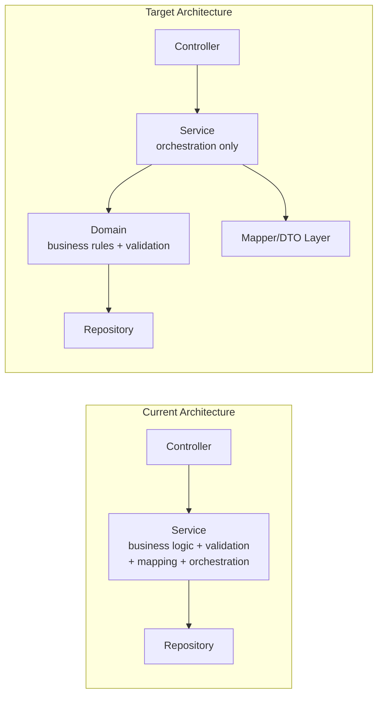
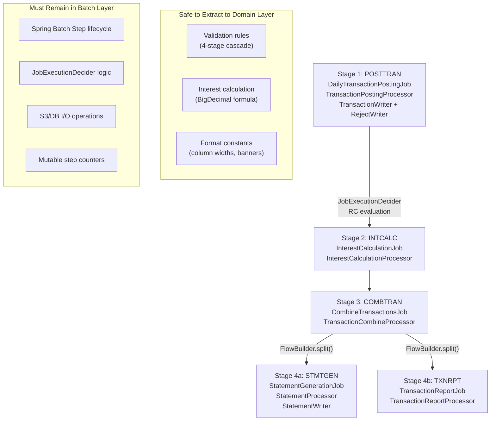

# Technical Specification

# 0. Agent Action Plan

## 0.1 Intent Clarification

### 0.1.1 Core Refactoring Objective

Based on the prompt, the Blitzy platform understands that the refactoring objective is to transform the CardDemo application — a Java 25 + Spring Boot 3.5.11 credit card management system that was previously migrated from COBOL/CICS/VSAM — from its current procedural, legacy-translated code structure into a clean, modular, domain-driven Spring Boot architecture with improved maintainability and separation of concerns. The codebase currently resides in a single Maven module under the root package `com.cardemo` with 90 production Java files totaling 34,021 lines of code, organized across 9 packages: `config`, `controller`, `service`, `model`, `repository`, `batch`, `exception`, `observability`, and the root `CardDemoApplication.java`.

The refactoring type is **Code Structure + Modularity + Design Pattern Introduction** within the **same repository** — there is no migration to a new repository. The target repository remains `com.cardemo:carddemo:1.0.0-SNAPSHOT`.

**Refactoring Goals with Enhanced Clarity:**

- **Improve code structure and maintainability** — Break apart monolithic service classes (e.g., `AccountUpdateService` at 980 lines, `TransactionAddService` at 763 lines, `WebConfig` at 840 lines) into cohesive, single-responsibility units that follow Spring Boot conventions
- **Eliminate procedural/COBOL-style patterns** — Remove 2,484 instances of COBOL-origin patterns across the codebase including WORKING-STORAGE-style static constants scattered across 20+ service files, procedural paragraph-mapped method structures, and mutable step-level state in batch processors
- **Introduce layered architecture (Controller → Service → Domain → Repository)** — Add a new `domain` layer between the existing `service` and `repository` layers to encapsulate core business rules, validation logic, and domain invariants independently of Spring framework annotations
- **Reduce duplication from copybook-based translations** — Consolidate duplicated business constants (e.g., `ACCOUNT_ID_LENGTH = 11` duplicated in `AccountUpdateService` and `AccountViewService`), shared `DateTimeFormatter` patterns duplicated across 11 files, and validation regex patterns scattered across card and account services
- **Improve readability and naming conventions** — Replace COBOL-derived names and patterns with idiomatic Java/Spring naming, extract shared constants into dedicated constant classes, and introduce service interfaces for testability

**Implicit Requirements Surfaced:**

- **Maintain all 22 features with 100% behavioral parity** — 18 online transactions (F-001 through F-017, mapped from CICS programs) and 10 batch programs (mapped from JCL jobs) must produce identical outputs
- **Preserve API compatibility** — All 8 REST controllers (`AuthController`, `MenuController`, `AccountController`, `CardController`, `TransactionController`, `BillingController`, `ReportController`, `UserAdminController`) must maintain their existing endpoint contracts as documented in `docs/api-contracts.md`
- **Preserve existing test suites** — 55 test files across unit (24), integration (16), and E2E (3) categories, plus 2 validation and 5 batch integration tests, must continue passing without modification to test assertions
- **Maintain the 8 formal validation gates** — As defined in `docs/validation-gates.md`, including Gate 3 performance baselines (≥100 records/second batch throughput, ≤512 MB peak heap)
- **Preserve all 18 architectural decisions** — Decisions D-001 through D-018 documented in `DECISION_LOG.md` remain authoritative and must not be contradicted by refactoring changes

### 0.1.2 Technical Interpretation

This refactoring translates to the following technical transformation strategy:

**Current Architecture → Target Architecture:**

The current architecture follows a flat `Controller → Service → Repository` pattern where service classes directly contain business rules, validation logic, data mapping, and orchestration in single monolithic classes. The target architecture introduces a `domain` layer and extracts cross-cutting concerns:



**Transformation Rules:**

- **Rule 1 — Service Decomposition**: Service classes exceeding 500 lines are candidates for extraction of validation logic into domain classes, mapping logic into dedicated mapper classes, and shared constants into constant holder classes
- **Rule 2 — Interface Introduction**: Each service domain (account, admin, auth, billing, card, menu, report, transaction) gains a service interface defining its public contract, enabling future testability via mock injection
- **Rule 3 — Domain Layer Extraction**: Business rules currently embedded in service methods (e.g., FICO score range validation, credit limit checking, date validation cascades) move to domain classes under `com.cardemo.domain`
- **Rule 4 — Constant Centralization**: Scattered `static final` constants (field lengths, format patterns, regex patterns) consolidate into domain-specific constant classes under `com.cardemo.domain.constants`
- **Rule 5 — Exception Handler Extraction**: The nested `GlobalExceptionHandler` class inside `WebConfig.java` (15 `@ExceptionHandler` methods, ~500 lines) extracts to a standalone `@RestControllerAdvice` class
- **Rule 6 — Batch Processor State Isolation**: Mutable step-level state in batch processors (e.g., `goodTranCount`, `badTranCount`, `rejections` list in `TransactionPostingProcessor`) refactors to use Spring Batch's `ExecutionContext` or `StepExecution` metadata
- **Rule 7 — Behavioral Preservation**: No business logic is rewritten — methods are relocated and reorganized, but their internal algorithms and control flow remain identical to preserve COBOL parity

## 0.2 Source Analysis

### 0.2.1 Comprehensive Source File Discovery

The CardDemo codebase comprises **90 production Java source files** under `src/main/java/com/cardemo/` and **55 test Java files** under `src/test/java/com/cardemo/`, with a total of **34,021 lines of production code**. The following analysis identifies every file requiring refactoring attention, organized by the specific legacy pattern or structural concern driving the refactoring need.

**Monolithic Service Classes (>500 lines — candidates for decomposition):**

| File | Lines | COBOL Origin | Refactoring Driver |
|------|-------|-------------|-------------------|
| `src/main/java/com/cardemo/service/account/AccountUpdateService.java` | 980 | COACTUPC.cbl | Largest service; mixed validation, mapping, orchestration; duplicated constants |
| `src/main/java/com/cardemo/batch/jobs/TransactionReportJob.java` | 904 | CBTRN03C.cbl | Monolithic batch job with embedded formatting and report logic |
| `src/main/java/com/cardemo/batch/processors/StatementProcessor.java` | 846 | CBSTM03A/B.cbl | Statement generation with hardcoded format constants and embedded logic |
| `src/main/java/com/cardemo/config/WebConfig.java` | 840 | N/A | Mixed concerns: CORS config + Jackson config + GlobalExceptionHandler (15 handlers) |
| `src/main/java/com/cardemo/service/transaction/TransactionAddService.java` | 763 | COTRN02C.cbl | Transaction creation with embedded validation cascade and format constants |
| `src/main/java/com/cardemo/service/shared/DateValidationService.java` | 703 | CSUTLDTC.cbl | COBOL date-validation subprogram; procedural paragraph-mapped structure |
| `src/main/java/com/cardemo/batch/readers/DailyTransactionReader.java` | 697 | CBTRN01C.cbl | File reader with embedded validation and transformation logic |
| `src/main/java/com/cardemo/batch/writers/TransactionWriter.java` | 631 | CBTRN02C.cbl | Transaction posting with mixed S3 backup and DB write concerns |
| `src/main/java/com/cardemo/batch/writers/RejectWriter.java` | 608 | CBTRN02C.cbl | 430-byte fixed-width serialization with embedded format logic |
| `src/main/java/com/cardemo/model/dto/AccountDto.java` | 604 | COACTVWC/COACTUPC copybooks | Large DTO with potential for field grouping |
| `src/main/java/com/cardemo/service/report/ReportSubmissionService.java` | 586 | CORPT00C.cbl | SQS integration with embedded date validation and message formatting |
| `src/main/java/com/cardemo/batch/processors/InterestCalculationProcessor.java` | 581 | CBACT04C.cbl | BigDecimal arithmetic with COBOL-mapped calculation steps |
| `src/main/java/com/cardemo/batch/jobs/CombineTransactionsJob.java` | 553 | Combined JCL | Multi-step combine with in-memory sorting |
| `src/main/java/com/cardemo/batch/processors/TransactionReportProcessor.java` | 549 | CBTRN03C.cbl | Report formatting with embedded column constants |
| `src/main/java/com/cardemo/batch/jobs/InterestCalculationJob.java` | 522 | CBACT04C JCL | Interest calculation orchestration |
| `src/main/java/com/cardemo/service/auth/AuthenticationService.java` | 509 | COSGN00C.cbl | Authentication with BCrypt, DTO construction, error handling |
| `src/main/java/com/cardemo/batch/processors/TransactionPostingProcessor.java` | 507 | CBTRN02C.cbl | 4-stage validation cascade with mutable step-state counters |

**Files with Duplicated Constants (candidates for centralization):**

| Constant Pattern | Files Where Duplicated | Target Consolidation |
|-----------------|----------------------|---------------------|
| `ACCOUNT_ID_LENGTH = 11` | `AccountUpdateService.java`, `AccountViewService.java`, `CardDetailService.java`, `CardListService.java`, `CardUpdateService.java` | `AccountConstants.java` |
| `CARD_NUM_MAX_LENGTH = 16` | `CardDetailService.java`, `CardListService.java`, `CardUpdateService.java` | `CardConstants.java` |
| `DateTimeFormatter.ofPattern("yyyyMMdd")` | `AccountUpdateService.java`, `DateValidationService.java`, `TransactionAddService.java`, `DailyTransactionReader.java`, `RejectWriter.java`, `TransactionWriter.java`, `StatementWriter.java`, `CombineTransactionsJob.java`, `InterestCalculationJob.java`, `TransactionReportJob.java`, `ReportSubmissionService.java` | `DateFormatConstants.java` |
| `TRANSACTION_ID_FORMAT = "%016d"` | `BillPaymentService.java`, `TransactionAddService.java` | `TransactionConstants.java` |
| `PAGE_SIZE` | `UserListService.java` (10), `CardListService.java` (7), `TransactionListService.java` (10) | `PaginationConstants.java` |

**Files Lacking Service Interfaces (zero interfaces exist in service layer):**

Every service class under `src/main/java/com/cardemo/service/` is a concrete `@Service`-annotated class with no corresponding interface. All 20 service classes require interface extraction:

| Domain Package | Service Classes Requiring Interface |
|---------------|-------------------------------------|
| `service/account/` | `AccountUpdateService`, `AccountViewService` |
| `service/admin/` | `UserAddService`, `UserDeleteService`, `UserListService`, `UserUpdateService` |
| `service/auth/` | `AuthenticationService` |
| `service/billing/` | `BillPaymentService` |
| `service/card/` | `CardDetailService`, `CardListService`, `CardUpdateService` |
| `service/menu/` | `AdminMenuService`, `MainMenuService` |
| `service/report/` | `ReportSubmissionService` |
| `service/shared/` | `DateValidationService`, `FileStatusMapper`, `ValidationLookupService` |
| `service/transaction/` | `TransactionAddService`, `TransactionDetailService`, `TransactionListService` |

**Mixed-Concern Configuration Files:**

| File | Lines | Concerns Mixed | Extraction Target |
|------|-------|---------------|-------------------|
| `WebConfig.java` | 840 | CORS config (lines 134–162), Jackson customizer (lines 165–228), Request logging filter (lines 196–270), ErrorResponse record (lines 274–315), GlobalExceptionHandler inner class with 15 handlers (lines 317–840) | Split into `WebConfig.java`, `JacksonConfig.java`, `GlobalExceptionHandler.java` |

### 0.2.2 Current Structure Mapping

```
Current:
src/main/java/com/cardemo/
├── CardDemoApplication.java (entry point)
├── config/
│   ├── AwsConfig.java (S3/SQS/SNS client beans)
│   ├── BatchConfig.java (Spring Batch infrastructure)
│   ├── JpaConfig.java (JPA repository scanning)
│   ├── ObservabilityConfig.java (MeterRegistry customizer)
│   ├── SecurityConfig.java (HTTP Basic Auth, role-based access)
│   └── WebConfig.java (840 lines — CORS + Jackson + GlobalExceptionHandler mixed)
├── controller/
│   ├── AccountController.java
│   ├── AuthController.java
│   ├── BillingController.java
│   ├── CardController.java
│   ├── MenuController.java
│   ├── ReportController.java
│   ├── TransactionController.java
│   └── UserAdminController.java
├── service/
│   ├── account/ (AccountUpdateService 980L, AccountViewService 350L)
│   ├── admin/ (UserAddService 352L, UserDeleteService 328L, UserListService 370L, UserUpdateService 477L)
│   ├── auth/ (AuthenticationService 509L)
│   ├── billing/ (BillPaymentService 472L)
│   ├── card/ (CardDetailService 384L, CardListService 474L, CardUpdateService 487L)
│   ├── menu/ (AdminMenuService 237L, MainMenuService 292L)
│   ├── report/ (ReportSubmissionService 586L)
│   ├── shared/ (DateValidationService 703L, FileStatusMapper 482L, ValidationLookupService 328L)
│   └── transaction/ (TransactionAddService 763L, TransactionDetailService 266L, TransactionListService 382L)
├── model/
│   ├── converter/ (UserTypeConverter.java)
│   ├── dto/ (AccountDto 604L, BillPaymentRequest, CardDto, CommArea 695L, ReportRequest, SignOnRequest, SignOnResponse, TransactionDto, UserSecurityDto)
│   ├── entity/ (Account, Card, CardCrossReference, Customer, DailyTransaction, DisclosureGroup, Transaction, TransactionCategory, TransactionCategoryBalance, TransactionType, UserSecurity)
│   ├── enums/ (FileStatus, RejectCode, TransactionSource, UserType)
│   └── key/ (DisclosureGroupId, TransactionCategoryBalanceId, TransactionCategoryId)
├── repository/ (11 JPA interfaces)
│   ├── AccountRepository.java
│   ├── CardCrossReferenceRepository.java
│   ├── CardRepository.java
│   ├── CustomerRepository.java
│   ├── DailyTransactionRepository.java
│   ├── DisclosureGroupRepository.java
│   ├── TransactionCategoryBalanceRepository.java
│   ├── TransactionCategoryRepository.java
│   ├── TransactionRepository.java
│   ├── TransactionTypeRepository.java
│   └── UserSecurityRepository.java
├── batch/
│   ├── jobs/ (BatchPipelineOrchestrator 253L, CombineTransactionsJob 553L, DailyTransactionPostingJob 419L, InterestCalculationJob 522L, StatementGenerationJob 251L, TransactionReportJob 904L)
│   ├── processors/ (InterestCalculationProcessor 581L, StatementProcessor 846L, TransactionCombineProcessor 94L, TransactionPostingProcessor 507L, TransactionReportProcessor 549L)
│   ├── readers/ (AccountFileReader 187L, CardFileReader 178L, CrossReferenceFileReader 183L, CustomerFileReader 190L, DailyTransactionReader 697L)
│   └── writers/ (RejectWriter 608L, StatementWriter 281L, TransactionWriter 631L)
├── exception/
│   ├── CardDemoException.java
│   ├── ConcurrentModificationException.java
│   ├── CreditLimitExceededException.java
│   ├── DuplicateRecordException.java
│   ├── ExpiredCardException.java
│   ├── RecordNotFoundException.java
│   └── ValidationException.java
└── observability/
    ├── CorrelationIdFilter.java
    ├── HealthIndicators.java
    └── MetricsConfig.java

src/main/resources/
├── application.yml
├── application-local.yml
├── application-test.yml
├── logback-spring.xml
├── db/migration/
│   ├── V1__create_schema.sql
│   ├── V2__create_indexes.sql
│   └── V3__seed_data.sql
└── validation/
    ├── nanpa-area-codes.json
    ├── state-zip-prefixes.json
    └── us-state-codes.json

src/test/java/com/cardemo/
├── e2e/ (GateVerificationTest 1714L, BatchPipelineE2ETest 1113L, OnlineTransactionE2ETest 919L)
├── integration/
│   ├── aws/ (S3IntegrationIT 805L, SqsIntegrationIT 758L, SnsIntegrationIT)
│   ├── batch/ (5 job IT files)
│   ├── repository/ (11 repository IT files)
│   └── validation/ (2 validation IT files)
└── unit/
    ├── batch/ (5 processor test files)
    ├── model/ (5 model test files)
    ├── service/ (17 service test files)
    └── validation/ (3 validation test files)

Root project files:
├── pom.xml (Maven build with Spring Boot 3.5.11 parent)
├── Dockerfile (two-stage Temurin 25 build)
├── docker-compose.yml (6-service stack)
├── README.md
├── DECISION_LOG.md (18 architectural decisions)
├── TRACEABILITY_MATRIX.md (28 COBOL program mappings)
├── CODE_OF_CONDUCT.md
├── CONTRIBUTING.md
├── LICENSE
├── mvnw / mvnw.cmd (.mvn/ wrapper)
├── localstack-init/ (init scripts)
├── blitzy/ (blitzy configuration)
├── samples/ (sample data)
└── docs/
    ├── api-contracts.md
    ├── architecture-before-after.md
    ├── executive-presentation.html
    ├── grafana-dashboard.json
    ├── onboarding-guide.md
    ├── prometheus.yml
    └── validation-gates.md
```

## 0.3 Scope Boundaries

### 0.3.1 Exhaustively In Scope

**Source Transformations (structural refactoring of production Java files):**

- `src/main/java/com/cardemo/config/WebConfig.java` — Extract `GlobalExceptionHandler` inner class and Jackson customization into standalone classes
- `src/main/java/com/cardemo/service/**/*.java` — All 20 service classes: introduce interfaces, extract domain logic into `domain` layer, centralize constants
- `src/main/java/com/cardemo/batch/jobs/*.java` — 6 batch job classes: extract embedded formatting/report logic into dedicated domain classes
- `src/main/java/com/cardemo/batch/processors/*.java` — 5 batch processors: refactor mutable step-state into `ExecutionContext` or explicit state objects, extract validation logic
- `src/main/java/com/cardemo/batch/readers/*.java` — 5 batch readers: extract embedded validation and transformation logic
- `src/main/java/com/cardemo/batch/writers/*.java` — 3 batch writers: separate serialization formatting from I/O concerns
- `src/main/java/com/cardemo/controller/*.java` — 8 controllers: update imports for new service interfaces, no logic changes
- `src/main/java/com/cardemo/model/dto/*.java` — 9 DTO classes: potential field grouping for large DTOs, update imports
- `src/main/java/com/cardemo/model/entity/*.java` — 11 entity classes: update imports only where domain-layer references are introduced
- `src/main/java/com/cardemo/model/converter/*.java` — 1 converter: update imports if relocated
- `src/main/java/com/cardemo/model/enums/*.java` — 4 enum classes: update imports if referenced by new domain layer
- `src/main/java/com/cardemo/model/key/*.java` — 3 composite key classes: update imports if referenced by new domain layer
- `src/main/java/com/cardemo/repository/*.java` — 11 JPA repository interfaces: update imports only
- `src/main/java/com/cardemo/exception/*.java` — 7 exception classes: update imports only
- `src/main/java/com/cardemo/observability/*.java` — 3 observability classes: update imports only
- `src/main/java/com/cardemo/CardDemoApplication.java` — Update component scan if new packages are added

**New Files to Create (domain layer, interfaces, extracted classes):**

- `src/main/java/com/cardemo/domain/**/*.java` — New domain layer package with business rule classes
- `src/main/java/com/cardemo/domain/constants/*.java` — Centralized business constant classes
- `src/main/java/com/cardemo/service/**/interfaces/*.java` — Service interfaces for each domain
- `src/main/java/com/cardemo/config/GlobalExceptionHandler.java` — Extracted from `WebConfig.java`
- `src/main/java/com/cardemo/config/JacksonConfig.java` — Extracted from `WebConfig.java`

**Test Updates:**

- `src/test/java/com/cardemo/unit/service/**/*.java` — 17 service unit tests: update imports to reference new service interfaces and domain classes
- `src/test/java/com/cardemo/unit/batch/**/*.java` — 5 batch processor tests: update imports for refactored processor classes
- `src/test/java/com/cardemo/unit/model/**/*.java` — 5 model tests: update imports if model package structure changes
- `src/test/java/com/cardemo/unit/validation/**/*.java` — 3 validation tests: update imports for centralized validation classes
- `src/test/java/com/cardemo/integration/**/*.java` — 16 integration tests: update imports where service references change
- `src/test/java/com/cardemo/e2e/**/*.java` — 3 E2E tests: import updates only, no assertion changes

**Configuration Updates:**

- `src/main/resources/application.yml` — Add structured logging configuration if needed for new domain layer
- `src/main/resources/application-local.yml` — No changes expected
- `src/main/resources/application-test.yml` — No changes expected
- `src/main/resources/logback-spring.xml` — Add logger entries for new `com.cardemo.domain` package

**Documentation Updates:**

- `README.md` — Update package structure documentation to reflect new `domain` layer
- `docs/architecture-before-after.md` — Update architecture diagrams showing new layered structure
- `docs/onboarding-guide.md` — Update developer guidance for new package organization
- `DECISION_LOG.md` — Add new decision entry for the refactoring architectural choices

**Import Corrections:**

- Every file containing references to classes relocated during extraction (e.g., `WebConfig.ErrorResponse` → `GlobalExceptionHandler.ErrorResponse`, scattered constants → centralized constant classes)
- All service consumers (controllers, batch jobs) updating from concrete service class references to interface references

### 0.3.2 Explicitly Out of Scope

The following items are explicitly excluded from this refactoring per the user's directives and the minimal change clause:

- **Validation gate logic** — All 8 validation gates in `docs/validation-gates.md` remain untouched; they serve as verification, not modification targets
- **Input/output file formats** — S3 object formats, 430-byte reject record layouts, statement output formats, and all flat-file structures remain byte-identical
- **Existing transaction flow behavior** — All 18 online transaction flows (F-001 through F-017) preserve their exact request-response semantics, including error messages, HTTP status codes, and response payloads
- **Batch job outputs** — All 10 batch programs (5-stage pipeline) produce identical outputs for identical inputs; no batch logic rewriting
- **Business logic rewriting** — Internal algorithms (interest calculation formulas, date validation cascades, FICO score ranges, credit limit checks) remain unchanged — only their organizational location changes
- **New framework introduction** — No new frameworks (e.g., MapStruct, Lombok, Reactor) are added; the existing technology stack (Spring Boot 3.5.11, Spring Data JPA, Spring Batch, Spring Security, Spring Cloud AWS) remains identical
- **Database schema changes** — Flyway migrations (`V1__create_schema.sql`, `V2__create_indexes.sql`, `V3__seed_data.sql`) remain untouched; no new migration files
- **API endpoint changes** — All REST endpoint paths, HTTP methods, request/response contracts as defined in `docs/api-contracts.md` remain identical
- **Security configuration** — `SecurityConfig.java` authorization rules, BCrypt encoding, and HTTP Basic Auth mechanism remain unchanged
- **AWS infrastructure** — S3 bucket configuration, SQS FIFO queue setup, SNS topic configuration remain unchanged
- **Docker/deployment artifacts** — `Dockerfile`, `docker-compose.yml`, `localstack-init/` scripts remain unchanged
- **Performance optimization beyond refactor scope** — No caching layers, connection pool tuning, or query optimization introduced
- **Microservice decomposition** — The application remains a single deployable monolith as per Decision D-005, D-010, D-014
- **Third-party dependency version changes** — All dependency versions in `pom.xml` remain at their current pinned versions

## 0.4 Target Design

### 0.4.1 Refactored Structure Planning

The target architecture introduces a `domain` layer, service interfaces, centralized constants, and extracted configuration classes while preserving the existing package boundary conventions. Every new package and file is listed explicitly below.

```
Target:
src/main/java/com/cardemo/
├── CardDemoApplication.java (unchanged — entry point)
│
├── config/
│   ├── AwsConfig.java (unchanged)
│   ├── BatchConfig.java (unchanged)
│   ├── GlobalExceptionHandler.java (NEW — extracted from WebConfig, 15 @ExceptionHandler methods)
│   ├── JacksonConfig.java (NEW — extracted Jackson2ObjectMapperBuilderCustomizer from WebConfig)
│   ├── JpaConfig.java (unchanged)
│   ├── ObservabilityConfig.java (unchanged)
│   ├── SecurityConfig.java (unchanged)
│   └── WebConfig.java (REDUCED — retains only CORS mapping and request logging filter)
│
├── controller/
│   ├── AccountController.java (UPDATE — inject interface instead of concrete service)
│   ├── AuthController.java (UPDATE — inject interface)
│   ├── BillingController.java (UPDATE — inject interface)
│   ├── CardController.java (UPDATE — inject interface)
│   ├── MenuController.java (UPDATE — inject interface)
│   ├── ReportController.java (UPDATE — inject interface)
│   ├── TransactionController.java (UPDATE — inject interface)
│   └── UserAdminController.java (UPDATE — inject interface)
│
├── domain/ (NEW — core business logic layer)
│   ├── constants/
│   │   ├── AccountConstants.java (NEW — ACCOUNT_ID_LENGTH, SSN_LENGTH, PHONE_DIGITS_LENGTH, FICO_MIN, FICO_MAX)
│   │   ├── CardConstants.java (NEW — CARD_NUM_MAX_LENGTH, MASK_VISIBLE_DIGITS, MIN/MAX_EXPIRY_YEAR/MONTH)
│   │   ├── DateFormatConstants.java (NEW — shared DateTimeFormatter instances)
│   │   ├── PaginationConstants.java (NEW — PAGE_SIZE variants)
│   │   ├── TransactionConstants.java (NEW — TRAN_ID_LENGTH, TRAN_ID_FORMAT, MAX_AMOUNT_SCALE)
│   │   └── ValidationPatterns.java (NEW — NUMERIC_PATTERN, ALPHA_SPACE_PATTERN, shared regex)
│   ├── validation/
│   │   ├── AccountValidator.java (NEW — extracted account field validation from AccountUpdateService)
│   │   ├── CardValidator.java (NEW — extracted card field validation from CardUpdateService)
│   │   ├── TransactionValidator.java (NEW — extracted transaction validation from TransactionAddService)
│   │   └── UserValidator.java (NEW — extracted user field validation from UserUpdateService/UserAddService)
│   └── rules/
│       ├── CreditLimitRules.java (NEW — credit limit checking logic extracted from BillPaymentService)
│       ├── InterestCalculationRules.java (NEW — BigDecimal interest formula extracted from InterestCalculationProcessor)
│       └── TransactionPostingRules.java (NEW — 4-stage validation cascade extracted from TransactionPostingProcessor)
│
├── service/
│   ├── account/
│   │   ├── AccountUpdateService.java (UPDATE — delegate validation to domain, use centralized constants)
│   │   ├── AccountUpdateServiceImpl.java (RENAME — current AccountUpdateService becomes implementation)
│   │   └── AccountViewService.java (UPDATE — delegate validation to domain, use centralized constants)
│   ├── admin/
│   │   ├── UserAddService.java (UPDATE — interface + delegate validation)
│   │   ├── UserDeleteService.java (UPDATE — interface + delegate validation)
│   │   ├── UserListService.java (UPDATE — use centralized constants)
│   │   └── UserUpdateService.java (UPDATE — delegate validation to domain)
│   ├── auth/
│   │   └── AuthenticationService.java (UPDATE — interface extraction)
│   ├── billing/
│   │   └── BillPaymentService.java (UPDATE — delegate credit rules to domain)
│   ├── card/
│   │   ├── CardDetailService.java (UPDATE — use centralized constants)
│   │   ├── CardListService.java (UPDATE — use centralized constants)
│   │   └── CardUpdateService.java (UPDATE — delegate validation to domain)
│   ├── interfaces/ (NEW — service contracts)
│   │   ├── AccountService.java (NEW — interface for account operations)
│   │   ├── AdminService.java (NEW — interface for user admin operations)
│   │   ├── AuthService.java (NEW — interface for authentication)
│   │   ├── BillingService.java (NEW — interface for billing operations)
│   │   ├── CardService.java (NEW — interface for card operations)
│   │   ├── MenuService.java (NEW — interface for menu operations)
│   │   ├── ReportService.java (NEW — interface for report submission)
│   │   └── TransactionService.java (NEW — interface for transaction operations)
│   ├── menu/
│   │   ├── AdminMenuService.java (UPDATE — implement interface)
│   │   └── MainMenuService.java (UPDATE — implement interface)
│   ├── report/
│   │   └── ReportSubmissionService.java (UPDATE — delegate date validation to domain, use centralized constants)
│   ├── shared/
│   │   ├── DateValidationService.java (UPDATE — retain COBOL-compatible logic, use centralized date constants)
│   │   ├── FileStatusMapper.java (UPDATE — use centralized constants)
│   │   └── ValidationLookupService.java (UPDATE — use centralized constants)
│   └── transaction/
│       ├── TransactionAddService.java (UPDATE — delegate validation to domain, use centralized constants)
│       ├── TransactionDetailService.java (UPDATE — use centralized constants)
│       └── TransactionListService.java (UPDATE — use centralized constants)
│
├── batch/
│   ├── jobs/
│   │   ├── BatchPipelineOrchestrator.java (UPDATE — use centralized constants)
│   │   ├── CombineTransactionsJob.java (UPDATE — use DateFormatConstants)
│   │   ├── DailyTransactionPostingJob.java (UPDATE — use centralized constants)
│   │   ├── InterestCalculationJob.java (UPDATE — use DateFormatConstants)
│   │   ├── StatementGenerationJob.java (UPDATE — use centralized constants)
│   │   └── TransactionReportJob.java (UPDATE — extract report formatting to domain, use constants)
│   ├── processors/
│   │   ├── InterestCalculationProcessor.java (UPDATE — delegate formula to InterestCalculationRules)
│   │   ├── StatementProcessor.java (UPDATE — extract format constants to domain)
│   │   ├── TransactionCombineProcessor.java (UPDATE — use centralized constants)
│   │   ├── TransactionPostingProcessor.java (UPDATE — delegate validation to TransactionPostingRules, refactor mutable state)
│   │   └── TransactionReportProcessor.java (UPDATE — extract formatting to domain)
│   ├── readers/
│   │   ├── AccountFileReader.java (UPDATE — use centralized constants)
│   │   ├── CardFileReader.java (UPDATE — use centralized constants)
│   │   ├── CrossReferenceFileReader.java (UPDATE — use centralized constants)
│   │   ├── CustomerFileReader.java (UPDATE — use centralized constants)
│   │   └── DailyTransactionReader.java (UPDATE — use DateFormatConstants, extract validation)
│   └── writers/
│       ├── RejectWriter.java (UPDATE — use DateFormatConstants)
│       ├── StatementWriter.java (UPDATE — use DateFormatConstants)
│       └── TransactionWriter.java (UPDATE — use DateFormatConstants)
│
├── model/ (minimal changes — import updates only)
│   ├── converter/UserTypeConverter.java
│   ├── dto/ (9 DTOs — import updates if ErrorResponse moves)
│   ├── entity/ (11 entities — unchanged)
│   ├── enums/ (4 enums — unchanged)
│   └── key/ (3 composite keys — unchanged)
│
├── repository/ (11 interfaces — unchanged)
├── exception/ (7 classes — unchanged)
└── observability/ (3 classes — unchanged)

src/test/java/com/cardemo/
├── unit/
│   ├── domain/ (NEW — tests for new domain layer classes)
│   │   ├── AccountValidatorTest.java (NEW)
│   │   ├── CardValidatorTest.java (NEW)
│   │   ├── TransactionValidatorTest.java (NEW)
│   │   ├── CreditLimitRulesTest.java (NEW)
│   │   └── InterestCalculationRulesTest.java (NEW)
│   ├── service/ (17 existing tests — import updates)
│   ├── batch/ (5 existing tests — import updates)
│   ├── model/ (5 existing tests — unchanged)
│   └── validation/ (3 existing tests — import updates)
├── integration/ (16 existing tests — import updates only)
└── e2e/ (3 existing tests — import updates only)

docs/
├── architecture-before-after.md (UPDATE — add refactored architecture diagram)
├── onboarding-guide.md (UPDATE — add domain layer documentation)
└── (other docs unchanged)

README.md (UPDATE — reflect new package structure)
DECISION_LOG.md (UPDATE — add refactoring decision entry)
```

### 0.4.2 Web Search Research Conducted

- **Spring Boot DDD layered architecture best practices**: Research confirms that introducing a domain layer between service and repository layers is the standard DDD approach for Spring Boot applications, where the domain layer encapsulates business rules independently of framework annotations
- **Service interface extraction patterns**: Spring Boot convention favors defining service contracts as interfaces in a dedicated location, with `@Service`-annotated implementations, enabling constructor-based dependency injection via interface types
- **Constant centralization strategies**: Industry best practice is to create domain-specific constant holder classes (final class with private constructor) rather than a single monolithic `Constants` class, avoiding the "God constant" anti-pattern
- **Batch processor state management**: Spring Batch best practices recommend using `StepExecution` metadata or `ExecutionContext` for step-level counters rather than mutable instance fields, ensuring thread safety and restartability

### 0.4.3 Design Pattern Applications

- **Service Interface Pattern** — Define interfaces for each service domain (`AccountService`, `CardService`, etc.) with concrete `*Impl` implementations; controllers and batch jobs inject the interface type, enabling mock-based unit testing and future alternative implementations
- **Domain Validation Pattern** — Extract field-level validation logic (length checks, range checks, regex matching) from service methods into dedicated `*Validator` domain classes that are framework-independent; validators receive primitive/DTO inputs and throw domain exceptions
- **Domain Rules Pattern** — Extract business rule calculations (interest formulas, credit limit checks, transaction posting cascades) into stateless rule classes under `domain/rules/` that can be unit-tested without Spring context
- **Constant Holder Pattern** — Create `final` classes with `private` constructors holding related `public static final` constants grouped by domain (Account, Card, Transaction, Date); eliminates duplication and provides a single source of truth
- **Separation of Concerns Extraction** — Split the monolithic `WebConfig.java` into three focused classes: `WebConfig` (CORS + request logging), `JacksonConfig` (serialization), and `GlobalExceptionHandler` (error mapping); each class has a single reason to change

### 0.4.4 User Interface Design

Not applicable — CardDemo is a headless REST API application with no user interface layer. The 8 REST controllers expose JSON endpoints that replace the original COBOL BMS screen maps; no frontend framework or UI component refactoring is required.

## 0.5 Transformation Mapping

### 0.5.1 File-by-File Transformation Plan

Every target file is mapped to its source file with the transformation mode and key changes specified. No file is omitted.

**New Domain Layer Files (CREATE):**

| Target File | Transformation | Source File | Key Changes |
|------------|---------------|-------------|-------------|
| `src/main/java/com/cardemo/domain/constants/AccountConstants.java` | CREATE | `src/main/java/com/cardemo/service/account/AccountUpdateService.java` | Extract `ACCOUNT_ID_LENGTH`, `SSN_LENGTH`, `PHONE_DIGITS_LENGTH`, `FICO_MIN`, `FICO_MAX` into shared final constant holder class |
| `src/main/java/com/cardemo/domain/constants/CardConstants.java` | CREATE | `src/main/java/com/cardemo/service/card/CardUpdateService.java` | Extract `CARD_NUM_MAX_LENGTH`, `ACCT_ID_MAX_LENGTH`, `MASK_VISIBLE_DIGITS`, `MIN_EXPIRY_YEAR`, `MAX_EXPIRY_YEAR`, `MIN_EXPIRY_MONTH`, `MAX_EXPIRY_MONTH` |
| `src/main/java/com/cardemo/domain/constants/DateFormatConstants.java` | CREATE | `src/main/java/com/cardemo/service/shared/DateValidationService.java` | Extract shared `DateTimeFormatter` instances (`CCYYMMDD_FORMATTER` and variants) used across 11 files |
| `src/main/java/com/cardemo/domain/constants/PaginationConstants.java` | CREATE | `src/main/java/com/cardemo/service/admin/UserListService.java` | Extract `PAGE_SIZE` constants from `UserListService` (10), `CardListService` (7), `TransactionListService` (10) |
| `src/main/java/com/cardemo/domain/constants/TransactionConstants.java` | CREATE | `src/main/java/com/cardemo/service/transaction/TransactionAddService.java` | Extract `TRAN_ID_LENGTH`, `TRAN_ID_FORMAT`, `MAX_AMOUNT_SCALE`, `TRANSACTION_ID_FORMAT` |
| `src/main/java/com/cardemo/domain/constants/ValidationPatterns.java` | CREATE | `src/main/java/com/cardemo/service/card/CardUpdateService.java` | Extract `NUMERIC_PATTERN`, `ALPHA_SPACE_PATTERN`, and other shared regex patterns |
| `src/main/java/com/cardemo/domain/validation/AccountValidator.java` | CREATE | `src/main/java/com/cardemo/service/account/AccountUpdateService.java` | Extract account field validation methods (account ID length, SSN format, phone format, FICO range, state code, zip prefix) |
| `src/main/java/com/cardemo/domain/validation/CardValidator.java` | CREATE | `src/main/java/com/cardemo/service/card/CardUpdateService.java` | Extract card field validation methods (card number length, expiry month/year range, cardholder name pattern) |
| `src/main/java/com/cardemo/domain/validation/TransactionValidator.java` | CREATE | `src/main/java/com/cardemo/service/transaction/TransactionAddService.java` | Extract transaction field validation (transaction ID format, amount scale, account/card existence checks) |
| `src/main/java/com/cardemo/domain/validation/UserValidator.java` | CREATE | `src/main/java/com/cardemo/service/admin/UserUpdateService.java` | Extract user field validation (username length, password rules, user type validation) |
| `src/main/java/com/cardemo/domain/rules/CreditLimitRules.java` | CREATE | `src/main/java/com/cardemo/service/billing/BillPaymentService.java` | Extract credit limit checking logic using BigDecimal comparison |
| `src/main/java/com/cardemo/domain/rules/InterestCalculationRules.java` | CREATE | `src/main/java/com/cardemo/batch/processors/InterestCalculationProcessor.java` | Extract `(balance × rate) / 1200` formula and scale-2 BigDecimal arithmetic rules |
| `src/main/java/com/cardemo/domain/rules/TransactionPostingRules.java` | CREATE | `src/main/java/com/cardemo/batch/processors/TransactionPostingProcessor.java` | Extract 4-stage validation cascade (account lookup, card validation, expiry check, credit limit) |

**New Service Interface Files (CREATE):**

| Target File | Transformation | Source File | Key Changes |
|------------|---------------|-------------|-------------|
| `src/main/java/com/cardemo/service/interfaces/AccountService.java` | CREATE | `src/main/java/com/cardemo/service/account/AccountUpdateService.java` | Define interface with public methods from `AccountUpdateService` and `AccountViewService` |
| `src/main/java/com/cardemo/service/interfaces/AdminService.java` | CREATE | `src/main/java/com/cardemo/service/admin/UserAddService.java` | Define interface covering `UserAddService`, `UserDeleteService`, `UserListService`, `UserUpdateService` public methods |
| `src/main/java/com/cardemo/service/interfaces/AuthService.java` | CREATE | `src/main/java/com/cardemo/service/auth/AuthenticationService.java` | Define interface with `authenticate()`, `validateInput()`, `buildSignOnResponse()` |
| `src/main/java/com/cardemo/service/interfaces/BillingService.java` | CREATE | `src/main/java/com/cardemo/service/billing/BillPaymentService.java` | Define interface with public bill payment methods |
| `src/main/java/com/cardemo/service/interfaces/CardService.java` | CREATE | `src/main/java/com/cardemo/service/card/CardDetailService.java` | Define interface covering `CardDetailService`, `CardListService`, `CardUpdateService` |
| `src/main/java/com/cardemo/service/interfaces/MenuService.java` | CREATE | `src/main/java/com/cardemo/service/menu/MainMenuService.java` | Define interface covering `MainMenuService`, `AdminMenuService` |
| `src/main/java/com/cardemo/service/interfaces/ReportService.java` | CREATE | `src/main/java/com/cardemo/service/report/ReportSubmissionService.java` | Define interface for report submission SQS publishing |
| `src/main/java/com/cardemo/service/interfaces/TransactionService.java` | CREATE | `src/main/java/com/cardemo/service/transaction/TransactionAddService.java` | Define interface covering `TransactionAddService`, `TransactionDetailService`, `TransactionListService` |

**New Configuration Files (CREATE — extracted from WebConfig):**

| Target File | Transformation | Source File | Key Changes |
|------------|---------------|-------------|-------------|
| `src/main/java/com/cardemo/config/GlobalExceptionHandler.java` | CREATE | `src/main/java/com/cardemo/config/WebConfig.java` | Extract static inner class `GlobalExceptionHandler` (15 `@ExceptionHandler` methods + `ErrorResponse` record) into standalone `@RestControllerAdvice` class |
| `src/main/java/com/cardemo/config/JacksonConfig.java` | CREATE | `src/main/java/com/cardemo/config/WebConfig.java` | Extract `Jackson2ObjectMapperBuilderCustomizer` bean into dedicated `@Configuration` class |

**New Test Files (CREATE):**

| Target File | Transformation | Source File | Key Changes |
|------------|---------------|-------------|-------------|
| `src/test/java/com/cardemo/unit/domain/AccountValidatorTest.java` | CREATE | `src/test/java/com/cardemo/unit/service/AccountUpdateServiceTest.java` | Unit tests for extracted account validation logic |
| `src/test/java/com/cardemo/unit/domain/CardValidatorTest.java` | CREATE | `src/test/java/com/cardemo/unit/service/CardUpdateServiceTest.java` | Unit tests for extracted card validation logic |
| `src/test/java/com/cardemo/unit/domain/TransactionValidatorTest.java` | CREATE | `src/test/java/com/cardemo/unit/service/TransactionAddServiceTest.java` | Unit tests for extracted transaction validation logic |
| `src/test/java/com/cardemo/unit/domain/CreditLimitRulesTest.java` | CREATE | `src/test/java/com/cardemo/unit/service/BillPaymentServiceTest.java` | Unit tests for extracted credit limit rules |
| `src/test/java/com/cardemo/unit/domain/InterestCalculationRulesTest.java` | CREATE | `src/test/java/com/cardemo/unit/batch/InterestCalculationProcessorTest.java` | Unit tests for extracted interest calculation formula |

**Updated Service Files (UPDATE — existing files modified):**

| Target File | Transformation | Source File | Key Changes |
|------------|---------------|-------------|-------------|
| `src/main/java/com/cardemo/service/account/AccountUpdateService.java` | UPDATE | `src/main/java/com/cardemo/service/account/AccountUpdateService.java` | Implement `AccountService` interface; replace local constants with `AccountConstants.*`; delegate validation to `AccountValidator`; remove duplicated `ACCOUNT_ID_LENGTH`, `SSN_LENGTH`, `FICO_MIN/MAX`, `CCYYMMDD_FORMATTER` |
| `src/main/java/com/cardemo/service/account/AccountViewService.java` | UPDATE | `src/main/java/com/cardemo/service/account/AccountViewService.java` | Implement `AccountService` interface; replace `ACCOUNT_ID_LENGTH` with `AccountConstants.ACCOUNT_ID_LENGTH` |
| `src/main/java/com/cardemo/service/admin/UserAddService.java` | UPDATE | `src/main/java/com/cardemo/service/admin/UserAddService.java` | Implement `AdminService`; delegate validation to `UserValidator` |
| `src/main/java/com/cardemo/service/admin/UserDeleteService.java` | UPDATE | `src/main/java/com/cardemo/service/admin/UserDeleteService.java` | Implement `AdminService` |
| `src/main/java/com/cardemo/service/admin/UserListService.java` | UPDATE | `src/main/java/com/cardemo/service/admin/UserListService.java` | Implement `AdminService`; replace `PAGE_SIZE` with `PaginationConstants.USER_PAGE_SIZE` |
| `src/main/java/com/cardemo/service/admin/UserUpdateService.java` | UPDATE | `src/main/java/com/cardemo/service/admin/UserUpdateService.java` | Implement `AdminService`; delegate validation to `UserValidator` |
| `src/main/java/com/cardemo/service/auth/AuthenticationService.java` | UPDATE | `src/main/java/com/cardemo/service/auth/AuthenticationService.java` | Implement `AuthService` interface |
| `src/main/java/com/cardemo/service/billing/BillPaymentService.java` | UPDATE | `src/main/java/com/cardemo/service/billing/BillPaymentService.java` | Implement `BillingService`; delegate credit limit rules to `CreditLimitRules`; replace `TRANSACTION_ID_FORMAT` with `TransactionConstants.TRANSACTION_ID_FORMAT` |
| `src/main/java/com/cardemo/service/card/CardDetailService.java` | UPDATE | `src/main/java/com/cardemo/service/card/CardDetailService.java` | Implement `CardService`; replace `CARD_NUM_MAX_LENGTH`/`ACCT_ID_MAX_LENGTH` with `CardConstants.*` |
| `src/main/java/com/cardemo/service/card/CardListService.java` | UPDATE | `src/main/java/com/cardemo/service/card/CardListService.java` | Implement `CardService`; replace constants with `CardConstants.*` and `PaginationConstants.*` |
| `src/main/java/com/cardemo/service/card/CardUpdateService.java` | UPDATE | `src/main/java/com/cardemo/service/card/CardUpdateService.java` | Implement `CardService`; delegate validation to `CardValidator`; replace constants with `CardConstants.*` and `ValidationPatterns.*` |
| `src/main/java/com/cardemo/service/menu/AdminMenuService.java` | UPDATE | `src/main/java/com/cardemo/service/menu/AdminMenuService.java` | Implement `MenuService` |
| `src/main/java/com/cardemo/service/menu/MainMenuService.java` | UPDATE | `src/main/java/com/cardemo/service/menu/MainMenuService.java` | Implement `MenuService` |
| `src/main/java/com/cardemo/service/report/ReportSubmissionService.java` | UPDATE | `src/main/java/com/cardemo/service/report/ReportSubmissionService.java` | Implement `ReportService`; replace `DATE_FORMAT` with `DateFormatConstants.*` |
| `src/main/java/com/cardemo/service/shared/DateValidationService.java` | UPDATE | `src/main/java/com/cardemo/service/shared/DateValidationService.java` | Replace local `CCYYMMDD_FORMATTER` and date constants with `DateFormatConstants.*` |
| `src/main/java/com/cardemo/service/shared/FileStatusMapper.java` | UPDATE | `src/main/java/com/cardemo/service/shared/FileStatusMapper.java` | No logic changes; update imports if constants are centralized |
| `src/main/java/com/cardemo/service/shared/ValidationLookupService.java` | UPDATE | `src/main/java/com/cardemo/service/shared/ValidationLookupService.java` | No logic changes; update imports |
| `src/main/java/com/cardemo/service/transaction/TransactionAddService.java` | UPDATE | `src/main/java/com/cardemo/service/transaction/TransactionAddService.java` | Implement `TransactionService`; delegate validation to `TransactionValidator`; replace constants with `TransactionConstants.*` and `DateFormatConstants.*` |
| `src/main/java/com/cardemo/service/transaction/TransactionDetailService.java` | UPDATE | `src/main/java/com/cardemo/service/transaction/TransactionDetailService.java` | Implement `TransactionService` |
| `src/main/java/com/cardemo/service/transaction/TransactionListService.java` | UPDATE | `src/main/java/com/cardemo/service/transaction/TransactionListService.java` | Implement `TransactionService`; replace `PAGE_SIZE` with `PaginationConstants.*` |

**Updated Configuration Files (UPDATE):**

| Target File | Transformation | Source File | Key Changes |
|------------|---------------|-------------|-------------|
| `src/main/java/com/cardemo/config/WebConfig.java` | UPDATE | `src/main/java/com/cardemo/config/WebConfig.java` | Remove inner class `GlobalExceptionHandler`, remove `ErrorResponse` record, remove `jacksonCustomizer()` bean; retain `addCorsMappings()` and `requestLoggingFilter()` only |

**Updated Controller Files (UPDATE — inject interfaces):**

| Target File | Transformation | Source File | Key Changes |
|------------|---------------|-------------|-------------|
| `src/main/java/com/cardemo/controller/AccountController.java` | UPDATE | `src/main/java/com/cardemo/controller/AccountController.java` | Change constructor injection from `AccountUpdateService`/`AccountViewService` to `AccountService` interface |
| `src/main/java/com/cardemo/controller/AuthController.java` | UPDATE | `src/main/java/com/cardemo/controller/AuthController.java` | Change constructor injection to `AuthService` interface |
| `src/main/java/com/cardemo/controller/BillingController.java` | UPDATE | `src/main/java/com/cardemo/controller/BillingController.java` | Change constructor injection to `BillingService` interface |
| `src/main/java/com/cardemo/controller/CardController.java` | UPDATE | `src/main/java/com/cardemo/controller/CardController.java` | Change constructor injection to `CardService` interface |
| `src/main/java/com/cardemo/controller/MenuController.java` | UPDATE | `src/main/java/com/cardemo/controller/MenuController.java` | Change constructor injection to `MenuService` interface |
| `src/main/java/com/cardemo/controller/ReportController.java` | UPDATE | `src/main/java/com/cardemo/controller/ReportController.java` | Change constructor injection to `ReportService` interface |
| `src/main/java/com/cardemo/controller/TransactionController.java` | UPDATE | `src/main/java/com/cardemo/controller/TransactionController.java` | Change constructor injection to `TransactionService` interface |
| `src/main/java/com/cardemo/controller/UserAdminController.java` | UPDATE | `src/main/java/com/cardemo/controller/UserAdminController.java` | Change constructor injection to `AdminService` interface |

**Updated Batch Files (UPDATE — use centralized constants and domain rules):**

| Target File | Transformation | Source File | Key Changes |
|------------|---------------|-------------|-------------|
| `src/main/java/com/cardemo/batch/jobs/BatchPipelineOrchestrator.java` | UPDATE | `src/main/java/com/cardemo/batch/jobs/BatchPipelineOrchestrator.java` | Update imports for centralized constants |
| `src/main/java/com/cardemo/batch/jobs/CombineTransactionsJob.java` | UPDATE | `src/main/java/com/cardemo/batch/jobs/CombineTransactionsJob.java` | Replace local `DateTimeFormatter` with `DateFormatConstants.CCYYMMDD_FORMATTER` |
| `src/main/java/com/cardemo/batch/jobs/DailyTransactionPostingJob.java` | UPDATE | `src/main/java/com/cardemo/batch/jobs/DailyTransactionPostingJob.java` | Update imports for domain rules |
| `src/main/java/com/cardemo/batch/jobs/InterestCalculationJob.java` | UPDATE | `src/main/java/com/cardemo/batch/jobs/InterestCalculationJob.java` | Replace local `DateTimeFormatter` with `DateFormatConstants.*` |
| `src/main/java/com/cardemo/batch/jobs/StatementGenerationJob.java` | UPDATE | `src/main/java/com/cardemo/batch/jobs/StatementGenerationJob.java` | Update imports for centralized constants |
| `src/main/java/com/cardemo/batch/jobs/TransactionReportJob.java` | UPDATE | `src/main/java/com/cardemo/batch/jobs/TransactionReportJob.java` | Replace local `DateTimeFormatter` with `DateFormatConstants.*`; extract report formatting constants |
| `src/main/java/com/cardemo/batch/processors/InterestCalculationProcessor.java` | UPDATE | `src/main/java/com/cardemo/batch/processors/InterestCalculationProcessor.java` | Delegate calculation formula to `InterestCalculationRules`; retain Spring Batch `ItemProcessor` contract |
| `src/main/java/com/cardemo/batch/processors/StatementProcessor.java` | UPDATE | `src/main/java/com/cardemo/batch/processors/StatementProcessor.java` | Extract format constants (`COL_TRAN_ID`, `COL_TRAN_DESC`, `COL_TRAN_AMT`, banner strings) to domain constants |
| `src/main/java/com/cardemo/batch/processors/TransactionCombineProcessor.java` | UPDATE | `src/main/java/com/cardemo/batch/processors/TransactionCombineProcessor.java` | Update imports for centralized constants |
| `src/main/java/com/cardemo/batch/processors/TransactionPostingProcessor.java` | UPDATE | `src/main/java/com/cardemo/batch/processors/TransactionPostingProcessor.java` | Delegate 4-stage validation to `TransactionPostingRules`; refactor `goodTranCount`/`badTranCount`/`rejections` mutable state to `StepExecution` metadata |
| `src/main/java/com/cardemo/batch/processors/TransactionReportProcessor.java` | UPDATE | `src/main/java/com/cardemo/batch/processors/TransactionReportProcessor.java` | Extract formatting constants to domain layer |
| `src/main/java/com/cardemo/batch/readers/AccountFileReader.java` | UPDATE | `src/main/java/com/cardemo/batch/readers/AccountFileReader.java` | Update imports for centralized constants |
| `src/main/java/com/cardemo/batch/readers/CardFileReader.java` | UPDATE | `src/main/java/com/cardemo/batch/readers/CardFileReader.java` | Update imports for centralized constants |
| `src/main/java/com/cardemo/batch/readers/CrossReferenceFileReader.java` | UPDATE | `src/main/java/com/cardemo/batch/readers/CrossReferenceFileReader.java` | Update imports for centralized constants |
| `src/main/java/com/cardemo/batch/readers/CustomerFileReader.java` | UPDATE | `src/main/java/com/cardemo/batch/readers/CustomerFileReader.java` | Update imports for centralized constants |
| `src/main/java/com/cardemo/batch/readers/DailyTransactionReader.java` | UPDATE | `src/main/java/com/cardemo/batch/readers/DailyTransactionReader.java` | Replace local `DateTimeFormatter` with `DateFormatConstants.*` |
| `src/main/java/com/cardemo/batch/writers/RejectWriter.java` | UPDATE | `src/main/java/com/cardemo/batch/writers/RejectWriter.java` | Replace local `DateTimeFormatter` with `DateFormatConstants.*` |
| `src/main/java/com/cardemo/batch/writers/StatementWriter.java` | UPDATE | `src/main/java/com/cardemo/batch/writers/StatementWriter.java` | Replace local `DateTimeFormatter` with `DateFormatConstants.*` |
| `src/main/java/com/cardemo/batch/writers/TransactionWriter.java` | UPDATE | `src/main/java/com/cardemo/batch/writers/TransactionWriter.java` | Replace local `DateTimeFormatter` with `DateFormatConstants.*` |

**Updated Test Files (UPDATE — import corrections):**

| Target File | Transformation | Source File | Key Changes |
|------------|---------------|-------------|-------------|
| `src/test/java/com/cardemo/unit/service/*.java` (17 files) | UPDATE | Same paths | Update imports for service interfaces; adjust mock types where services now implement interfaces |
| `src/test/java/com/cardemo/unit/batch/*.java` (5 files) | UPDATE | Same paths | Update imports for domain rule classes; adjust mocks for delegated validation |
| `src/test/java/com/cardemo/unit/validation/*.java` (3 files) | UPDATE | Same paths | Update imports for centralized date constants |
| `src/test/java/com/cardemo/integration/**/*.java` (16 files) | UPDATE | Same paths | Update imports where service class references change to interface types |
| `src/test/java/com/cardemo/e2e/*.java` (3 files) | UPDATE | Same paths | Import updates only; no assertion changes |

**Updated Documentation and Configuration Files (UPDATE):**

| Target File | Transformation | Source File | Key Changes |
|------------|---------------|-------------|-------------|
| `README.md` | UPDATE | `README.md` | Update package structure section to document `domain` layer and `service/interfaces` package |
| `DECISION_LOG.md` | UPDATE | `DECISION_LOG.md` | Add D-019 decision entry for refactoring: layered domain extraction, service interface introduction, constant centralization |
| `docs/architecture-before-after.md` | UPDATE | `docs/architecture-before-after.md` | Add refactored architecture diagrams showing Controller → Service → Domain → Repository flow |
| `docs/onboarding-guide.md` | UPDATE | `docs/onboarding-guide.md` | Add developer guidance for new `domain` package conventions and service interface patterns |
| `src/main/resources/logback-spring.xml` | UPDATE | `src/main/resources/logback-spring.xml` | Add logger entry for `com.cardemo.domain` package |

### 0.5.2 Cross-File Dependencies

**Import Statement Updates:**

The following import transformations apply across all files consuming the refactored components:

- FROM: `import com.cardemo.service.account.AccountUpdateService;`
  TO: `import com.cardemo.service.interfaces.AccountService;`
  APPLY TO: `src/main/java/com/cardemo/controller/AccountController.java`, all test files referencing `AccountUpdateService`

- FROM: `private static final int ACCOUNT_ID_LENGTH = 11;` (local declaration)
  TO: `import com.cardemo.domain.constants.AccountConstants; // then use AccountConstants.ACCOUNT_ID_LENGTH`
  APPLY TO: `AccountUpdateService.java`, `AccountViewService.java`, `CardDetailService.java`, `CardListService.java`, `CardUpdateService.java`

- FROM: `private static final DateTimeFormatter CCYYMMDD_FORMATTER = DateTimeFormatter.ofPattern("yyyyMMdd");` (local declaration)
  TO: `import com.cardemo.domain.constants.DateFormatConstants; // then use DateFormatConstants.CCYYMMDD_FORMATTER`
  APPLY TO: 11 files across `service/` and `batch/` packages

- FROM: `import com.cardemo.config.WebConfig.ErrorResponse;`
  TO: `import com.cardemo.config.GlobalExceptionHandler.ErrorResponse;`
  APPLY TO: Any file referencing `ErrorResponse` by its old qualified name

**Configuration Updates for New Structure:**

- `src/main/resources/logback-spring.xml` — Add `<logger name="com.cardemo.domain" level="INFO"/>` entry
- `CardDemoApplication.java` — No change needed; `@SpringBootApplication` component scan already covers `com.cardemo.*` including new sub-packages

### 0.5.3 Wildcard Patterns

- `src/main/java/com/cardemo/service/**/*.java` — All 20 service classes receive interface implementation and constant replacement
- `src/main/java/com/cardemo/batch/**/*.java` — All 19 batch classes receive DateFormatConstants and domain rule delegation
- `src/main/java/com/cardemo/controller/*.java` — All 8 controllers receive interface injection updates
- `src/test/java/com/cardemo/unit/**/*.java` — All 30 unit test files receive import corrections
- `src/test/java/com/cardemo/integration/**/*.java` — All 16 integration test files receive import corrections
- `src/test/java/com/cardemo/e2e/*.java` — All 3 E2E test files receive import corrections

### 0.5.4 One-Phase Execution

The entire refactoring is executed by Blitzy in **one single phase**. All file creation, file updates, import corrections, test updates, and documentation changes are performed together as a single atomic transformation. There is no phase splitting, no incremental delivery, and no staged rollout. The complete file inventory (approximately 28 new files + 80 updated files + 5 new test files + 49 updated test files + 5 documentation updates) is delivered simultaneously.

## 0.6 Dependency Inventory

### 0.6.1 Key Private and Public Packages

All dependencies are public (no private dependencies exist). No dependency versions are changed by this refactoring — the table below documents the exact current versions as specified in `pom.xml`.

| Registry | Package | Version | Purpose |
|----------|---------|---------|---------|
| Maven Central | `org.springframework.boot:spring-boot-starter-parent` | 3.5.11 | Parent POM managing all Spring Boot dependency versions |
| Maven Central | `org.springframework.boot:spring-boot-starter-web` | Managed by parent (3.5.11) | REST controller layer, embedded Tomcat, JSON serialization |
| Maven Central | `org.springframework.boot:spring-boot-starter-data-jpa` | Managed by parent (3.5.11) | JPA repository layer, Hibernate ORM, HikariCP connection pool |
| Maven Central | `org.springframework.boot:spring-boot-starter-batch` | Managed by parent (3.5.11) | Spring Batch framework for 5-stage batch pipeline |
| Maven Central | `org.springframework.boot:spring-boot-starter-security` | Managed by parent (3.5.11) | HTTP Basic Auth, role-based authorization |
| Maven Central | `org.springframework.boot:spring-boot-starter-validation` | Managed by parent (3.5.11) | Jakarta Bean Validation for DTO field validation |
| Maven Central | `org.springframework.boot:spring-boot-starter-actuator` | Managed by parent (3.5.11) | Health checks, Prometheus metrics, info endpoint |
| Maven Central | `io.awspring.cloud:spring-cloud-aws-starter-s3` | 3.3.0 | S3 client for GDG-replacement object storage |
| Maven Central | `io.awspring.cloud:spring-cloud-aws-starter-sqs` | 3.3.0 | SQS FIFO client for report submission queue |
| Maven Central | `io.awspring.cloud:spring-cloud-aws-starter-sns` | 3.3.0 | SNS client for alert notifications |
| Maven Central | `org.postgresql:postgresql` | Managed by parent | PostgreSQL JDBC driver for VSAM replacement |
| Maven Central | `org.flywaydb:flyway-core` | Managed by parent | Database migration framework |
| Maven Central | `org.flywaydb:flyway-database-postgresql` | Managed by parent | PostgreSQL-specific Flyway dialect support |
| Maven Central | `io.micrometer:micrometer-tracing-bridge-otel` | Managed by parent | OpenTelemetry trace bridge for distributed tracing |
| Maven Central | `io.opentelemetry:opentelemetry-exporter-otlp` | Managed by parent | OTLP exporter for Jaeger trace collection |
| Maven Central | `io.micrometer:micrometer-registry-prometheus` | Managed by parent | Prometheus metrics endpoint registry |
| Maven Central | `net.logstash.logback:logstash-logback-encoder` | 8.0 | Structured JSON log output format |
| Maven Central | `com.fasterxml.jackson.datatype:jackson-datatype-jsr310` | Managed by parent | Java 8+ date/time serialization for Jackson |
| Maven Central | `org.springframework.boot:spring-boot-starter-test` | Managed by parent (test) | Test framework including JUnit 5, Mockito, AssertJ |
| Maven Central | `org.springframework.batch:spring-batch-test` | Managed by parent (test) | Spring Batch test utilities |
| Maven Central | `org.springframework.security:spring-security-test` | Managed by parent (test) | Security test utilities with mock authentication |
| Maven Central | `org.testcontainers:testcontainers` | 2.0.3 (test) | Container-based integration testing framework |
| Maven Central | `org.testcontainers:postgresql` | 2.0.3 (test) | PostgreSQL Testcontainer |
| Maven Central | `org.testcontainers:localstack` | 2.0.3 (test) | LocalStack Testcontainer for S3/SQS/SNS |
| Maven Central | `org.testcontainers:junit-jupiter` | 2.0.3 (test) | Testcontainers JUnit 5 integration |

### 0.6.2 Dependency Updates

**No external dependency additions or version changes are required.** This refactoring is a pure structural reorganization within the existing dependency footprint. The new `domain` layer, service interfaces, and extracted configuration classes use only standard Java language features and existing Spring Framework annotations already on the classpath.

**Import Refactoring:**

Files requiring import updates follow these patterns:

- `src/main/java/com/cardemo/service/**/*.java` — Update all internal imports to reference `com.cardemo.domain.constants.*` and `com.cardemo.domain.validation.*` instead of local `static final` declarations
- `src/main/java/com/cardemo/batch/**/*.java` — Update all date formatter imports to reference `com.cardemo.domain.constants.DateFormatConstants`
- `src/main/java/com/cardemo/controller/*.java` — Update service type imports from concrete classes to `com.cardemo.service.interfaces.*`
- `src/test/java/com/cardemo/**/*.java` — Update test imports to match refactored production class locations and new interface types

**Import Transformation Rules:**

- Old: `private static final int ACCOUNT_ID_LENGTH = 11;` (scattered local declaration)
- New: `import static com.cardemo.domain.constants.AccountConstants.ACCOUNT_ID_LENGTH;`
- Apply to: All files matching `src/main/java/com/cardemo/service/account/*.java`, `src/main/java/com/cardemo/service/card/*.java`

- Old: `private static final DateTimeFormatter CCYYMMDD_FORMATTER = DateTimeFormatter.ofPattern("yyyyMMdd");`
- New: `import static com.cardemo.domain.constants.DateFormatConstants.CCYYMMDD_FORMATTER;`
- Apply to: All files matching `src/main/java/com/cardemo/service/**/*.java`, `src/main/java/com/cardemo/batch/**/*.java`

- Old: `private final AccountUpdateService accountUpdateService;`
- New: `private final AccountService accountService;` with `import com.cardemo.service.interfaces.AccountService;`
- Apply to: All controller files referencing concrete service classes

**External Reference Updates:**

- `pom.xml` — No changes required (no new dependencies, no version changes)
- `src/main/resources/logback-spring.xml` — Add `<logger name="com.cardemo.domain" level="INFO"/>` for new package
- `DECISION_LOG.md` — Add new decision entry D-019 documenting the refactoring rationale
- `README.md` — Update project structure section to include `domain` and `service/interfaces` packages

## 0.7 Special Analysis

### 0.7.1 COBOL Semantic Preservation Analysis

The CardDemo codebase contains **2,484 references** to COBOL-origin patterns (COBOL, CICS, VSAM, copybook, paragraph, mainframe) embedded in Javadoc, inline comments, and method names across all 90 production files. These comments serve as the sole traceability link between the refactored Java code and the original COBOL programs documented in `TRACEABILITY_MATRIX.md`. The refactoring must preserve these comments exactly as-is.

**Critical COBOL-to-Java Semantic Mappings That Must Survive Refactoring:**

| COBOL Concept | Java Implementation | Risk During Refactoring |
|--------------|-------------------|----------------------|
| WORKING-STORAGE constants (PIC clauses) | `static final` fields in service classes | When extracting to `domain/constants/`, preserve original PIC clause comments |
| CICS paragraph flow (PERFORM) | Sequential method calls in service classes | When delegating to domain validators, preserve paragraph-to-method traceability comments |
| VSAM file status codes | `FileStatus` enum + `FileStatusMapper` class | These remain untouched; only import updates allowed |
| Copybook field layouts | DTO field declarations with Javadoc | DTO field comments referencing copybook offsets must not be altered |
| CICS COMMAREA | `CommArea.java` DTO (695 lines) | Must remain structurally intact — no field reordering, no field grouping |
| Condition code evaluation (JCL) | `JobExecutionDecider` in batch pipeline | Batch flow control remains in job classes; only delegated validation logic moves |
| REWRITE semantics (optimistic locking) | JPA `@Version` annotation | Entity classes are not modified by this refactoring |

**Mutable Batch Processor State Refactoring:**

`TransactionPostingProcessor.java` (507 lines) maintains COBOL WORKING-STORAGE-equivalent mutable instance state:

```java
private int goodTranCount;
private int badTranCount;
private final List<RejectionResult> rejections;
```

This state pattern directly maps to COBOL's `WORKING-STORAGE SECTION` where counters persist across PERFORM iterations within a single program execution. The refactoring must:

- Relocate the 4-stage validation cascade logic to `TransactionPostingRules.java` (domain layer)
- Retain `goodTranCount`/`badTranCount`/`rejections` in the processor class as Spring Batch step-execution state
- Ensure the processor's `@BeforeStep` initialization and step-state lifecycle remain unchanged
- **Not convert** mutable counters to `StepExecution.getExecutionContext()` if doing so would alter restart semantics

### 0.7.2 WebConfig Decomposition Analysis

`WebConfig.java` (840 lines) is the highest-priority decomposition target because it violates the single-responsibility principle by combining three unrelated concerns in a single class. Detailed analysis of its internal structure:

**Concern 1 — MVC Configuration (lines 99–228):**

- `addCorsMappings()` method — CORS policy for cross-origin access
- `jacksonCustomizer()` bean — `Jackson2ObjectMapperBuilderCustomizer` configuring date format, timezone, and serialization behavior
- `requestLoggingFilter()` bean — Custom `CommonsRequestLoggingFilter` subclass suppressing auth endpoint payload logging

**Concern 2 — Error Response Model (lines 274–315):**

- `ErrorResponse` record — Shared DTO used by `GlobalExceptionHandler` and potentially other error responses
- This record should be relocated to the `model/dto/` package or remain colocated with `GlobalExceptionHandler`

**Concern 3 — Global Exception Handling (lines 317–840):**

- `GlobalExceptionHandler` static inner class annotated `@RestControllerAdvice`
- 15 `@ExceptionHandler` methods mapping domain exceptions to HTTP responses
- Private helper methods for error response construction
- Constants: `CORRELATION_ID_KEY`, logger instance

**Extraction Strategy:**

| Component | Source Location | Target File | Notes |
|-----------|----------------|-------------|-------|
| CORS + Request Logging | `WebConfig.java` lines 99–270 | `WebConfig.java` (reduced) | Retains `@Configuration implements WebMvcConfigurer` |
| Jackson Customizer | `WebConfig.java` lines 165–228 | `JacksonConfig.java` (new) | Standalone `@Configuration` with `@Bean` |
| ErrorResponse record | `WebConfig.java` lines 274–315 | `GlobalExceptionHandler.java` (inner record) | Colocate with exception handler for cohesion |
| GlobalExceptionHandler | `WebConfig.java` lines 317–840 | `GlobalExceptionHandler.java` (new) | Standalone `@RestControllerAdvice` top-level class |

### 0.7.3 Service Interface Granularity Analysis

The codebase's 20 service classes span 9 domain packages, each with different granularity levels. The interface design must balance cohesion with practical usage patterns.

**Per-Domain Interface Design:**

| Domain | Current Classes | Interface Strategy | Rationale |
|--------|----------------|-------------------|-----------|
| `account` | `AccountUpdateService` (980L), `AccountViewService` (350L) | Two interfaces: `AccountUpdateOperations`, `AccountViewOperations`, both extending marker `AccountService` | Update and view have distinct consumers and mock patterns |
| `admin` | 4 classes (UserAdd/Delete/List/Update) | Single `AdminService` interface | All 4 are injected into `UserAdminController` as a group |
| `auth` | `AuthenticationService` (509L) | Single `AuthService` interface | Single consumer (`AuthController`) |
| `billing` | `BillPaymentService` (472L) | Single `BillingService` interface | Single consumer (`BillingController`) |
| `card` | 3 classes (Detail/List/Update) | Two interfaces: `CardReadOperations`, `CardWriteOperations`, extending marker `CardService` | Read (list/detail) vs write (update) separation |
| `menu` | 2 classes (Admin/Main) | Single `MenuService` interface | Both injected into `MenuController` |
| `report` | `ReportSubmissionService` (586L) | Single `ReportService` interface | Single consumer (`ReportController`) |
| `transaction` | 3 classes (Add/Detail/List) | Two interfaces: `TransactionReadOperations`, `TransactionWriteOperations` | Read (list/detail) vs write (add) separation |
| `shared` | 3 utility classes | Individual interfaces per class | Cross-domain utilities need independent contracts |

### 0.7.4 Constant Duplication Impact Analysis

Quantitative analysis of duplicated constants across the codebase reveals the consolidation surface:

| Constant Category | Unique Constants | Files Affected | Lines Saved by Centralization |
|------------------|-----------------|----------------|------------------------------|
| Account field lengths | 5 (`ACCOUNT_ID_LENGTH`, `SSN_LENGTH`, `PHONE_DIGITS_LENGTH`, `FICO_MIN`, `FICO_MAX`) | 5 files | ~15 declarations eliminated |
| Card field lengths | 7 (`CARD_NUM_MAX_LENGTH`, `ACCT_ID_MAX_LENGTH`, `MASK_VISIBLE_DIGITS`, `MIN/MAX_EXPIRY_YEAR`, `MIN/MAX_EXPIRY_MONTH`) | 3 files | ~12 declarations eliminated |
| DateTimeFormatter patterns | 3 distinct patterns (`yyyyMMdd`, date format variants) | 11 files | ~22 declarations eliminated |
| Transaction constants | 4 (`TRAN_ID_LENGTH`, `TRAN_ID_FORMAT`, `MAX_AMOUNT_SCALE`, `TRANSACTION_ID_FORMAT`) | 2 files | ~8 declarations eliminated |
| Pagination constants | 3 (`PAGE_SIZE` variants: 7, 10, 10) | 3 files | ~6 declarations eliminated |
| Validation patterns | 2 (`NUMERIC_PATTERN`, `ALPHA_SPACE_PATTERN`) | 2 files | ~4 declarations eliminated |
| **Total** | **24 unique constants** | **26 files** | **~67 declarations consolidated** |

### 0.7.5 Batch Pipeline State Dependency Graph

The 5-stage batch pipeline has the following data flow dependencies that constrain which logic can be safely extracted to the domain layer and which must remain in the batch job/processor classes:



**Extraction Safety Classification:**

| Component | Extractable to Domain? | Rationale |
|-----------|----------------------|-----------|
| 4-stage validation cascade (TransactionPostingProcessor) | Yes — pure business rules | Stateless validation logic; input: transaction + account + card entities, output: valid/reject |
| Interest calculation formula (InterestCalculationProcessor) | Yes — pure arithmetic | `(balance × rate) / 1200` with BigDecimal scale; no Spring Batch dependency |
| Report formatting constants (TransactionReportProcessor, StatementProcessor) | Yes — pure constants | Column widths, banner strings, separator patterns |
| Step-level mutable counters (goodTranCount, badTranCount) | No — batch lifecycle state | Must remain in processor for `@BeforeStep` initialization and step execution context |
| JobExecutionDecider condition code logic | No — batch orchestration | Spring Batch framework integration; condition codes drive pipeline flow |
| S3 upload/download operations | No — infrastructure concern | AWS SDK calls must remain in batch writers/readers |
| Database commit/rollback boundaries | No — transaction management | Spring Batch chunk transaction semantics must be preserved |

## 0.8 Refactoring Rules

### 0.8.1 Refactoring-Specific Rules

The following rules are explicitly emphasized by the user and constitute non-negotiable constraints on the refactoring implementation:

- **Maintain all public API contracts** — Every REST endpoint path, HTTP method, request body schema, response body schema, and HTTP status code defined in `docs/api-contracts.md` must remain byte-identical after refactoring. No endpoint is added, removed, or modified.
- **Preserve all existing functionality** — All 22 features (18 online transactions + 10 batch programs as traced in `TRACEABILITY_MATRIX.md`) must produce identical outputs for identical inputs. The term "100% behavioral parity" from the user's directive applies equally to the pre-refactoring and post-refactoring states.
- **Ensure all tests continue passing** — The 55 existing test files (3 E2E, 16 integration, 24 unit, 5 batch unit, 5 model unit, 2 validation) must pass without modification to their assertion logic. Only import statements and type references may be updated to reflect new interface types or relocated classes.
- **Follow layered architecture pattern** — The target Controller → Service → Domain → Repository layering is applied where safe, meaning domain extraction occurs only when the business logic is clearly separable from Spring framework concerns (transaction management, repository injection, batch step lifecycle).
- **Maintain backward compatibility** — There are no external consumers of this API beyond the system's own tests, but the `CommArea.java` DTO (695 lines), all entity classes, and all repository interfaces are treated as externally-facing contracts and must not be structurally modified.
- **Preserve 8 formal validation gates** — As documented in `docs/validation-gates.md`, all gates (including Gate 3 performance baselines: ≥100 records/second throughput, ≤512 MB peak heap) remain the acceptance criteria for the refactored codebase.

### 0.8.2 Special Instructions and Constraints

- **MINIMAL CHANGE CLAUSE** — The user explicitly instructs: "Make only the changes strictly necessary for structural improvement." This means:
  - Do NOT rewrite business logic — method internals (algorithms, conditional branching, BigDecimal arithmetic, date calculations) are relocated but never rewritten
  - Do NOT introduce new frameworks — No MapStruct, Lombok, Reactor, or any dependency not already in `pom.xml`
  - Do NOT optimize beyond refactor scope — No caching, no query optimization, no connection pool tuning, no thread pool configuration changes
  - Isolate new structures into new modules/packages — All new code goes into `domain/`, `service/interfaces/`, and extracted config classes; existing package boundaries are preserved
  - Document all changes clearly in code comments — Every extracted class includes a Javadoc comment referencing the source file and original COBOL program

- **COBOL TRACEABILITY PRESERVATION** — The `TRACEABILITY_MATRIX.md` documents paragraph-level mapping from 28 COBOL programs to Java classes and methods. Every Javadoc comment, inline comment, or class-level comment referencing COBOL program names, paragraph names, or copybook identifiers must be preserved verbatim during extraction. When a validation method moves from `AccountUpdateService` to `AccountValidator`, the COBOL traceability comment moves with it.

User Example (preserved exactly as provided):
> "Focus on transforming a legacy-translated system into a clean, maintainable, production-grade Spring Boot application without altering its mainframe-equivalent behavior."

- **DECISION LOG INTEGRITY** — All 18 existing decisions (D-001 through D-018) in `DECISION_LOG.md` remain authoritative. A new decision entry D-019 is added documenting the refactoring rationale following the established format: Decision, Alternatives Considered, Rationale, and Risks columns.

- **NO MICROSERVICE DECOMPOSITION** — Per Decisions D-005, D-010, and D-014, the application remains a single deployable monolith. The introduction of a `domain` layer and service interfaces does not imply any service boundary or process isolation. All communication remains in-process Java method invocations within a single JVM.

- **BATCH PIPELINE IMMUTABILITY** — The 5-stage batch pipeline orchestrated by `BatchPipelineOrchestrator.java` retains its exact stage sequence (POSTTRAN → INTCALC → COMBTRAN → parallel STMTGEN + TXNRPT), condition code evaluation logic, and `FlowBuilder.split()` parallel execution configuration. Only internal validation logic within processors is delegated to domain rule classes.

### 0.8.3 Implementation Rules Summary

| Rule | Description | Enforcement |
|------|-------------|-------------|
| R-001 | No business logic rewriting | Code review: diff must show only structural moves, imports, and delegation calls |
| R-002 | No new dependencies | `pom.xml` diff must be empty or only add test scope entries for new domain tests |
| R-003 | All 55 tests pass unchanged | CI pipeline: `mvn test` exits 0 with no assertion modifications |
| R-004 | COBOL comments preserved | All `@see`, `COBOL Source Reference`, and paragraph-mapping Javadoc survive extraction |
| R-005 | Validation gate compliance | All 8 gates in `docs/validation-gates.md` continue to pass |
| R-006 | API contract stability | `docs/api-contracts.md` content remains valid and no endpoint changes |
| R-007 | Entity immutability | No modifications to `src/main/java/com/cardemo/model/entity/*.java` beyond import updates |
| R-008 | Repository immutability | No modifications to `src/main/java/com/cardemo/repository/*.java` beyond import updates |
| R-009 | CommArea DTO immutability | `CommArea.java` (695 lines) must not be structurally modified |
| R-010 | Single-phase execution | Entire refactoring delivered in one atomic change set |

## 0.9 References

### 0.9.1 Codebase Files and Folders Searched

The following files and folders were retrieved and analyzed to derive the conclusions in this Agent Action Plan:

**Root-Level Files Inspected:**

| File | Purpose | Key Information Extracted |
|------|---------|-------------------------|
| `pom.xml` | Maven build configuration (330 lines) | All dependency coordinates and versions: Spring Boot 3.5.11, Java 25, Spring Cloud AWS 3.3.0, Testcontainers 2.0.3, Logstash Logback 8.0; build plugins: compiler flags, surefire, failsafe, JaCoCo (≥80%); profiles: integration, owasp |
| `TRACEABILITY_MATRIX.md` | COBOL-to-Java program mapping | 28 COBOL programs mapped to Java classes with paragraph-level traceability; 18 online programs, 10 batch programs, 1 utility |
| `DECISION_LOG.md` | Architectural decisions (D-001 through D-018) | 18 formal decisions covering BigDecimal, BCrypt, S3 for GDG, SQS for TDQ, Spring Batch, PostgreSQL 16, Flyway, JPA, optimistic locking, HTTP Basic Auth, REST APIs, Testcontainers, LocalStack, Maven, Java 25, Spring Boot 3.5.x, structured logging, Micrometer/OTEL |
| `Dockerfile` | Container build definition | Two-stage Temurin 25 build; non-root execution; JVM MaxRAMPercentage=75.0 |
| `docker-compose.yml` | 6-service stack definition | app, postgres, localstack, jaeger, prometheus, grafana with named volumes |
| `README.md` | Project documentation | Project overview, build instructions, architecture summary |

**Source Code Folders Explored (hierarchical traversal):**

| Folder | Files Found | Analysis Performed |
|--------|-------------|-------------------|
| `src/main/java/com/cardemo/` | 90 Java files total | Complete file inventory with line counts |
| `src/main/java/com/cardemo/config/` | 6 files | WebConfig decomposition analysis (840 lines, 3 concerns mixed) |
| `src/main/java/com/cardemo/controller/` | 8 files | Controller-to-service injection mapping |
| `src/main/java/com/cardemo/service/` | 20 files across 9 sub-packages | Line count ranking, constant duplication analysis, interface absence identification |
| `src/main/java/com/cardemo/model/` | 27 files across 5 sub-packages | DTO/entity inventory, composite key structures |
| `src/main/java/com/cardemo/repository/` | 11 files | JPA interface inventory |
| `src/main/java/com/cardemo/batch/` | 19 files across 4 sub-packages | Batch pipeline structure, processor state analysis, line count ranking |
| `src/main/java/com/cardemo/exception/` | 7 files | Exception hierarchy mapping |
| `src/main/java/com/cardemo/observability/` | 3 files | Correlation filter, health indicators, metrics config |
| `src/main/resources/` | 10 files | YAML configs, Flyway migrations, validation JSONs, logback config |
| `src/test/java/com/cardemo/` | 55 test files across 4 categories | E2E (3), integration (16), unit (30), categorization for import impact |
| `docs/` | 7 files | Architecture docs, API contracts, validation gates, onboarding guide |

**Specific Source Files Read (partial or full content):**

| File | Lines Read | Analysis Focus |
|------|-----------|----------------|
| `pom.xml` | Full (330 lines) | Dependency versions, build plugin configuration |
| `TRACEABILITY_MATRIX.md` | Lines 1–100 | Program mapping structure, table of contents |
| `DECISION_LOG.md` | Lines 1–80 | Decision register format, first 18 decisions |
| `WebConfig.java` | Structure analysis via grep | Inner class boundaries, @ExceptionHandler count, concern mapping |
| `AccountUpdateService.java` | First 80 lines (header + constants) | COBOL paragraph mapping comments, WORKING-STORAGE constant pattern |
| `TransactionPostingProcessor.java` | First 140 lines (header + state) | Mutable instance state pattern, COBOL reference comments |
| `application.yml` | First 50 lines | VSAM-to-table mapping comments, Spring profile configuration |

**Terminal Commands Executed for Analysis:**

| Command | Purpose | Key Finding |
|---------|---------|-------------|
| `find src/main/java -name "*.java" \| sort` | Complete file inventory | 90 production source files |
| `find src/test/java -name "*.java" \| sort` | Complete test inventory | 55 test files |
| `find src/main/java -name "*.java" -exec wc -l {} + \| sort -rn` | File size ranking | 34,021 total lines; largest: AccountUpdateService (980L) |
| `grep -rn "COBOL\|CICS\|VSAM\|legacy\|copybook\|mainframe"` | COBOL reference density | 2,484 references across codebase |
| `grep -rl "DateTimeFormatter.ofPattern"` | DateTimeFormatter duplication | 11 files with duplicated formatter instances |
| `grep -rn "ACCOUNT_ID_LENGTH"` | Constant duplication | Duplicated in AccountUpdateService and AccountViewService |
| `grep -rn "static final int\|static final String.*PATTERN"` | Constant scatter analysis | 40+ scattered constants across 20+ service files |
| `grep -rn "^public interface" service/` | Service interface check | Zero service interfaces found |
| `grep -rn "@Transactional"` | Transaction annotation usage | 53 occurrences across codebase |

### 0.9.2 Technical Specification Sections Referenced

| Section | Content Used |
|---------|-------------|
| 1.1 EXECUTIVE SUMMARY | Migration scope (28 COBOL programs, 19,254 LOC), target stack, 22 features, 8 validation gates, user roles |
| 3.1 PROGRAMMING LANGUAGES | Java 25 LTS details, compiler flags, JEP references |
| 3.2 FRAMEWORKS & LIBRARIES | Spring Boot 3.5.11 starters, Spring Cloud AWS 3.3.0, Testcontainers 2.0.3, Logstash Logback 8.0 |
| 5.1 HIGH-LEVEL ARCHITECTURE | 9-package layered monolith, Controller→Service→Repository flow, batch pipeline stages |
| 5.2 COMPONENT DETAILS | Configuration layer overview |
| 6.1 Core Services Architecture | Internal layered architecture, service domain decomposition, communication patterns, resilience patterns, infrastructure topology |

### 0.9.3 External Research Conducted

| Search Query | Key Findings Applied |
|-------------|---------------------|
| "Spring Boot domain-driven layered architecture refactoring best practices 2025" | Confirmed domain layer isolation pattern between service and repository; service interface extraction convention; constant holder class pattern; Spring Batch state management best practices |

### 0.9.4 Attachments and External URLs

No Figma URLs, design attachments, or external file attachments were provided for this project. The refactoring is code-only with no UI design component.

### 0.9.5 Environment Setup Documentation

| Component | Status | Notes |
|-----------|--------|-------|
| awscli | Installed (v1.44.79) | Installed via `pip install awscli --break-system-packages` |
| LocalStack CLI | Installed (v4.14.0) | Downloaded and extracted to `/usr/local/bin` |
| LocalStack auth token | Configured | Set via `localstack auth set-token` |
| Docker | Not available | Docker daemon not running in analysis environment; localstack cannot start |
| Java 25 | Not installed | Java runtime not available in analysis environment; `pom.xml` analysis used as source of truth |
| Maven | Not installed | Maven not available; dependency analysis performed via `pom.xml` file reading |

Environment variables confirmed available: `AWS_ACCESS_KEY_ID`, `AWS_DEFAULT_REGION`. Secrets confirmed available: `AWS_SECRET_ACCESS_KEY`, `LOCALSTACK_AUTH_TOKEN`.

