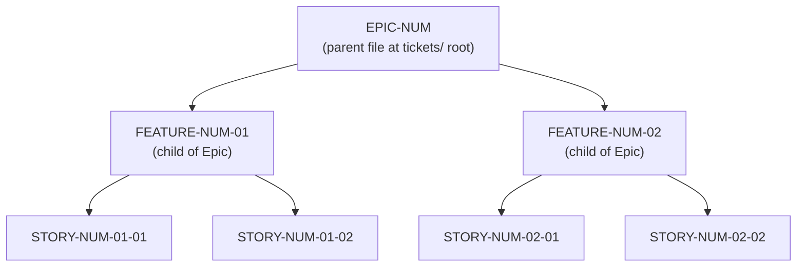
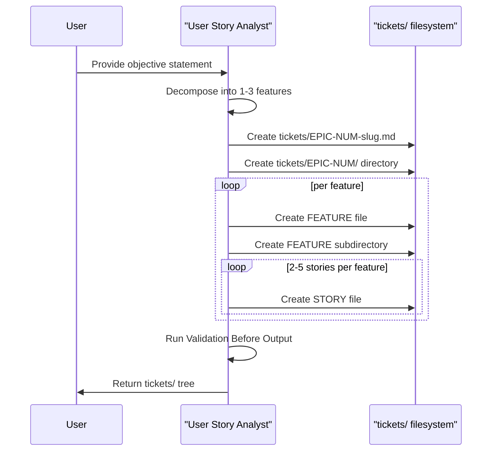

# Tickets — User Story Analyst Framework

This directory hosts the **User Story Analyst framework** — a methodology for transforming a single objective statement into a hierarchical corpus of Epic → Feature → Story Markdown artifacts that satisfy [INVEST](#invest-quick-reference) principles and [BDD](#bdd-quick-reference)-style Given/When/Then acceptance criteria. The framework complements (does not replace) the 11-step contributing workflow documented in [`../profile/README.md`](../profile/README.md).

## Table of Contents

- [Overview](#overview)
- [Directory Tree](#directory-tree)
- [Hierarchy Diagram](#hierarchy-diagram)
- [Execution Flow](#execution-flow)
- [Naming Convention](#naming-convention)
- [Authoring Workflow](#authoring-workflow)
- [INVEST Quick Reference](#invest-quick-reference)
- [BDD Quick Reference](#bdd-quick-reference)
- [Forbidden Terms](#forbidden-terms)
- [Edge-Case Categories](#edge-case-categories)
- [Story Estimation Quick Reference](#story-estimation-quick-reference)
- [Validation Before Output](#validation-before-output)
- [Definition-of-Done Checklists](#definition-of-done-checklists)
- [Related Resources](#related-resources)

## Overview

The User Story Analyst framework is a self-contained authoring system for decomposing a single objective statement into a hierarchical tree of testable, INVEST-compliant user stories. Given an objective, the analyst produces one parent **Epic**, one to three child **Features**, and two to five **Stories** per feature, with each story carrying 4–8 BDD-style acceptance criteria and an explicit set of edge cases drawn from a fixed taxonomy.

This framework is intended for **Active Contributors** who decompose objective statements into structured tickets. All artifacts live under this `tickets/` directory at the repository root, alongside the `profile/` folder. The canonical analyst prompt is preserved verbatim in [`./USER-STORY-ANALYST.md`](./USER-STORY-ANALYST.md); the reusable scaffolds live under [`./templates/`](./templates/); and a fully worked reference example is provided as [`./EPIC-001-establish-prompt-catalog.md`](./EPIC-001-establish-prompt-catalog.md) plus its [`./EPIC-001/`](./EPIC-001/) subtree.

The existing organization profile rendering at [`../profile/README.md`](../profile/README.md) is referenced read-only as the source of the demonstrative epic's roadmap-derived objective statement; that file is **not modified** by this framework. All Markdown in this directory uses GitHub Flavored Markdown (GFM) and renders directly on github.com without any build step.

## Directory Tree

The User Story Analyst prompt mandates the following filesystem shape for every Epic produced under `tickets/`. The illustrative example below uses the user-supplied "Export Data Capabilities" epic to show exactly how files and directories nest:

```plaintext
tickets/
├── EPIC-001-export-data-capabilities.md
└── EPIC-001/
    ├── FEATURE-001-01-csv-export.md
    ├── FEATURE-001-01/
    │   ├── STORY-001-01-01-add-export-button.md
    │   ├── STORY-001-01-02-generate-csv-file.md
    │   └── STORY-001-01-03-handle-export-errors.md
    ├── FEATURE-001-02-pdf-export.md
    └── FEATURE-001-02/
        ├── STORY-001-02-01-add-pdf-option.md
        └── STORY-001-02-02-generate-pdf-file.md
```

The tree above is illustrative — it shows the shape of any analyst output, not the actual contents of THIS repository. The concrete worked example shipped with this framework follows the same pattern with [`./EPIC-001-establish-prompt-catalog.md`](./EPIC-001-establish-prompt-catalog.md) as the reference Epic and the [`./EPIC-001/`](./EPIC-001/) subdirectory holding its child Features and Stories.

## Hierarchy Diagram

The Epic → Feature → Story relationship is illustrated below:



## Execution Flow

The analyst's runtime sequence is:



## Naming Convention

Filenames and directory names must follow the exact patterns below. The numeric tokens `NUM`, `NN`, and `SS` are zero-padded integers, and slugs are lowercase, hyphen-separated words (kebab-case).

- **Epic file**: `EPIC-NUM-slug.md` where `NUM` is a zero-padded 3-digit integer (e.g., `EPIC-001`).
- **Epic directory**: `EPIC-NUM/` — matches the Epic file's identifier (e.g., `EPIC-001/`).
- **Feature file**: `FEATURE-NUM-NN-slug.md` placed inside `EPIC-NUM/`, where `NN` is a zero-padded 2-digit integer (e.g., `FEATURE-001-01`).
- **Feature directory**: `FEATURE-NUM-NN/` — matches the Feature file's identifier (e.g., `FEATURE-001-01/`).
- **Story file**: `STORY-NUM-NN-SS-slug.md` placed inside `FEATURE-NUM-NN/`, where `SS` is a zero-padded 2-digit integer (e.g., `STORY-001-01-01`).
- **Slug rules**: lowercase letters, digits, and hyphens; no spaces, no underscores, no uppercase characters.
- **Title field rule (Rule S-7)**: the Markdown `# Title` heading inside each file conforms to the "Action + Object + Outcome" pattern and does not exceed 255 characters.

The table below shows representative identifiers paired with example slugs:

| Tier | Identifier | Example Slug | Resulting Filename |
|---|---|---|---|
| Epic | `EPIC-001` | `establish-prompt-catalog` | `EPIC-001-establish-prompt-catalog.md` |
| Feature | `FEATURE-001-01` | `define-catalog-schema-and-contribution-guidelines` | `FEATURE-001-01-define-catalog-schema-and-contribution-guidelines.md` |
| Story | `STORY-001-01-01` | `document-prompt-metadata-schema` | `STORY-001-01-01-document-prompt-metadata-schema.md` |

## Authoring Workflow

To invoke the analyst on a new objective statement, follow these steps in order:

1. Open [`./USER-STORY-ANALYST.md`](./USER-STORY-ANALYST.md) and copy the complete prompt text.
2. Replace the `PROVIDE_YOUR_OBJECTIVE_STATEMENT_HERE` placeholder with your concrete objective statement.
3. Decompose the objective into 1–3 features per the analyst's execution sequence.
4. Create a new `tickets/EPIC-{next-number}-{slug}.md` by copying [`./templates/EPIC-TEMPLATE.md`](./templates/EPIC-TEMPLATE.md) and populating placeholders.
5. Create the `tickets/EPIC-{next-number}/` subdirectory.
6. For each feature: copy [`./templates/FEATURE-TEMPLATE.md`](./templates/FEATURE-TEMPLATE.md) to `tickets/EPIC-{next-number}/FEATURE-{next-number}-NN-{slug}.md`, create its subdirectory, and populate placeholders.
7. For each story: copy [`./templates/STORY-TEMPLATE.md`](./templates/STORY-TEMPLATE.md) to the path `tickets/EPIC-{next-number}/FEATURE-{next-number}-NN/STORY-{next-number}-NN-SS-{slug}.md`, populate placeholders, and satisfy INVEST + BDD + required-coverage + edge-case rules.
8. Run the [Validation Before Output](#validation-before-output) checklist below — every item must pass.
9. Commit via git with a conventional-commit message (e.g., `docs(tickets): add EPIC-NN ...`).

## INVEST Quick Reference

Every story validates against all six criteria.

| Criterion | Definition |
|---|---|
| Independent | Self-contained with no inherent dependency on another user story. |
| Negotiable | Can be changed or rewritten until committed to an iteration. |
| Valuable | Delivers measurable value to the end user and/or customer. |
| Estimable | Size can be estimated with a certain level of certainty. |
| Sized appropriately | Small enough to plan, task, and prioritize with certainty (completable within a sprint). |
| Testable | Provides necessary information to make test development possible. |

## BDD Quick Reference

Acceptance criteria use the Given/When/Then template:

- **Given** — Context: what is already true before the trigger; the "before state" of the system, user, or data.
- **When** — Action: a single trigger event (the only one per AC; compound actions split across multiple ACs).
- **Then** — Outcome: every verifiable result that follows the trigger.

### AC Format

Each acceptance criterion is rendered exactly as:

```
**AC-N: Descriptive Title**
- **Given** [a specific scenario or precondition]
- **When** [a specific action or criteria is met]
- **Then** [the expected result or outcome]
```

### Required Coverage

Every story includes AT LEAST ONE acceptance criterion for each of the four categories below:

1. Input validation (Given invalid input scenario)
2. Expected output/behavior (Given valid input scenario)
3. Error handling (Given error condition scenario)
4. Edge case handling (Given boundary condition scenario)

## Forbidden Terms

The following 13 terms must NOT appear in any acceptance criterion (case-insensitive):

- `approximately`
- `several`
- `various`
- `adequate`
- `appropriate`
- `properly`
- `correctly`
- `efficiently`
- `quickly`
- `easily`
- `user-friendly`
- `reasonable`
- `sufficient`

Every time-, count-, volume-, or quality-related claim must be expressed with a concrete measurable value (e.g., "within 2 seconds", "at least 3 entries", "maximum 500 characters") rather than a vague qualifier.

## Edge-Case Categories

Every story documents 3 to 5 edge cases. The first three categories below are mandatory in every story; the fourth is included when the story's behavior involves shared mutable state.

| Category | Required? | Example |
|---|---|---|
| Empty/Null Input | Mandatory | empty string, null reference, zero-element collection |
| Boundary Values | Mandatory | minimum/maximum lengths, smallest/largest numeric values |
| Invalid Input | Mandatory | malformed type, out-of-range values, unauthorized formats |
| Concurrent/Conflicting Operations | If applicable | simultaneous writes, race conditions, lock contention |

## Story Estimation Quick Reference

Every story includes an estimation block grounded in the Effort/Complexity/Uncertainty rubric:

- **Effort** (Low/Medium/High) — with rationale.
- **Complexity** (Low/Medium/High) — with rationale.
- **Uncertainty** (Low/Medium/High) — with rationale.

### Fibonacci Story Points

Suggested story points are drawn from the Fibonacci set:

`{1, 2, 3, 5, 8, 13}`

Story points represent **relative size**, not absolute hours. Authors compare a candidate story to previously sized stories on the same team and pick the closest Fibonacci value. Stories larger than 13 points are split until each part fits within the scale.

## Validation Before Output

Every artifact must pass every rule below before commit.

- [ ] Zero forbidden terms in acceptance criteria
- [ ] Each acceptance criterion follows the Given/When/Then structure with a clear pass/fail determination
- [ ] All required edge case categories are covered per story (Empty/Null Input, Boundary Values, Invalid Input mandatory; Concurrent/Conflicting Operations if applicable)
- [ ] All stories satisfy every INVEST criterion (Independent, Negotiable, Valuable, Estimable, Sized appropriately, Testable)
- [ ] All stories are demo-able to a Product Owner
- [ ] Epic file links correctly to all child Feature files via relative paths
- [ ] Feature files link correctly to all child Story files via relative paths
- [ ] All files saved under `tickets/` with correct naming convention (`EPIC-NUM-slug.md`, `FEATURE-NUM-NN-slug.md`, `STORY-NUM-NN-SS-slug.md`)

## Definition-of-Done Checklists

The three Definition-of-Done checklists below are reproduced **verbatim** from the User Story Analyst prompt. The set of items, their wording, and their order must not be modified when these checklists are embedded into Epic, Feature, and Story files.

### Epic-Level (5 items)

- [ ] All child features completed
- [ ] Integration testing across features passed
- [ ] Documentation updated
- [ ] Final code review approved
- [ ] CI pipeline passes

### Feature-Level (5 items)

- [ ] All child user stories completed
- [ ] Feature-level integration testing passed
- [ ] Feature documentation updated
- [ ] Code reviewed and approved
- [ ] CI pipeline passes

### Story-Level (7 items)

- [ ] Code passes linting/static analysis
- [ ] Unit tests cover new functionality (minimum 80% coverage)
- [ ] Integration tests validate acceptance criteria (all Given/When/Then scenarios pass)
- [ ] Documentation updated
- [ ] Code reviewed and approved
- [ ] CI pipeline passes
- [ ] Story is demo-able to Product Owner

## Related Resources

| Resource | Link |
|---|---|
| Analyst Prompt Specification | [USER-STORY-ANALYST.md](./USER-STORY-ANALYST.md) |
| Epic Template | [templates/EPIC-TEMPLATE.md](./templates/EPIC-TEMPLATE.md) |
| Feature Template | [templates/FEATURE-TEMPLATE.md](./templates/FEATURE-TEMPLATE.md) |
| Story Template | [templates/STORY-TEMPLATE.md](./templates/STORY-TEMPLATE.md) |
| Worked Example: Epic-001 | [EPIC-001-establish-prompt-catalog.md](./EPIC-001-establish-prompt-catalog.md) |
| Organization Profile (read-only context) | [../profile/README.md](../profile/README.md) |
